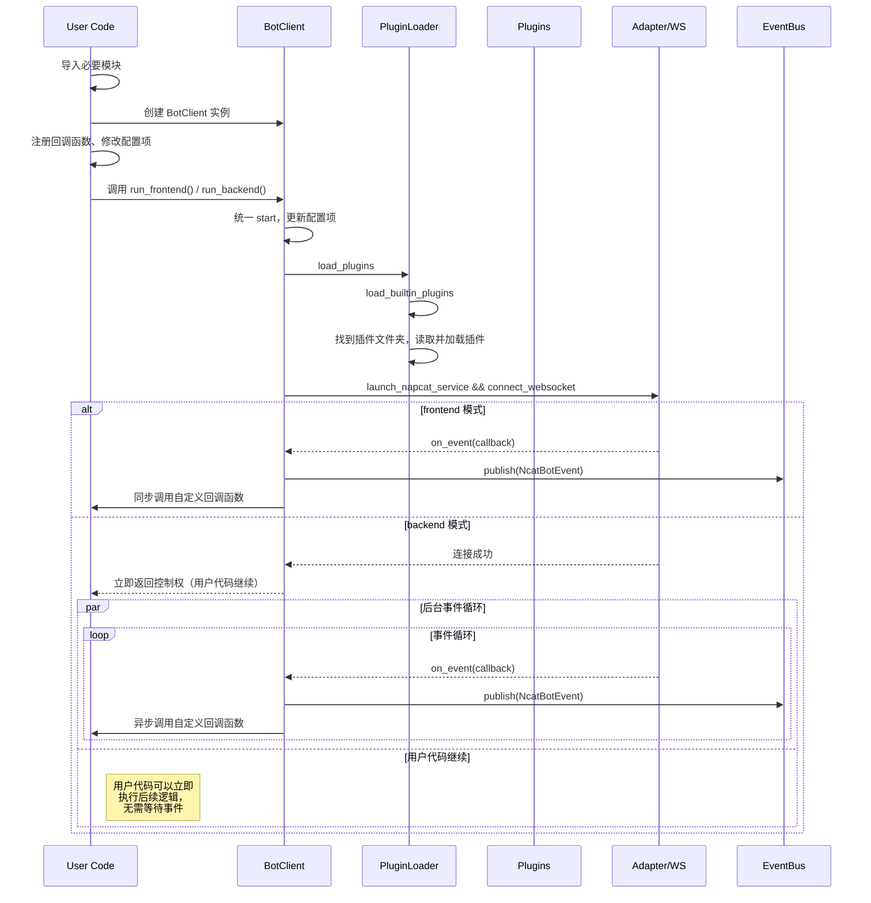
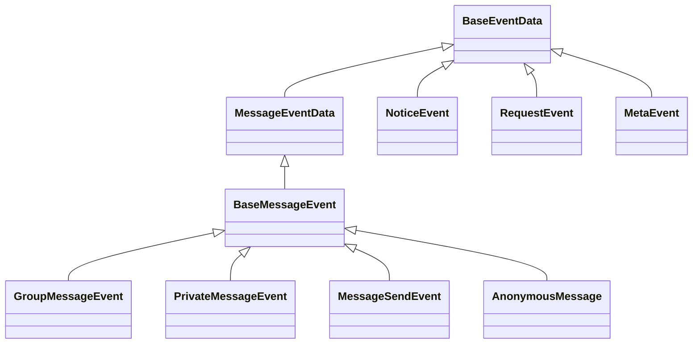
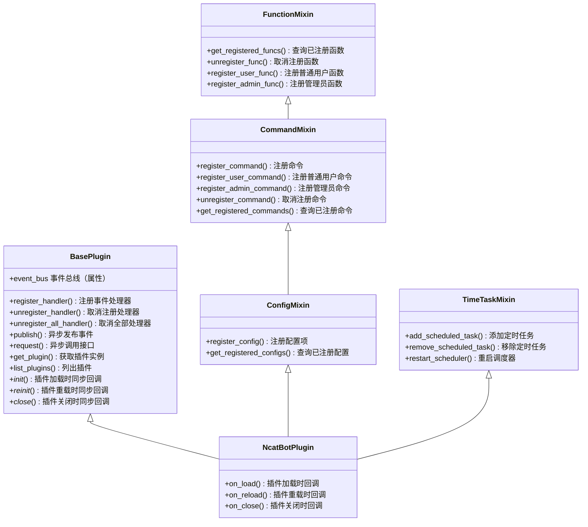
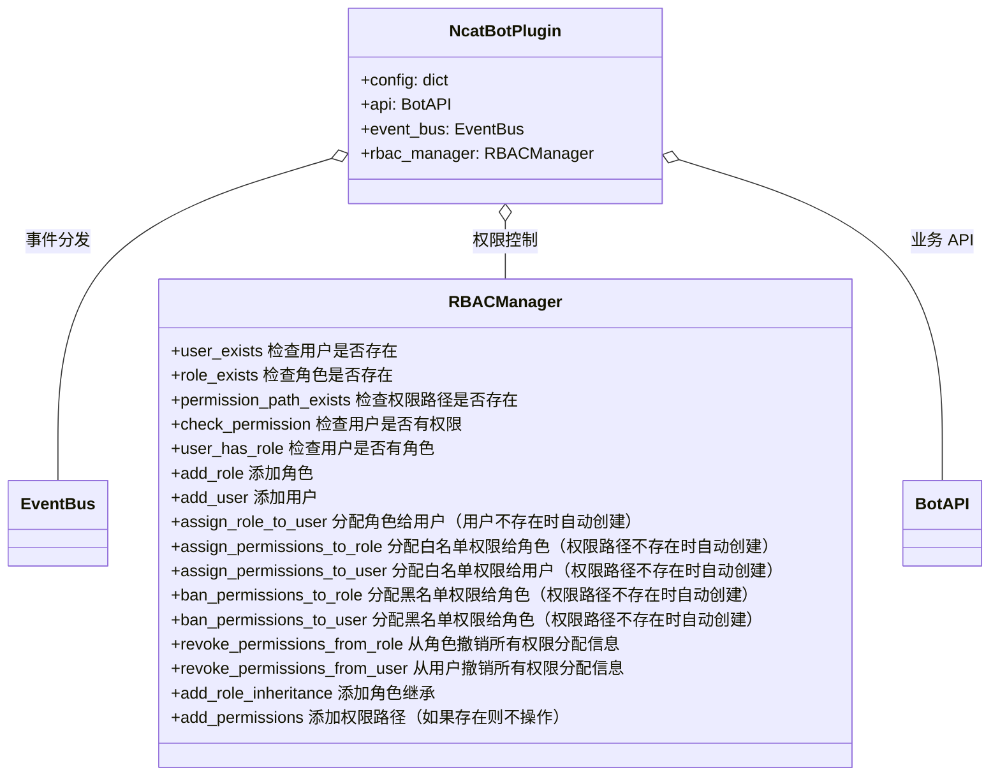
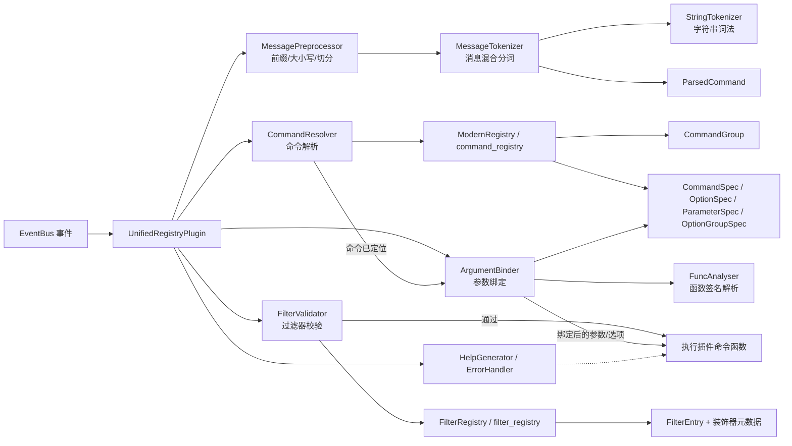
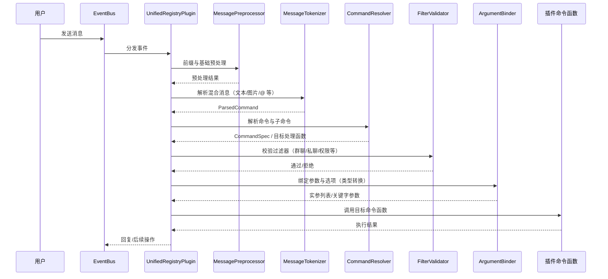
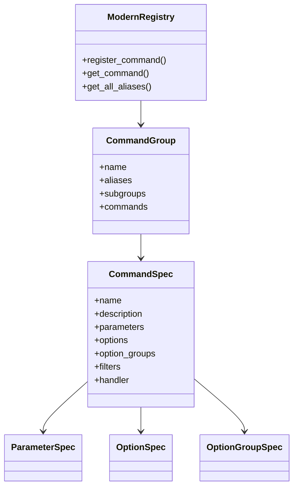
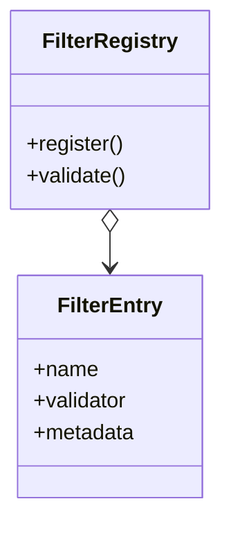

本文档供 AI 阅读. NcatBot 文档 base_url 为 `https://docs.ncatbot.xyz/`, 文档中包含相对链接，为用户生成链接时必须加上这个前缀生成绝对链接。

# 文件: 1. 开始\1. 认识 NcatBot.md

---
title: 认识 NcatBot
createTime: 2025/01/23 20:00:05
permalink: /guide/zxn1zv1t/
---
## 最好的 NcatBot


## NcatBot 和 NapCat 的关系

[NapCat](https://github.com/NapNeko/NapCatQQ) 是基于 TypeScript 构建的 Bot 框架, 通过相应的启动器或者框架, 主动调用 QQ Node 模块提供给客户端的接口, 实现Bot 的功能.

NcatBot 是 NapCat 的 Python SDK. NcatBot 实现了连接和调用 NapCat 的接口, 大家无需关心复杂的 HTTP 和 WebSocket 通讯协议, 只需要像使用任何 Python 第三方库一样使用 NcatBot, 即可完成 QQ Bot 的开发.

因此, 只有**同时运行** NcatBot 和 Napcat, QQ Bot 才能正常运行哟~ 嗯, NcatBot 会**自动运行** Napcat, 所以大部分时候你无需担心 Napcat 的运行问题.

## 加入我们

呀, 木子喵真的太可爱了, 我也想...

咳咳, 嗯, 如果你对项目有更好的想法, 欢迎加入我们! 如果可以, 为我们的[项目](https://github.com/liyihao1110/ncatbot)点一个小小的 star 就是对我们最大的支持啦~

这是我们的[交流群](https://qm.qq.com/q/L6XGXYqL86), 群里面有用我们的项目搭建的 QQ 机器人, 所谓百闻不如一见, 大家可以进群体验喵~


## 开源声明

::: caution
任何使用该项目的自然人都必须了解并遵守本开源声明，一切因不遵守该声明所造成的不良后果，NcatBot开发项目组不承担任何责任。
:::

本项目采用 `NcatBot Non-Commercial License` 开源, 在 `Apache License 2.0` 协议的基础上, **限制**对 **NcatBot 源代码的二次开发**以及**任何形式的商业用途**, 具体条款如下:

```
NcatBot Non-Commercial License

Copyright (c) 2025 NcatBot开发项目组

在遵守以下条款的前提下，特此免费授予任何获得本软件及相关文档文件（以下简称“软件”）的人员不受限制地处置本软件的权利，包括但不限于使用、复制、修改、合并、发布、分发、再许可的权利：

一、约束条款
1. 未经授权，禁止商业用途
   - 不得直接或间接通过本软件获利，包括但不限于：
     * 售卖软件副本或衍生作品
     * 作为商业产品或服务组成部分
     * 用于广告推广或流量变现
     * 其他以营利为目的的使用场景

2. 二次开发授权
   - 修改后的衍生作品需满足：
     * 必须保留原始版权声明
     * 需通过邮件(lyh_02@foxmail.com)提交授权申请
     * 获得书面授权后方可分发

二、违约处理
1. 违反上述条款自动终止授权
2. 需承担因此造成的所有法律责任
3. 侵权方需承担维权产生的合理费用

三、免责声明
本软件按"原样"提供，不做任何明示或暗示的担保，包括但不限于对适销性、特定用途适用性的担保。在任何情况下，作者或版权持有人均不对任何索赔、损害或其他责任负责。

四、管辖法律
本协议适用中华人民共和国法律，任何争议应提交厦门仲裁委员会仲裁解决。

本协议最终解释权归 NcatBot 开发项目组所有。
```

本项目仅用于学习交流, 使用本项目造成的任何后果由使用者承担, 与项目开发组无关.

**严禁**将本项目用于以下用途:

- 传播反动、淫秽、赌博、暴力、电信诈骗等违法信息.

## 我们的合作伙伴

感谢 [IppClub](https://github.com/IppClub/) 对本项目的大力支持。

> 欢迎来到 I++ 俱乐部!！我们是一个充满激情的开发者、创作者和创新者社区，致力于通过协作与开源开发的力量，推动有意义的项目与技术的诞生。最初，I++ 俱乐部起源于大学里的学生社团，随着核心成员的毕业与加入工作，俱乐部活动逐渐拓展到了社会范围，现也面向同样来自打工阶层的程序员们。我们鼓励技术爱好者共同探索IT领域的无限可能，推动技术交流与创新，创造更加开放、包容的技术文化。

感谢 [NapCat](https://github.com/NapNeko) 为本项目提供底层支持。

感谢 [林枫云](https://www.dkdun.cn/) 为本项目提供上云服务。

二次开发项目 [FcatBot](https://github.com/Fish-LP/FcatBot)。

---

# 文件: 1. 开始\2. 快速开始.md

---
title: 快速开始
createTime: 2025/02/07 15:21:39
permalink: /guide/dto79lp7/
---

## 什么是 NcatBot

NcatBot 是 [NapCat](https://github.com/NapNeko/NapCatQQ) 的 Python SDK (开发者套件)， 旨在简化 QQ Bot 的开发和部署流程。

## 核心优势

- **配置简单**：NcatBot 只需要 pip 就能安装， 只需要配置 QQ 号就能运行， 适合快速上手， 快速开发。
  
- **功能丰富**：NcatBot 拥有丰富的内置功能， 如**配置项管理**， **权限系统**， **数据持久化**， 涵盖大部分场景， 免去重复造轮子的烦恼。

- **文档齐全**：NcatBot 拥有同类产品中最完善的文档， 包含**安装指南**， **开发指南**， **API 参考**， **FAQ** 等， 帮助你快速上手。

- **AI 友好**：NcatBot 在设计之初就考虑到了 AI 辅助开发的需求，其代码逻辑结构和命名均按照 AI 友好的方式设计，你可以利用 AI 非常高效的开发自己的 Bot。

## 让我们开始

1. [通用安装指南](./3.%20安装教程/1%20通用安装指南.md)
2. [开发指南](3.%20开发指南.md)


---

# 文件: 1. 开始\3. 安装教程\1 通用安装指南.md

---
title: 通用安装指南
createTime: 2025/04/22 15:21:39
permalink: /guide/minimali/
---

本通用指南提供最简单的叙述，如果需要详细指导，可以查看下面的详细指南。

## 详细安装指南

- [Linux](./2.%20Linux%20安装.md)
- [Windows](./3.%20Windows%20安装.md)
- [Windows Server](./4.%20Windows%20Server%20安装.md)
- [MacOS](./4.%20MacOS%20安装.md)

## 环境检查

- Python：版本 >= 3.8
- 操作系统：
  - Win10、Win11
    - 更新电脑 QQ 到最新版本
  - Linux
    - 安装好 curl sudo。
- 网络环境：使用本机 6099 和 3001 端口。如果确实存在占用，参考[配置项](../../2.%20基本开发/4.%20配置项.md)解决。

## 安装 NcatBot

```bash
pip install ncatbot -U -i https://mirrors.aliyun.com/pypi/simple/
```

## Hello NcatBot

```python
from ncatbot.core import BotClient
bot = BotClient()
api = BotClient.run_blocking(bt_uin="234567", root="345678") # bt_uin 是 Bot 账号, root 是拥有 Bot 最高权限的账号。
api.post_private_msg_sync("345678", "Hello NcatBot~meow") # 第一个参数表示发送消息的对象（QQ 号）
print("程序生命周期结束")
```

- NcatBot 组件中内置一个 QQ 客户端，运行前请在电脑上退出 `bt_uin` 对应 QQ 的登录。

- 运行后在终端用手机扫码登录 Bot QQ。


---

# 文件: 1. 开始\3. 安装教程\2. Linux 安装.md

---
title: Linux 安装
createTime: 2025-03-25 15:50:00
permalink: /guide/linuxins/
---

## 检查基本环境

推荐使用 Ubuntu 24.04 LTS 版本.

### Python

==使用 Python3.8 及以上的版本。==

### 其它基本工具

`curl sudo` 必须安装, 其它工具的安装可以跳过.

::: code-tabs
@tab Debian/Ubuntu
```shell
sudo apt-get update -y -qq && sudo apt-get -y -qq install curl sudo
```
@tab RPM/CentOS
```shell
sudo dnf install -y epel-release && sudo dnf install --allowerasing -y curl sudo
```
:::


## 安装 NcatBot

项目已经发布到 PYPI, 可以使用 pip 直接下载本项目.

==请不要从 GitHub 上下载 .zip 压缩包，如果下载过，请删掉所有相关的文件。==

先进入 root 用户模式。

::: code-tabs
@tab linux
```shell
sudo su
```
:::

执行该命令，在用户目录创建虚拟环境、激活环境并下载有关资源。

::: code-tabs
@tab pip
```shell
cd ~
python3 -m venv .ncatbot
. ~/.ncatbot/bin/activate
pip install ncatbot -U -i https://mirrors.aliyun.com/pypi/simple
```
:::


## 运行

### 准备 QQ 号

为了测试, 需要两个 QQ 号：

- **Bot**: 由 NcatBot 控制, 可以使用接口收发消息.
- **root**: 由你控制, 用于测试 Bot 的功能.

NcatBot 相当于一个电脑 QQ 客户端，因此在登陆前，你需要退出 Bot 在其它电脑客户端上的登录。

### 执行代码

以下代码是一个最小可运行示例，将它保存到 `main.py` 中。

先在手机上登录 Bot，然后执行 `python3 main.py` 运行。按照提示输入 Bot QQ 号，然后手机扫码登录。

接着使用 root 向 Bot 发送一条消息 "测试"，收到回复即正常运行。

::: code-tabs
@tab Python
```python
# ========= 导入必要模块 ==========
from ncatbot.core import BotClient, PrivateMessage

# ========== 创建 BotClient ==========
bot = BotClient()

# ========= 注册回调函数 ==========
@bot.private_event()
async def on_private_message(msg: PrivateMessage):
    if msg.raw_message == "测试":
        await bot.api.post_private_msg(msg.user_id, text="NcatBot 测试成功喵~")

# ========== 启动 BotClient==========
bot.run() # 一直执行，不会结束
```
:::

## 常见问题

查阅 [FAQ](../../10.%20常见问题/1.%20安装时常见问题.md) 页面.


---

# 文件: 1. 开始\3. 安装教程\3. Windows 安装.md

---
title: Windows 安装
createTime: 2025/02/07 15:21:39
permalink: /guide/wininsta/
---

::: warning
此教程只适用 Window10、Windows11 操作系统。
:::

::: warning
请不要在云电脑上使用本项目，如果需要上云请使用 Linux 操作系统。
:::

## 任务列表

我们给出一个简单的任务清单, 你可以按照下面的步骤来安装 NcatBot.

1. 正确安装 Python3.12

2. 通过 pip 安装 NcatBot

3. 安装最新版 QQ

4. 运行代码并扫码登录

## 1. 安装 Python

[教程](https://zhuanlan.zhihu.com/p/111168324)

## 2. 安装 NcatBot

::: warning
不要从 GitHub 上下载 .zip 压缩包；如果下载并解压过，请删掉解压出来的文件。
:::

项目已经发布到 PYPI, 可以使用 pip 直接下载本项目.

按下 `Win+R`, 在左下角打开**运行**, 输入 `powershell` 并回车, 打开**终端**.

复制下面的代码, 粘贴到**终端**中, 按回车执行.

::: code-tabs
@tab pip(稳定版, 推荐)

```shell
pip install ncatbot -U -i https://mirrors.aliyun.com/pypi/simple
```
:::

## 3. 安装最新版 QQ

:::tip
如果出现无法登录的问题，请先卸载掉 QQ，再去官网下载安装最新版 QQ。
:::

卸载掉电脑上已经安装的 QQ。

前往 [QQ 官网](im.qq.com) 下载安装最新版 QQ。

## 4. NcatBot 启动

### 准备 QQ 号

为了测试, 需要两个 QQ 号：

- **Bot**: 由 NcatBot 控制, 可以使用接口收发消息.
- **root**: 由你控制, 用于测试 Bot 的功能.

NcatBot 相当于一个电脑 QQ 客户端，因此在登陆前，==你需要退出 Bot 在其它电脑客户端上的登录。==

### 开始运行

建立一个==新的工作目录==(文件夹)，文件夹名为 `ncatbot`。

1. 双击进入 `ncatbot` 文件夹.

2. 在文件夹中新建一个 `main.py` 文件，注意[后缀名](https://zhuanlan.zhihu.com/p/112226609) 是 `.py`

3. 用记事本或者其它文本编辑器打开 `main.py` 文件，复制以下代码进去，并**保存**。

::: code-tabs
@tab Python
```python
# ========= 导入必要模块 ==========
from ncatbot.core import BotClient, PrivateMessage

# ========== 创建 BotClient ==========
bot = BotClient()

# ========= 注册回调函数 ==========
@bot.private_event()
async def on_private_message(msg: PrivateMessage):
    if msg.raw_message == "测试":
        await bot.api.post_private_msg(msg.user_id, text="NcatBot 测试成功喵~")

# ========== 启动 BotClient==========
bot.run()
```
:::

4. 右键文件夹（就像你新建那个文件一样），选择 "在终端中打开"。在跳出的窗口（即终端，通常为黑底白字）输入 `python main.py` 执行代码。

:::details 没有**在终端中打开**

部分 Windows10 操作系统确实没有这个选项。

打开你的 ncatbot 文件夹。看到窗口最上方那条地址栏了吗？（写着“此电脑 > 桌面 > ncatbot”之类）

用鼠标在这条地址栏里点一下，整条路径就会变成蓝底白字。直接按 Ctrl + C 就复制好了。

打开 PowerShell（Win+R → 输入 powershell → 回车），输入 cd "Ctrl+V 粘贴刚才复制的路径"，回车，路径就切进去了。
:::

5. 在手机上登录 Bot。电脑上按照提示输入 Bot QQ 号，然后手机扫码登录。

6. 接着使用 root 向 Bot 发送一条消息 "测试"，收到回复即正常运行。

## 5. 常见问题

### `python main.py` 后没有反应

[查看](../../10.%20常见问题/2.%20运行时常见问题.md)

### 卡在登录中

- 如果使用的是云电脑，安全机制会阻止 NcatBot 正常运行。此时建议
  - 使用自己的电脑。
  - 使用 Linux 操作系统。

### 有一步做不下去怎么办？

- 将本教程全数复制下来，发给 AI（kimi 等），并将你的疑惑告诉它，它会教你。

### 好像有红色的报错？ 

- 将出现**红色错误提示**的页面，**尽可能全的截取下来**，交给 Kimi 等 AI 助手并请求它们的帮助。


---

# 文件: 1. 开始\3. 安装教程\4. Windows Server 安装.md

---
title: Windows Server 安装
createTime: 2025/10/23 00:26:37
permalink: /guide/winServerinsta/
---

如果是使用云服务器进行部署，建议使用Linux环境，如果没有Linux基础，或者有特殊业务需求，那也可参考本篇关于Windows Server的安装教程。

::: warning
此教程适用 Windows Server 2019、Windows Server 2022 操作系统。
:::

> [!IMPORTANT]
> 如果你使用的是Windows Server 2019，强烈建议你先使用ie安装Microsoft Edge浏览器，而不是直接使用ie。
<br />无论使用什么版本的Windows Server，ncatbot都可能无法自行安装napcat，需要你自行安装napcat。
<br />不建议在Windows Server 2025上运行本项目，因为大多数云服务器承担不起系统的性能开销，如果硬要用，可以基本参考本篇的教程。

---
## 1. 安装 Python
进入[Python官网](https://www.python.org/)下载Python3.12的安装包。

以管理员身份运行安装包并安装Python。

如果安装包报错`0x80070659 系统策略禁止这个安装`。

那么尝试**以管理员身份运行**cmd并输入以下命令：
```shell
reg add "HKLM\Software\Policies\Microsoft\Windows\Installer" /v DisableMSI /t REG_DWORD /d 0 /f
```
或者使用 PowerShell(**管理员**) 运行以下命令：
```shell
New-Item -Path "HKLM:\Software\Policies\Microsoft\Windows" -Name "Installer" -Force | Out-Null
New-ItemProperty -Path "HKLM:\Software\Policies\Microsoft\Windows\Installer" -Name "DisableMSI" -PropertyType DWord -Value 0 -Force | Out-Null
```
然后再以管理员身份执行Python的安装。

## 2. 手动安装napcat和qq（可选）

::: note
如果在第四步中，Ncatbot自动安装napcat时出错可以参考这一步。
:::

详细可参阅[NapCat.Shell - Win 手动启动教程](https://napneko.github.io/guide/boot/Shell#napcat-shell-win-%E6%89%8B%E5%8A%A8%E5%90%AF%E5%8A%A8%E6%95%99%E7%A8%8B)。

从napcat的[Github仓库](https://github.com/NapNeko/NapCatQQ/releases)中下载最新的**NapCat.Shell.zip**。

把下载的压缩包中的文件复制到一个叫`napcat`的文件夹中，并且把文件夹移动到**ncatbot入口程序**（例如`./main.py`）的**根目录**，就像`./napcat`。

从QQ官网下载并安装最新的[QQNT](https://im.qq.com/pcqq/index.shtml)

## 3. 安装 NcatBot
::: warning
不要从 GitHub 上下载 .zip 压缩包；如果下载并解压过，请删掉解压出来的文件。
:::

项目已经发布到 PYPI, 可以使用 pip 直接下载本项目。

按下 `Win+R`, 在左下角打开**运行**, 输入 `powershell` 并回车, 打开**终端**。

复制下面的代码, 粘贴到**终端**中, 按回车执行。

::: code-tabs
@tab pip(稳定版, 推荐)

```shell
pip install ncatbot -U -i https://mirrors.aliyun.com/pypi/simple
```
:::

## 4. NcatBot 启动

### 准备 QQ 号

为了测试, 需要两个 QQ 号：

- **Bot**: 由 NcatBot 控制, 可以使用接口收发消息.
- **root**: 由你控制, 用于测试 Bot 的功能.

NcatBot 相当于一个电脑 QQ 客户端，因此在登陆前，==你需要退出 Bot 在其它电脑客户端上的登录。==

### 开始运行

建立一个==新的工作目录==(文件夹)，文件夹名为 `ncatbot`。

1. 双击进入 `ncatbot` 文件夹.

2. 在文件夹中新建一个 `main.py` 文件，注意[后缀名](https://zhuanlan.zhihu.com/p/112226609) 是 `.py`

3. 用记事本或者其它文本编辑器打开 `main.py` 文件，复制以下代码进去，并**保存**。

::: code-tabs
@tab Python
```python
# ========= 导入必要模块 ==========
from ncatbot.core import BotClient, PrivateMessage

# ========== 创建 BotClient ==========
bot = BotClient()

# ========= 注册回调函数 ==========
@bot.private_event()
async def on_private_message(msg: PrivateMessage):
    if msg.raw_message == "测试":
        await bot.api.post_private_msg(msg.user_id, text="NcatBot 测试成功喵~")

# ========== 启动 BotClient==========
bot.run()
```
:::

4. 进入 ncatbot 文件夹，点击上方的地址栏（例如`C:\Users\admin\Desktop\ncat`）,清空地址栏。然后输入 powershell → 回车，打开PowerShell窗口，接着输入 `python main.py` 运行代码。

5. 在手机上登录 Bot。电脑上按照提示输入 Bot QQ 号，然后手机扫码登录。

6. 接着使用 root 向 Bot 发送一条消息 "测试"，收到回复即正常运行。

## 5. 常见问题

### 授权操作超时

在保证napcat正常运行的前提下

考虑在启动参数中加入 enable_webui_interaction=False 跳过

即`bot.run(enable_webui_interaction=False)`

### 自动安装napcat失败

反复出现以下报错

` <urlopen error [SSL: CERTIFICATE_VERIFY_FAILED] certificate verify failed: unable to get local issuer certificate (_ssl.c:1010)>`

`安装失败: request timed out`

尝试参考第二步[手动安装napcat](#_2-手动安装napcat和qq-可选)

### napcat无法登录qq

如果出现无法登录的问题，请先卸载掉 QQ，再去官网下载安装最新版 QQ。必要时参考第二条[手动安装napcat](#_2-手动安装napcat和qq-可选)。

---

# 文件: 1. 开始\3. 安装教程\5. MacOS 安装.md

---
title: MacOS 安装
createTime: 2025/02/07 15:21:39
permalink: /guide/MacOSins/
---

建议换一台 Windows、Linux 的电脑使用，如果你非要用，那么：可以参考[通用安装指南](./1.5%20通用安装指南.md)。

**NapCat 引导操作**会检查操作系统，MacOS 不受支持会直接报错，你需要自行完成 NapCat 引导，以便在启动时跳过它：

- 按照 NapCat 文档[有关部分](https://napneko.github.io/guide/boot/Shell#napcat-macos-macos%E5%AE%89%E8%A3%85%E5%B7%A5%E5%85%B7) 正确安装 NapCat。

- 在 NapCat WebUI 中[配置 websocket 服务](https://napneko.github.io/config/basic#%E9%80%9A%E8%BF%87-webui-%E9%85%8D%E7%BD%AE-onebot-%E6%9C%8D%E5%8A%A1)

- 填写有关[配置项](../2.%20基本开发/4.%20配置项.md)。

然后就和其它系统的启动无异。

遇到困难可[进群](https://qm.qq.com/q/L6XGXYqL86)求助.

---

# 文件: 1. 开始\3. 开发指南.md

---
title: 开发指南
createTime: 2025/03/25 23:21:39
permalink: /guide/devguide/
---


## NcatBot 的几种开发范式

### 前台模式（大多数）

:::tip
3.x.y 版本中，该模式称为 "插件模式"
:::

前台模式下，你的代码只能通过**回调函数**被调用。（NcatBot 在前台运行）

适合场景：
- QQ Bot 是项目的核心，程序的生命周期就是 Bot 的生命周期。

讲人话（以下几种情况都是）：
- 收到消息、加群通知之后做点什么。
- 定时发送一些消息。
- 你无法明白前台模式和后台模式的差异。

[参考代码](./3.%20安装教程/2.%20Linux%20安装.md#执行代码)。

### 后台模式

:::tip
3.x.y 版本中，该模式称为 "主动模式"/"嵌入模式"
:::

后台模式启动后，会返回一个 `BotAPI` 示例，通过 API 可以调用有关接口完成对应操作。（NcatBot 在后台运行）

可以注册回调函数以便接收 QQ 端的消息。

适合场景：
- QQ Bot 只是项目工作流的一个组件，程序的生命周期不应该由 NcatBot 管理。

[参考代码](./3.%20安装教程/1%20通用安装指南.md#hello-ncatbot)


## 文档导航

### 1. 开始

- [1. 认识 NcatBot](./1.%20认识%20NcatBot.md): 项目简介与社区信息。
- [2. 快速开始](./2.%20快速开始.md): 最快 5 分钟跑通 NcatBot。
- 安装教程：
  - [通用安装指南](./3.%20安装教程/1%20通用安装指南.md)
  - [Linux 安装](./3.%20安装教程/2.%20Linux%20安装.md)
  - [Windows 安装](./3.%20安装教程/3.%20Windows%20安装.md)
  - [MacOS 安装](./3.%20安装教程/4.%20MacOS%20安装.md)
- [安装和使用插件](./4.%20安装和使用插件.md): 了解如何获取并启用社区插件。

### 2. 基本开发

- [1. 插件最小示例](../2.%20基本开发/1.%20插件最小示例.md)
- [2. 前后台模式最小示例](../2.%20基本开发/2.%20前后台模式最小示例.md)
- [3. NcatBot 生命周期](../2.%20基本开发/3.%20NcatBot%20生命周期.md)
- [4. 配置项](../2.%20基本开发/4.%20配置项.md)
- [5. 状态量](../2.%20基本开发/5.%20状态量.md)

### 3. 组件介绍

- [1. 核心组件概览](../3.%20组件介绍/1.%20核心组件概览.md)
- [2. BotClient](../3.%20组件介绍/2.%20BotClient.md)
- [3. PluginLoader](../3.%20组件介绍/3.%20PluginLoader.md)
- [4. EventBus](../3.%20组件介绍/4.%20EventBus.md)
- [5. Adapter](../3.%20组件介绍/5.%20Adapter.md)
- [6. BotAPI](../3.%20组件介绍/6.%20BotAPI.md)

### 4. 数据结构介绍

- [1. 核心数据结构概览](../4.%20数据结构介绍/1.%20核心数据结构概览.md)
- [2. BaseEventData](../4.%20数据结构介绍/2.%20BaseEventData.md)
- [3. MessageArray](../4.%20数据结构介绍/3.%20MessageArray.md)
- [4. MessageSegment](../4.%20数据结构介绍/4.%20MessageSegment.md)
- [5. ForwardConstructor](../4.%20数据结构介绍/5.%20ForwardConstructor.md)

### 5. API 参考

- [1. 概览](../5.%20API%20参考/1.%20概览.md)
- [2. Message 有关 API](../5.%20API%20参考/2.%20Message%20有关%20API.md)
- [3. Account 有关 API](../5.%20API%20参考/3.%20Account%20有关%20API.md)
- [4. Group 有关 API](../5.%20API%20参考/4.%20Group%20有关%20API.md)
- [5. private 有关 API](../5.%20API%20参考/5.%20private%20有关%20API.md)
- [6. Support 有关 API](../5.%20API%20参考/6.%20Support%20有关%20API.md)
- 实战手册：
  - [常见场景](../5.%20API%20参考/7.%20实战手册/1.%20常见场景.md)

### 7. 插件系统

- [1. 介绍](../7.%20插件系统/1.%20介绍.md)
- [2. 插件类的成员](../7.%20插件系统/2.%20插件类的成员.md)
- 插件的交互系统：
  - [3.1 事件的发布和订阅](../7.%20插件系统/3.%20插件的交互系统/3.1%20事件的发布和订阅.md)
  - [3.2 功能和命令](../7.%20插件系统/3.%20插件的交互系统/3.2%20功能和命令.md)
  - [3.3 权限系统](../7.%20插件系统/3.%20插件的交互系统/3.3%20权限系统.md)
  - [3.4 系统命令](../7.%20插件系统/3.%20插件的交互系统/3.4%20系统命令.md)
  - [3.5 内置插件的拓展功能](../7.%20插件系统/3.%20插件的交互系统/3.5%20内置插件的拓展功能.md)
- 插件高级功能：
  - [4.1 添加依赖](../7.%20插件系统/4.%20插件高级功能/4.1.%20添加依赖.md)
  - [4.2 私有工作目录](../7.%20插件系统/4.%20插件高级功能/4.2%20私有工作目录.md)
  - [4.3 定时任务](../7.%20插件系统/4.%20插件高级功能/4.3%20定时任务.md)
  - [4.4 插件配置项](../7.%20插件系统/4.%20插件高级功能/4.4%20插件配置项.md)
- [5. 发布你的插件](../7.%20插件系统/5.%20发布你的插件.md)

### 8. 高级教程

- 统一命令注册器：
  - [概览](../8.%20高级教程/1.%20统一命令注册器/1.%20概览.md)
  - [快速开始](../8.%20高级教程/1.%20统一命令注册器/2.%20快速开始.md)
  - [命令系统](../8.%20高级教程/1.%20统一命令注册器/3.%20命令系统.md)
  - [参数解析](../8.%20高级教程/1.%20统一命令注册器/4.%20参数解析.md)
  - [过滤器系统](../8.%20高级教程/1.%20统一命令注册器/5.%20过滤器系统.md)
  - [测试指南](../8.%20高级教程/1.%20统一命令注册器/6.%20测试指南.md)
  - [实战案例](../8.%20高级教程/1.%20统一命令注册器/7.%20实战案例.md)
  - [最佳实践](../8.%20高级教程/1.%20统一命令注册器/8.%20最佳实践.md)
  - [FAQ](../8.%20高级教程/1.%20统一命令注册器/9.%20FAQ.md)
- 测试：
  - [概览](../8.%20高级教程/2.%20测试/1.%20概览.md)
  - [快速开始](../8.%20高级教程/2.%20测试/2.%20快速开始.md)
  - [API 参考](../8.%20高级教程/2.%20测试/3.%20API%20参考.md)
  - [函数式测试最佳实践](../8.%20高级教程/2.%20测试/4.%20函数式测试最佳实践.md)
  - [集成测试最佳实践](../8.%20高级教程/2.%20测试/5.%20集成测试最佳实践.md)
- 其他：
  - [远端模式](../8.%20高级教程/3.%20其他/1.%20远端模式.md)
  - [日志](../8.%20高级教程/3.%20其他/2.%20日志.md)
  - [CLI](../8.%20高级教程/3.%20其他/3.%20CLI.md)
  - [AI+NcatBot](../8.%20高级教程/3.%20其他/4.%20AI+NcatBot.md)
  - [开发技巧](../8.%20高级教程/3.%20其他/5.%20开发技巧.md)
- [最佳实践](../8.%20高级教程/4.%20最佳实践.md)

### 9. 实际项目参考

- 教程项目：
  - [发送复杂消息](../9.%20实际项目参考/教程项目/1.%20发送复杂消息.md)
  - [上传和获取文件](../9.%20实际项目参考/教程项目/3.%20上传和获取文件.md)
  - [处理好友请求和加群请求](../9.%20实际项目参考/教程项目/4.%20处理好友请求和加群请求.md)
- [1. 简单 BotClient 项目](../9.%20实际项目参考/1.%20简单%20BotClient%20项目.md)

### 10. 常见问题

- [1. 安装时常见问题](../10.%20常见问题/1.%20安装时常见问题.md)
- [2. 运行时常见问题](../10.%20常见问题/2.%20运行时常见问题.md)
- [3. 开发时常见问题](../10.%20常见问题/3.%20开发时常见问题.md)


---

# 文件: 1. 开始\4. 安装和使用插件.md

---
title: 安装和使用插件
createTime: 2025/03/27 11:45:00
permalink: /guide/inplugin/
---

# 还没做好

### 手动安装插件

将**插件文件夹**放入(运行[引导程序](../5.%20杂项/6.%20术语表.md#引导程序)时的)工作目录下 `plugins` 文件夹下即可.

### 自动安装插件

参阅[CLI](../5.%20杂项/5.%20CLI.md)

对于已经发布到[插件商店](https://github.com/ncatbot/ncatbot-plugins)的插件, 可以使用 CLI 的 `install` 命令自动安装.

例如查看[插件列表](https://github.com/ncatbot/NcatBot-Plugins/tree/main/plugins)找到已有的插件 `TestPlugin` 后, 可以使用 `install TestPlugin` 命令安装插件.

---

# 文件: 2. 基本开发\1. 插件最小示例.md

---
title: 插件模式最小示例
createTime: 2025/02/08 10:07:54
permalink: /guide/minexample/
---

## 文件结构

文件结构（工作目录为 main.py 所在目录）：
```
main.py
plugins/
    hello_plugin/
        hello_plugin.py
        __init__.py
```

## hello_plugin/hello_plugin.py

```python
from ncatbot.plugin_system import NcatBotPlugin
from ncatbot.plugin_system import command_registry
from ncatbot.plugin_system import filter_registry
from ncatbot.core.event import BaseMessageEvent, PrivateMessageEvent

class HelloPlugin(NcatBotPlugin):
    name = "HelloPlugin"
    version = "1.0.0"

    async def on_load(self):
        # 可留空，保持轻量
        pass

    @command_registry.command("hello")
    async def hello_cmd(self, event: BaseMessageEvent):
        await event.reply("你好！我是插件 HelloPlugin。")

    @filter_registry.private_filter
    async def on_private_msg(self, event: PrivateMessageEvent):
        await event.reply("你发送了一条私聊消息！")
```

### 插件类

插件类可以利用 NcatBot 插件系统的强大功能，来定义一组功能的集合。一个插件作为一个整体能够非常灵活的迁移，[参见](../7.%20插件系统/1.%20介绍.md)。

### command_registry

用于以**命令**的形式识别和处理消息，[参见](../8.%20高级教程/1.%20统一命令注册器/1.%20概览.md)。

### filter_registry

用于以**非命令**的形式识别和处理消息，[参见](../8.%20高级教程/1.%20统一命令注册器/5.%20过滤器系统.md)。

### ncatbot.core.event

事件数据结构，用于描述收到的消息、加群请求等，[参见](../4.%20数据结构介绍/2.%20BaseEventData.md)。

## hello_plugin/\_\_init\_\_.py

```python
from .hello_plugin import HelloPlugin

__all__ = ["HelloPlugin"]
```

用于导出和整理插件，以便插件系统识别和加载插件。

## main.py

```python
from ncatbot.core import BotClient

bot = BotClient()
bot.run_frontend()
```

### BotClient

用于启动和终止 Bot，安装、配置、连接 NapCat；引导[插件系统](../7.%20插件系统/1.%20介绍.md)的加载；提供回调函数注册接口，[参见](../3.%20组件介绍/2.%20BotClient.md#BotClient：事件回调注册与运行方式)。

## 运行

工作目录下执行 `python main.py`。

可以通过[配置项](4.%20配置项.md)指定 QQ 号等信息，以便无需每次输入 QQ 号。


---

# 文件: 2. 基本开发\2. 前后台模式最小示例.md

---
title: 前后台模式最小示例
createTime: 2025/04/28 10:54:49
permalink: /guide/activemode/
---

## 前台模式

### main.py

```python
from ncatbot.core import BotClient
from ncatbot.core.event import PrivateMessageEvent

bot = BotClient()

@bot.on_private_message()
async def on_private_message(event: PrivateMessageEvent):
    print("收到私聊消息")

bot.run_frontend()
```

### 运行

终端执行 `python main.py` 直接运行，收到私聊消息会在终端打印 `收到私聊消息`。

程序会**永远阻塞**在 `bot.run_frontend()`，除非按下 `Ctrl+C` 或者以其它方式终止，否则程序不会停止。

## 后台模式

### main.py

```python
from ncatbot.core import BotClient
from ncatbot.core.event import PrivateMessageEvent

bot = BotClient()

@bot.on_private_message()
async def on_private_message(event: PrivateMessageEvent):
    print("收到私聊消息")

api = bot.run_backend()
# 同步接口主动发消息（示例群号/QQ 号请替换）
api.send_private_text_sync(876543, "Bot 已经启动")
print("后台已运行，继续做其他同步任务……")
bot.exit() # 需要主动退出 Bot
```

### 运行

终端执行 `python main.py` 直接运行。

Bot **完成启动后**，会**返回** [BotAPI](../3.%20组件介绍/6.%20BotAPI.md) 实例。这个实例用于**调用各种接口**，如获取好友列表、群成员列表、收发消息、审核加群请求等。

:::details 剩余部分的讲解
`bot.run_backend()` **返回**后，程序将会继续执行：

- 在这个示例中，程序接下来调用了 `api.send_private_text_sync` 向 QQ 用户 876543 发送了一条消息。

- 接着打印了 `后台已运行，继续做其他同步任务……` 到终端。

- 最后调用有关接口**退出**了 Bot。
:::

## 组件

### BotAPI

这个实例用于**调用各种接口**，如获取好友列表、群成员列表、收发消息、审核加群请求等，[参见](../3.%20组件介绍/6.%20BotAPI.md)

### BotClient

用于启动和终止 Bot，安装、配置、连接 NapCat；引导[插件系统](../7.%20插件系统/1.%20介绍.md)的加载；提供回调函数注册接口，[参见](../3.%20组件介绍/2.%20BotClient.md)。

### ncatbot.core.event

包括 `PrivateMessageEvent`、`GroupMessageEvent`、`BaseMessageEvent` 等。

事件数据结构，用于描述收到的消息、加群请求等，[参见](../4.%20数据结构介绍/2.%20BaseEventData.md)。

---

# 文件: 2. 基本开发\3. NcatBot 生命周期.md

---
title: NcatBot 生命周期
createTime: 2025/02/08 10:07:54
permalink: /guide/lifespan/
---


## 生命周期阶段

1. 初始化
2. 启动流程
3. 插件装载
4. 运行
5. 关闭

## 关键组件

- `BotClient`: 生命周期协调者；注册官方事件回调 → 启动 NapCat 服务 → 建立 WS → 适配器事件转投 `event_bus`。
- `PluginLoader`: 加载、扫描目录并识别和加载插件。
- `NcatBotPlugin`: 插件基类，提供插件和插件系统交互所需的基本方法。
- `EventBus`: 线程化事件总线，向插件系统分发事件。
- `Adapter`: 接收 QQ 事件和消息。
- `BotAPI`: 调用 QQ 接口。

## 插件生命周期与持久化

- 载入：若存在数据文件则反序列化 YAML → `_init_()` → `on_load()`。
- 卸载：`unregister_all_handler()` → `_close_()` → `on_close()` → 序列化当前 `config` 并保存。
- 重载：调用旧实例 `_reinit_()` + `on_reload()` → 卸载旧 → 动态 reload 模块 → 重新 `load_plugin()`。（此功能不稳定）

## 关闭流程

- 触发方式：前台模式 `Ctrl+C` 触发 `KeyboardInterrupt`；或后台模式调用 `bot_exit()`。
- 步骤：设置 `status.exit` → `plugin_loader.unload_all()` → 插件写回配置 → 日志记录。

## Mermaid 流程图



## 1. 初始化

调用 `BotClient.run_xxxend()` 之前的流程称为初始化。

1. 导入必要的模块
2. 创建 BotClient 实例
3. 修改[配置项](../2.%20基本开发/4.%20配置项.md) (可选)
4. 注册回调函数 (可选)


## 2. 启动流程

启动流程发生在调用 `BotClient.run_xxxend()` 后。

### 2.1. 验证配置项

1. 如果是公网监听模式，检查 ws_token 强度，过弱的 ws_token 会被强制修改。
2. 如果启用了 WebUI，检查 webui_token 强度，过弱的 webui_token 会被强制修改。
3. 不支持 https/wss，会被强制修改为 http/ws。
4. 如果没有设置 bt_uin，会要求用户输入；如果没有设置 root，会 warning 提醒。
5. 如果以 `mock_mode` 启动，则执行 `Adapter` 级别的 Mock 注入，然后直接进入 [3. 加载插件](#3-加载插件)。

### 2.2 实际加载插件

插件加载操作实际上在这里执行。

### 2.3 安装或更新 NapCat (可选)

1. 尝试连接到 ws_uri 指定的 NapCat WebSocket 服务。如果成功，直接进入 2.5.1，否则下一步。
2. 检查操作系统，如果不是 Windows/Linux，直接报错。
3. 检查 NapCat 是否被安装/是否有可用更新；用户输入 `y` 确认安装/更新操作。
4. 安装对应的 NapCat 版本。

### 2.4 配置和启动 NapCat

1. 读取原有的 NapCat OneBot 配置文件（如果存在），检查当前配置和原有配置文件的兼容性：
    1. 如果不兼容则进行提示，按照用户选择，停止运行或者进行覆盖。
    2. 如果兼容，则正确合并配置。
2. 启动 NapCat 服务。

### 2.5 登录 NapCat（如果启用了 enable_webui_interaction）

1. 尝试连接到 NapCat WebUI，获取所需的登录信息。
2. 检查登录状态
    1. 如果未登录，要求用户扫码登录。
    2. 如果已登录，但登录信息有错，提示用户重启设备以刷新缓存。
    3. 如果已登录且登录信息正确，继续下一步。

### 2.6 建立 WebSocket 连接

1. 连接到 NapCat WebSocket 服务。

## 3. 加载插件

加载插件发生在启动流程后。

:::tip
实际代码实现中，launch_napcat_service 和 connect_websocket 发生在插件加载之后。由于这些过程的顺序不影响最终结果，因此将 launch_napcat_service 和 connect_websocket 归类到启动流程中。
:::

1. 调用 `PluginLoader.load_builtin_plugins` 加载**[内置插件](../7.%20插件系统/3.%20插件的交互系统/3.5%20内置插件的拓展功能.md)**。
2. 查找工作目录下的 `plugins` 目录, 读取插件 meta 信息.
3. 根据插件 meta 中的依赖信息构建加载拓扑图.
4. 加载每个插件
   1. 加载插件私有可持久化数据(包括配置项).
   2. 调用插件 `BasePlugin.on_load` 函数, 执行自定义初始化操作.
   3. 事件总线注册**插件功能**和**插件配置项**.

## 4. 运行

1. `Adapter` 接收事件，调用 `BotClient` 传递的事件钩子。
2. `BotClient` 的事件钩子执行以下操作：
   1. 将事件转换为 `NcatBotEvent` 标准对象。
   2. 将事件发布到插件系统的事件总线 `EventBus`。
   3. 同步/异步调用用户直接注册的回调函数。
3. 事件总线的行为
    1. 将事件按照优先级顺序，分发给所有订阅了该事件的处理函数。
    2. 如果事件被处理器拦截，则不再向后传递。
    3. 收集事件的处理结果，返回给事件发布者。
4. 内置插件的行为
    1. `UnifiedRegistry` 订阅了所有消息事件，将这些事件正确分发到使用 `command_registry` 或 `filter_registry` 注册的处理函数。
    2. `UnifiedRegistry` 订阅了通知事件、请求事件，将这些事件正确分发到使用 `command_registry` 或 `filter_registry` 注册的处理函数。
    3. `SystemManager` 在 `UnifiedRegistry` 里注册了一些处理函数，用于获取一些系统信息。
    <!-- 4. `GroupWhitelist` 以最高优先级订阅了所有消息事件 -->

## 5. 退出

:::warning
点 X 关闭属于异常退出, 不会触发退出流程。
:::

前台模式按下 `Ctrl+C` 正常退出，或者后台模式调用对应 `BotClient` 实例的 `exit` 方法, 进入退出流程：
1. 保存权限数据。
2. 调用 `BasePlugin._unload_` 函数，完成自定义卸载操作。
3. 保存插件配置项。
4. 关闭 NapCat 服务 (可选，默认不关闭)。


---

# 文件: 2. 基本开发\4. 配置项.md

---
title: 配置项
createTime: 2025/02/08 13:16:05
permalink: /guide/kfcvme50/
---

本文介绍 NcatBot 的各个配置项和配置项的指定方式。

## 访问配置项

可以从 `ncatbot.utils` 中导入配置项：

```python
from ncatbot.utils import ncatbot_config

print(ncatbot_config.bt_uin) # 123456
print(ncatbot.napcat.ws_uri) # ws://localhost:3001
print(ncatbot.plugin.plugins_dir) # plugins
```

## 配置项列表

### 根配置项

通过 `ncatbot_config.<config_name>` 访问。

| 配置项                       | 类型   | 默认值     | 说明                                                |
| ---------------------------- | ------ | ---------- | --------------------------------------------------- |
| `bt_uin`                     | `str`  | `"123456"` | 机器人 QQ 号                                        |
| `root`                       | `str`  | `"123456"` | 根用户 QQ 号，用于权限管理                          |
| `enable_webui_interaction`   | `bool` | `True`     | 是否启用 WebUI 交互                                 |
| `debug`                      | `bool` | `False`    | 是否启用调试模式，调试模式会打印部分异常的堆栈信息  |
| `github_proxy`               | `str`  | `None`     | GitHub 代理 URL，可通过环境变量 `GITHUB_PROXY` 设置 |
| `check_ncatbot_update`       | `bool` | `True`     | 是否检查 NcatBot 更新                               |
| `skip_ncatbot_install_check` | `bool` | `False`    | 是否跳过 NcatBot 安装检查                           |

### NapCat 配置项

通过 `ncatbot_config.napcat.<config_name>` 访问。

| 配置项                          | 类型   | 默认值                    | 说明                     |
| ------------------------------- | ------ | ------------------------- | ------------------------ |
| `ws_uri`                        | `str`  | `"ws://localhost:3001"`   | WebSocket URI 地址       |
| `ws_token`                      | `str`  | `"NcatBot"`               | WebSocket 令牌           |
| `ws_listen_ip`                  | `str`  | `"localhost"`             | WebSocket 监听 IP        |
| `webui_uri`                     | `str`  | `"http://localhost:6099"` | WebUI URI 地址           |
| `webui_token`                   | `str`  | `"NcatBot"`               | WebUI 令牌               |
| `enable_webui`                  | `bool` | `True`                    | 是否启用 WebUI           |
| `check_napcat_update`           | `bool` | `False`                   | 是否检查 NapCat 更新     |
| `stop_napcat`                   | `bool` | `False`                   | 退出时是否停止 NapCat    |
| `remote_mode`                   | `bool` | `False`                   | 是否启用远程模式         |
| `report_self_message`           | `bool` | `False`                   | 是否报告自身消息         |
| `report_forward_message_detail` | `bool` | `True`                    | 是否上报解析合并转发消息 |

#### 自动检测配置项

这些配置项会根据其他配置自动生成，不需要手动设置：

| 配置项       | 类型  | 说明                                 |
| ------------ | ----- | ------------------------------------ |
| `ws_host`    | `str` | WebSocket 主机，从 `ws_uri` 自动检测 |
| `ws_port`    | `int` | WebSocket 端口，从 `ws_uri` 自动检测 |
| `webui_host` | `str` | WebUI 主机，从 `webui_uri` 自动检测  |
| `webui_port` | `int` | WebUI 端口，从 `webui_uri` 自动检测  |

### Plugin 配置项

通过 `ncatbot_config.plugin.<config_name>` 访问。

| 配置项             | 类型        | 默认值      | 说明             |
| ------------------ | ----------- | ----------- | ---------------- |
| `plugins_dir`      | `str`       | `"plugins"` | 插件目录         |
| `plugin_whitelist` | `List[str]` | `[]`        | 插件白名单       |
| `plugin_blacklist` | `List[str]` | `[]`        | 插件黑名单       |
| `skip_plugin_load` | `bool`      | `False`     | 是否跳过插件加载 |

## 从文件设置配置项（推荐）

NcatBot 使用 YAML 格式的配置文件。默认配置文件路径为**当前工作目录下**的 `config.yaml`，可以通过环境变量 `NCATBOT_CONFIG_PATH` 自定义。

### 配置文件结构

```yaml
root: '123456' # Bot 管理员 QQ 号
bt_uin: '123456' # Bot QQ 号
enable_webui_interaction: true # 启用 webui 交互
check_ncatbot_update: true # 检查 NcatBot 更新
skip_ncatbot_install_check: false # 跳过 NcatBot 安装检查
debug: false # 调试模式, 开启将会打印更多调试信息
napcat:
  ws_uri: ws://localhost:3001
  webui_uri: http://localhost:6099
  webui_token: NcatBot
  ws_token: 'NcatBot'
  ws_listen_ip: localhost
  enable_webui: true
  remote_mode: false
  check_napcat_update: false
  stop_napcat: false
  report_self_message: false
  report_forward_message_detail: true # 上报解析合并转发消息
plugin:
  plugin_whitelist: [] # 插件白名单, 留空表示不启用白名单, 只加载白名单内的插件
  plugin_blacklist: [] # 插件黑名单, 留空表示不启用黑名单, 不加载黑名单内的插件
  # 同时启用白名单和黑名单时, 白名单优先级更高(即只有白名单内的插件会被加载, 黑名单无效)
  plugins_dir: plugins
  skip_plugin_load: false

```

## 使用特定接口设置配置项

NcatBot 提供了一些特定的方法来动态修改配置项，优先级高于从默认的配置文件加载：

### 基本配置修改

```python
from ncatbot.utils import ncatbot_config

# 设置机器人 QQ 号
ncatbot_config.set_bot_uin("1234567890")

# 设置管理员 QQ 号
ncatbot_config.set_root("9876543210")
```

### NapCat 配置修改

```python
# 设置 WebSocket 连接地址
ncatbot_config.set_ws_uri("ws://127.0.0.1:3001")

# 设置 WebSocket 令牌
ncatbot_config.set_ws_token("new_secure_token")

# 设置 WebUI 地址
ncatbot_config.set_webui_uri("http://127.0.0.1:6099")

# 设置 WebUI 令牌
ncatbot_config.set_webui_token("new_webui_token")

# 设置监听 IP
ncatbot_config.set_ws_listen_ip("0.0.0.0")
```

### 从文件更新配置

```python
from ncatbot.config import Config

# 从文件更新现有配置
ncatbot_config.update_from_file("/path/to/new/config.yaml")
```

### 通用配置更新

对于 NapCat 配置项和 Plugin 配置项，只需要写最后一级名字即可，例如 `ws_token`、`plugins_dir`。

```python
# 使用 update_config 方法批量更新
ncatbot_config.update_config(
    bt_uin="1234567890",
    debug=True,
    root="9876543210"
)

# 使用 update_value 方法更新单个配置
# ncatbot_config.debug
ncatbot_config.update_value("debug", True)
# ncatbot_config.napcat.ws_token
ncatbot_config.update_value("ws_token", "new_secure_token") 
# ncatbot_config.plugin.plugins_dir
ncatbot_config.update_value("plugins_dir", "/path/to/plugins") 
```

## 在运行时指定配置项

执行 `BotClient.run_xxxend()` 时可以传入配置项参数，优先级最高。

```python
from ncatbot.core import BotClient
bot = BotClient()
bot.run_frontend(
  bt_uin="1234567890", # ncatbot_config.bt_uin
  root="9876543210", # ncatbot_config.root
  ws_uri="ws://127.0.0.1:3001", # ncatbot_config.napcat.ws_uri
  plugins_dir="/path/to/plugins" # ncatbot_config.plugin.plugins_dir
)
```

## 注意事项

### 文件编码

配置文件必须使用 UTF-8 编码。

### 自动检查项目

1. **QQ 号格式验证**：QQ 号支持字符串和整数格式，处理时会自动转为字符串；使用默认 QQ 号时会要求手动输入。
2. **URI 格式标准化**：使用 http/ws 协议，不支持 https/wss，会自动补充或替换协议前缀。
3. **端口和主机提取**：从 URI 中自动提取主机名和端口。
4. **目录存在性检查**：自动创建不存在的插件目录。

### 安全检查

- **强密码检查**：当 `ws_listen_ip` 设置为 `0.0.0.0` 时，要求 `ws_token` 为强密码
- **WebUI 安全**：启用 WebUI 时要求 `webui_token` 为强密码
- **远程连接警告**：连接非本地 NapCat 服务时给出提示

强密码要求：
- 至少 12 位字符
- 包含数字、字母和特殊符号
- 特殊符号包括：`!@#$%^&*()_+-=[]{}|;:,.<>?`

## 常见问题

### Q: 为什么我的配置项没有生效？

A: 参阅[ NcatBot 生命周期](3.%20NcatBot%20生命周期.md)，配置项指定需要在调用 `BotClient.run_xxxend()` 之前完成。

```python
ncatbot_config.update_from_file("config.yaml")
```


---

# 文件: 2. 基本开发\5. 状态量.md

---
title: 状态量
createTime: 2025/9/26 13:16:05
permalink: /guide/status/
---

状态量是一些全局变量，包含必要的运行时信息，供插件和核心模块使用。

## 状态量列表

| 名称               | 类型    | 说明                     |
| ------------------ | ------- | ------------------------ |
| `status.exit`      | `bool`  | 全局退出标志             |
| `status.global_api`| `BotAPI`| 全局 BotAPI 实例         |
| `status.global_access_manager` | `RBACManager` | 全局权限管理器实例 |

## 访问状态量

可以从 `ncatbot.utils` 中导入状态量：

```python
from ncatbot.utils import status

print(status.exit) # False
print(status.global_api) # <ncatbot.core.api.BotAPI object at 0x...>
print(status.global_access_manager) # <ncatbot.core.rbac.RBACManager object at 0x...>
```

## 状态量介绍

### `status.exit`

NcatBot 的全局退出标志，一般用于后台模式开发。

### `status.global_api`

可以用于调用 NcatBot 提供的 QQ 操作接口，用于发送消息、审核加群请求、获取群成员列表等 [参见](../3.%20组件介绍/6.%20BotAPI.md)。

### `status.global_access_manager`

用于访问 NcatBot 的内置权限管理器，实现权限控制，[参见](../7.%20插件系统/3.%20插件的交互系统/3.3%20权限系统.md)。

---

# 文件: 3. 组件介绍\1. 核心组件概览.md

---
title: "核心组件概览"
createTime: 2025/09/26 10:00:00
permalink: /guide/components/
---

# NcatBot 核心组件概览

- `BotClient`: 生命周期协调者；注册官方事件回调 → 启动 NapCat 服务 → 建立 WS → 适配器事件转投 `event_bus`。[BotClient 组件介绍](./2.%20BotClient.md)
- `PluginLoader`: 加载、扫描目录并识别和加载插件。[PluginLoader 组件介绍](./6.%20PluginLoader.md)
- `EventBus`: 线程化事件总线，向插件系统分发事件。 [EventBus 组件介绍](./4.%20EventBus.md)
- `Adapter`: 接收 QQ 事件和消息。 [Adapter 组件介绍](./5.%20Adapter.md)
- `BotAPI`: 调用 QQ 接口。[BotAPI 组件介绍](./6.%20BotAPI.md)

---

# 文件: 3. 组件介绍\2. BotClient.md

---
title: "BotClient 组件介绍"
createTime: 2025/09/26 10:30:00
permalink: /guide/botclient/
---


## BotClient：事件回调注册与运行方式


BotClient 是 NcatBot 的对外门面，==一个进程只允许出现一个 BotClient 实例==，负责：
- 持有 Adapter 与 BotAPI，并把 Adapter 的底层能力包装成易用的 API（`self.api = BotAPI(self.adapter.send)`）。
- 为「官方事件」建立回调分发组，并提供两种注册方式（函数式与装饰器）。
- 自动把官方事件转发到插件系统的 EventBus，让插件按需订阅处理。

本文重点介绍回调的注册方法与使用建议。

### 回调函数机制

NcatBot 采用==回调函数==机制来上报事件. 当对应事件发生时， 由 BotClient 调用事件绑定的回调函数， 并将事件相关信息作为参数传递。

NcatBot 的**回调函数只有一个参数**, 用于传递所发生事件的信息。

[上报格式](../4.%20数据结构介绍/2.%20BaseMessageEvent.md)


### 官方事件分组

NcatBot 会上报以下事件：

```python
OFFICIAL_GROUP_MESSAGE_EVENT = "ncatbot.group_message_event"
OFFICIAL_PRIVATE_MESSAGE_EVENT = "ncatbot.private_message_event"
OFFICIAL_MESSAGE_SEND_EVENT = "ncatbot.message_sent_event"
OFFICIAL_REQUEST_EVENT = "ncatbot.request_event"
OFFICIAL_NOTICE_EVENT = "ncatbot.notice_event"
OFFICIAL_STARTUP_EVENT = "ncatbot.startup_event"
OFFICIAL_SHUTDOWN_EVENT = "ncatbot.shutdown_event"
OFFICIAL_HEARTBEAT_EVENT = "ncatbot.heartbeat_event"
```

分为四大类：

- 元事件：
    - Bot 启动事件 (STARTUP_EVENT)
    - Bot 心跳事件 (HEARTBEAT_EVENT)
    - Bot 关闭事件 (SHUTDOWN_EVENT)
- 消息事件：
    - 群消息事件 (GROUP_MESSAGE_EVENT)
    - 私聊消息事件 (PRIVATE_MESSAGE_EVENT)
    - 自身消息 (MESSAGE_SENT_EVENT)
- 请求事件 (REQUEST_EVENT)
- 通知事件 (NOTICE_EVENT)

上报事件时传递的[数据结构](../4.%20数据结构介绍/2.%20BaseMessageEvent.md)。

BotClient 初始化时会为每个事件创建一个处理器列表，并把 Adapter 的 `event_callback[event_name]` 指向 `BotClient` 内部的**异步分发函数**。

发生事件后，异步分发函数被调用，以确保消息到达后能分发到你注册的处理器。

---

## 注册回调的两种方式

BotClient 同时提供「函数式 API」与「装饰器 API」。两种方式等效，可自由选择。

### 1) 函数式 API

- 群消息：`add_group_message_handler(handler, filter=None)`
- 私聊：`add_private_message_handler(handler, filter=None)`
- 自身消息：`add_message_sent_handler(handler, filter=None)`
- 通知：`add_notice_handler(handler, filter=None)`
- 请求：`add_request_handler(handler, filter=Literal['group','friend'])`
- 启动：`add_startup_handler(handler)`
- 关闭：`add_shutdown_handler(handler)`
- 心跳：`add_heartbeat_handler(handler)`

要点：
- handler 可以是同步或异步函数，内部会自动判断并在合适的上下文中执行。
- 「消息类事件」支持 `filter` 参数，用于对 `event.message` 做类型过滤。`filter` 必须是 `MessageSegment` 的子类；若过滤后没有消息片段，处理器会被跳过。
- 请求事件的 `filter` 用于筛选「好友请求」或「群请求」。
- ==NoticeEvent 会接收 Bot 自身触发的 Notice，例如戳一戳，实现这些场景时，务必注意不要反复回调。==

示例（函数式）：

```python
from ncatbot.core.client import BotClient
from ncatbot.core.event.message_segment import Image
from ncatbot.core.event import GroupMessageEvent

bot = BotClient()

def on_group(e: GroupMessageEvent):
    # 仅当消息中包含图片片段时才会进入
    print("收到一条含图片的群消息")

# 只处理包含图片的消息
bot.add_group_message_handler(on_group, filter=Image)
```

### 2) 装饰器 API（推荐）

- 群消息：`@bot.on_group_message(filter=...)`
- 私聊：`@bot.on_private_message(filter=...)`
- 自身消息：`@bot.on_message_sent(filter=...)`
- 通知：`@bot.on_notice()`
- 请求：`@bot.on_request(filter='group'|'friend')`
- 启动：`@bot.on_startup()`
- 关闭：`@bot.on_shutdown()`
- 心跳：`@bot.on_heartbeat()`

示例（装饰器）：

```python
from ncatbot.core.client import BotClient

bot = BotClient()

@bot.on_request(filter="group")
def on_group_request(e):
    # 仅处理加群请求
    pass
```

兼容别名（3xx 版本）：
- `group_event/private_event/notice_event/request_event/startup_event/shutdown_event/heartbeat_event`
- 以及 `add_*_event_handler` 等旧接口均已兼容映射。

---

## 执行模型与注意事项

- BotClient 会把 Adapter 输入的事件分发到内部线程池（`ThreadPool`），再调用你注册的处理器，避免阻塞收包循环。
- 处理器内部可以是同步或异步；若为异步函数会被正确 `await`。
- 请尽量避免在处理器内执行长时间阻塞操作；若有耗时 I/O，请自行创建任务或使用异步 API。
- 消息过滤：`filter` 需为 `MessageSegment` 子类，否则会抛出 `TypeError`。

---

## 运行 Bot 与插件系统对接

- 前台阻塞运行：`bot.run_frontend(**kwargs)`
- 后台非阻塞：`bot.run_backend(**kwargs)`（返回 `BotAPI` 以便在外部直接调用接口）

`start()` 过程会：
1) 校验并应用配置；
2) 创建 `EventBus` 与 `PluginLoader` 并加载插件；
3) 非 mock 模式下启动 NapCat 与 WebSocket；
4) 通过 `Adapter` 接收事件，触发上述回调与插件总线。

插件访问：
- `get_registered_plugins() -> List[BasePlugin]`
- `get_plugin(Type[T]) -> T`（按类型检索实例）

---

## 小贴士

- 想让插件收到官方事件？无需手动桥接。BotClient 已在内部注册了一个内置处理器：把官方事件封装为 `NcatBotEvent` 并发布到 `EventBus`，插件只需订阅相应事件类型即可。


---

# 文件: 3. 组件介绍\3. PluginLoader.md

---
title: "PluginLoader 组件介绍"
createTime: 2025/09/26 11:00:00
permalink: /guide/pluginloader/
---

## PluginLoader：插件发现、依赖与生命周期

PluginLoader 负责插件的全生命周期管理：发现、导入、依赖解析、初始化、卸载与重载，以及与 RBAC、事件总线的集成。

### 总体职责

- 加载内置插件。
- 目录扫描并导入插件模块（支持包或单文件 `.py`）。
- 自动安装插件依赖（可选，通过插件旁的 `requirements.txt` 或同名 `.requirements.txt`）。
- 构建依赖图并拓扑排序，按依赖顺序加载插件；检查版本约束。
- 为每个插件创建独立的线程池，并在该线程池内执行插件的异步初始化钩子。
- 提供卸载、重载、查询与枚举接口。
- 集成 RBAC：在全局状态中设置 `status.global_access_manager`。在加载时载入权限数据，卸载时保存权限数据。

---

## 发现与导入

入口：`load_plugins(plugins_path)`
1) 先加载内置插件：`SystemManager`、`UnifiedRegistryPlugin`。
2) 若未设置 `skip_plugin_load`，扫描 `plugins_path` 下的包与 `.py` 文件：
   - 目录插件需包含 `__init__.py`
   - 单文件插件为 `xxx.py`
3) 对每个候选，若检测到依赖文件：
   - 包目录：`<plugin>/requirements.txt`
   - 单文件：`<plugin>.requirements.txt`
   则按行调用包管理器安装（由 `PackageHelper.ensure` 实现）。
4) 导入模块后，读取其 `__all__` 中导出的插件类，并筛选出满足接口的类（具有 `name/version/dependencies`）。

---

## 依赖与版本检查

通过内部 `_DependencyResolver`：
- 抽取各插件的 `dependencies: Dict[str, version_spec]` 构建依赖图；
- 拓扑排序得到加载顺序；存在环时抛出 `PluginCircularDependencyError`；
- 加载完成后用 `SpecifierSet` 校验版本约束，不满足时抛出 `PluginVersionError/PluginDependencyError`。

---

## 初始化与线程模型

为避免阻塞主事件循环，Loader 会在「插件自己的线程池」中执行异步初始化：
- 实例化插件时传入 `event_bus/rbac_manager/plugin_loader` 等依赖；
- 把 `plugin.__onload__()` 包装进一个新事件循环并在该线程池中 `run_until_complete`；
- 多个插件初始化通过 `asyncio.gather` 并发执行。

卸载时调用 `plugin.__unload__()`；重载时会：
1) 调用旧实例的 `_reinit_()` 与 `on_reload()`；
2) 卸载旧实例；
3) reload 模块，重新定位插件类，加载新实例。

---

## 关键 API 一览

- `await load_plugins(path)`：批量加载（含内置插件）。
- `await load_plugin(PluginClass)`：单个加载。
- `await unload_plugin(name)` / `await unload_all()`：卸载。
- `await reload_plugin(name)`：重载。
- `list_plugins(obj=False)`：列出名称或实例。
- `get_plugin(name)` / `get_metadata(name)`：查询。

---

## 与 EventBus、RBAC 的协作

- 所有插件共享同一个 `EventBus` 实例，插件可在其 `__onload__` 中调用 `event_bus.subscribe(...)` 订阅事件。
- `RBACManager` 被注入并记录到全局状态，用于统一的权限校验；在 `unload_all` 时会持久化到 `config.rbac_path`。

---

## 开发建议

- 在插件中显式声明 `name/version/dependencies`，并在 `__all__` 中导出插件类。
- 如需第三方依赖，建议使用旁文件 `requirements.txt` 或 `.requirements.txt`，便于自动安装。
- 初始化中的耗时操作会在插件线程池中执行，但仍建议注意超时与异常处理，避免影响总线。


---

# 文件: 3. 组件介绍\4. EventBus.md

---
title: EventBus 事件总线
createTime: 2025/09/26 15:30:00
permalink: /guide/eventbus/
---

## EventBus：发布订阅与超时隔离

EventBus 为插件系统提供高性能的事件发布/处理机制，支持精确与正则订阅、优先级、超时监控与线程隔离，并可收集每个处理器的返回值与异常。

### 事件对象 NcatBotEvent

事件发布时使用 `NcatBotEvent(type, data)`：
- `type`: 字符串事件名（例如官方事件名或自定义事件）
- `data`: 任意数据对象（BotClient 发布**官方事件**时会传入对应的 `BaseEventData` 子类）（[BaseEventData](../4.%20数据结构介绍/2.%20BaseEventData.md)）
- `event.results`: 聚合各处理器返回值
- `event.exceptions`: 聚合过程中收集的异常
- 控制传播：`event.stop_propagation()` 或 `event.intercept()`（拦截并停止传播）

---

## 订阅事件 subscribe()

签名：
`subscribe(event_type, handler, priority=0, timeout=None, plugin=None) -> handler_id`

- `event_type`：
  - 精确匹配：如 `"ncat.private.message"`
  - 正则匹配：以 `re:` 前缀，例如 `re:^ncat\.(message|notice)\.`
- `handler`：同步或异步函数，接收 `NcatBotEvent`。
- `priority`：数值越大优先级越高，先执行；同优先级按函数名排序。
- `timeout`：超时秒数；默认使用总线的 `default_timeout`。
- `plugin`：可选，注入插件元数据；发生异常/超时时用于记录来源。
- 返回 `UUID` 标识，可用于 `unsubscribe()`。

取消订阅：`unsubscribe(handler_id) -> bool`

---

## 发布事件 publish()

签名：`await publish(event) -> List[Any]`

流程：
1) 收集匹配 `event.type` 的处理器（精确 + 正则），按优先级排序；
2) 为每个处理器在线程池中提交任务，支持同步/异步函数执行；
3) 为每个任务单独设置超时并监控，超时会强制终止该工作线程并以 `HandlerTimeoutError` 记录到 `event.exceptions`；
4) 正常返回值会追加到 `event._results`；
5) 返回结果列表（`event.results` 的副本）。

注意：
- 若某处理器调用了 `event.stop_propagation()` 或 `event.intercept()`，后续处理器将不会再被调度。
- 每个处理器在独立工作线程中执行，避免单个卡死影响全局；被终止的线程会被替补一个新的工作线程。

---

## 线程与超时模型

- EventBus 维护一个任务队列和一组工作线程（默认 `max_workers=1`，可在构造时自定义）。
- 监控线程会定期检查工作线程是否超时，若超时：
  - 使用 `PyThreadState_SetAsyncExc` 注入 `TimeoutError` 终止该线程；
  - 立即补充新的工作线程以维持并发度。

---

## 典型用法

订阅：
```python
hid = event_bus.subscribe(
    "ncat.private.message",
    handler=my_handler,
    priority=10,
    timeout=3,
    plugin=self,  # 在插件内订阅时建议传入，便于异常标注来源
)
```

发布：
```python
from ncatbot.plugin_system.event import NcatBotEvent
results = await event_bus.publish(NcatBotEvent("ncatbot.myplugin.myevent", data))
```

取消订阅：
```python
event_bus.unsubscribe(hid)
```

---

## 与 BotClient/Adapter 的协作

- Adapter 将 NapCat 的 WS 事件转换为 `BaseEventData` 并通过 BotClient 的内部处理器分发；
- BotClient 内置处理器会把这些官方事件包装为 `NcatBotEvent` 发布到 EventBus；
- 插件只需订阅相应事件类型即可参与处理，无需直接对接底层适配器。


---

# 文件: 3. 组件介绍\5. Adapter.md

---
title: Adapter 适配器
createTime: 2025/09/26 16:00:00
permalink: /guide/adapter/
---

## Adapter：与 NapCat/WS 的桥接与 BotAPI 协作

Adapter 是 NcatBot 与底层 NapCat WebSocket 的桥梁：
- 管理 WS 连接与收发循环；
- 将 NapCat 的上行事件解析为内部事件对象（`BaseEventData` 及其子类）；
- 提供线程安全的 API 调用通道，供 `BotAPI` 统一封装上行接口；
- 把收到的事件分发给由 `BotClient` 注册的事件回调。

---

## 与 BotAPI 的协作方式

`BotAPI` 在构造时被注入了一个异步回调：`async_callback = adapter.send`。

- 当你调用例如 `await bot.api.send_group_msg(...)` 时，底层会统一路由到 `Adapter.send(path, params)`；
- Adapter 会：
  1) 生成 `echo` 并登记一个 `Queue` 等待响应；
  2) 通过 WS 发送形如 `{ action, params, echo }` 的 JSON；
  3) 在收到带 `echo` 的响应后，唤醒对应的等待者并返回结果；
  4) 全程使用线程锁与线程到异步的桥接，保证在任意线程/事件循环下都可安全调用。

因此：所有对外暴露的 API 都集中在 `BotAPI` 层，Adapter 仅作为「可靠传输层」。这使得 API 的扩展与适配器的替换相互解耦。

---

## 连接与事件处理

`await connect_websocket()` 会：
1) 使用配置中的 `ws_uri` 与 `ws_token` 建立连接；
2) 进入读取循环 `recv()`；对于每条消息：
   - 若包含 `echo`：作为 API 响应交给 `_handle_response()`，唤醒等待队列；
   - 否则：交给 `_handle_event()` 解析为 `PrivateMessageEvent/GroupMessageEvent/NoticeEvent/RequestEvent/MetaEvent`。
3) 根据 `post_type` 与子类型从 `event_callback[event_name]` 查找并调用回调（由 BotClient 在启动时注册）。

内置的元事件处理：
- `meta_event.lifecycle.connect` 会触发 `OFFICIAL_STARTUP_EVENT`；
- `meta_event.heartbeat` 会触发 `OFFICIAL_HEARTBEAT_EVENT`。

异常管理：
- 主动关闭：抛出 `NcatBotConnectionError` 提示 NapCat 关闭了连接；
- 其他异常：清理连接并抛出 `NcatBotError`；支持 `CancelledError` 的优雅收尾。

---

## 关键 API

- `await connect_websocket() -> bool`：建立并维护 WS 收包循环。
- `await send(path: str, params: dict = None, timeout: float = 300.0) -> dict`：上行请求/响应模式，线程安全。
- `is_websocket_online() -> bool`：状态检查。
- `event_callback: Dict[str, Callable[[BaseEventData], None]]`：回调注册表，由 BotClient 在启动时填充。

---

## 使用建议

- 不要绕过 `BotAPI` 直接调用 `Adapter.send`，以免破坏抽象层次与未来迁移；
- 回调中避免阻塞（Adapter 的回调在事件循环里），BotClient 内部会将你的处理器分发到线程池执行；
- 若需自定义适配器（对接其他平台），建议保持与 `Adapter` 同样的回调与 `send` 协议，以便与 `BotAPI` 无缝集成。


---

# 文件: 3. 组件介绍\6. BotAPI.md

---
title: BotAPI 统一接口层
createTime: 2025/09/26 16:30:00
permalink: /guide/botapi/
---

## BotAPI：统一的上行接口门面

BotAPI 通过多重继承聚合五大接口域：
- 账号域：`AccountAPI`
- 群域：`GroupAPI`
- 消息域：`MessageAPI`
- 私聊/文件域：`PrivateAPI`
- 支持域：`SupportAPI`

所有接口最终都通过一个统一的异步回调 `async_callback(path, params)` 下发到底层适配器（Adapter）。这种设计让上层 API 的形态与底层传输解耦，既便于对外暴露一致的易用接口，也方便未来替换适配器或扩展新平台。

---

## 接口设计理念

- 部分接口使用互斥参数校验（`check_exclusive_argument`），确保 `group_id` 与 `user_id` 等不会同时/同时缺失；
- 底层返回统一包装为 `APIReturnStatus`/`MessageAPIReturnStatus`，非 0 retcode 会抛出 `NapCatAPIError`；
- 消息体通常使用 `MessageArray`/`MessageSegment`/`Forward` 等结构描述，API 内部负责序列化为 NapCat 需要的 JSON。
- 提供诸如 `post_group_msg/post_private_msg` 等组合接口，减少上层手动拼装消息片段的成本。
- 全局只持有一个 `BotAPI` 实例，位于 `status.global_api`，但其他组件会创建对它的引用。

:::tip
BotAPI 接口很多，这里不逐一罗列。[详细列表](../5.%20API%20参考/1.%20概览.md)。 
:::

---

## 与其他组件的协作机理

### 与 Adapter

- 构造注入：`BotAPI.__init__(async_callback=Adapter.send)`；
- 调用路径：上层调用 `await bot.api.some_method(...)` → 进入对应 API 方法 → 统一 `await self.async_callback('/some_action', params)` → Adapter 生成 echo 并通过 WebSocket 下发 → 收到带 echo 的响应后唤醒并返回结果 → BotAPI 用 `APIReturnStatus` 解析并抛错或返回数据；
- 线程/循环安全：Adapter.send 内部使用线程安全结构与 to_thread 桥接，保障在插件线程、BotClient 线程、主事件循环等任意上下文调用都可工作。

### 与 BotClient

- BotClient 在初始化时创建 `BotAPI(self.adapter.send)` 并赋值到 `status.global_api` 作为全局易取入口；
- 事件处理器（无论在 BotClient 还是插件里）都可以直接使用 `bot.api` 发消息、管群、取状态等；
- `run_backend()` 会返回 `BotAPI`，便于在外部业务中直接操作 API 而不必持有 BotClient 引用。

### 与 EventBus

- EventBus 负责事件的分发处理（下行事件），BotAPI 负责上行调用；

### 与 PluginLoader

- PluginLoader 将 `event_bus/rbac_manager/plugin_loader` 注入到插件实例；
- 插件通常在 `on_load` 中订阅事件，并在处理器内通过 `self.api` 调用上行接口；

### 与事件数据结构

- GroupMessageEvent/PrivateMessageEvent 等事件数据结构中有 `reply/reply_sync` 便捷方法。可以调用它们快速回复。其实现中使用了 `status.global_api`。
---

## 实践建议

- 优先使用组合/便捷接口（如 `post_group_msg`、`post_private_msg`、`post_*_array_msg`）组织消息体，提高可读性；
- 捕获 `NapCatAPIError` 做业务兜底，必要时开启 debug 以获得更详细的堆栈定位；
- 在插件处理器中调用 API 时注意耗时操作，必要时拆分任务或使用并发控制，避免阻塞自己的工作线程或总线；
- 同步接口仅适合少量简单调用，复杂或频繁调用请使用异步接口以获得更好性能。


---

# 文件: 4. 数据结构介绍\1. 核心数据结构概览.md

---
title:  核心数据结构概览
createTime: 2025/09/26 15:34:27
permalink: /guide/dhw2k4vr/
---


---

# 文件: 4. 数据结构介绍\2. BaseEventData.md

---
title: 官方事件对象 BaseEventData
createTime: 2025/09/26 17:00:00
permalink: /guide/events/
---

## 概览

NcatBot 将 OneBot/NapCat 的原始事件（称为官方事件）结构封装为更易用的事件对象。本文介绍全部事件对象及其附属数据结构：
- GroupMessageEvent（群消息）
- PrivateMessageEvent（私聊消息）
- MessageSendEvent（自身消息）
- RequestEvent（请求：加好友/加群）
- NoticeEvent（通知：群上传/变更/撤回等）

这些事件对象都会出现在 BotClient 的回调或插件的 EventBus 订阅中。它们不仅承载数据，也内置了常用的便捷操作方法（如 reply/approve 等），直接走 BotAPI 完成上行操作。

---

## 事件类继承关系



## BaseEventData（基础事件）

关键字段：
- `self_id`: `str`，当前 Bot QQ 号
- `time`: `int`，事件时间戳（秒）
- `post_type`: `str`，事件类型，如 `message`、`notice`、`request`、`meta_event`


## BaseMessageEvent（消息事件基类）

关键字段：
- [BaseEventData](#BaseEventData) 的所有字段。
- `message_type`: `str`，消息类型，如 `private`、`group`
- `sub_type`: `str`，消息子类型，这里太多，下级再介绍。
- `message_id`: `str`，消息 ID
- `user_id`: `str`，消息发送者 QQ 号
- `message`: `MessageArray`，结构化消息片段集合，参见[MessageArray 使用指南](./3.%20MessageArray.md)
- `raw_message`: `str`，原始文本消息
- `sender`: `BaseSender`，发送者信息，参见下文。

## GroupMessageEvent（群消息）

关键字段：
- 包括 [BaseMessageEvent](#BaseMessageEvent) 的所有字段。
- `group_id`: `str`，群号
- `sub_type`: `str`，消息子类型，`normal` | `anonymous` | `notice`。
- `sender`: `GroupSender`，发送者信息，参见下文。

便捷方法：
- `await reply(text=None, image=None, at=True, space=True, rtf=None) -> str`：在群内回复，默认 at 发送者并引用原消息，返回消息 ID；
- `await delete()`：撤回该消息；
- `await kick()`：踢出发送者；
- `await ban(ban_duration=30)`：禁言发送者（秒）。
- 方法名后缀加 `_sync` 即同步调用。

典型使用（BotClient 装饰器）：
```python
@bot.on_group_message()
async def on_group(e: GroupMessageEvent):
    if "ping" in e.raw_message:
        e.reply_sync("pong 1")
        await e.reply("pong 2")
```

---

## PrivateMessageEvent（私聊消息）

关键字段（只列核心）：
- 包括 [BaseMessageEvent](#BaseMessageEvent) 的所有字段。
- `sub_type`: `str`，消息子类型，`friend` | `group` | `other`。
- `sender`: `PrivateSender`，发送者信息，参见下文。

便捷方法：
- `await reply(text=None, image=None, rtf=None) -> str`：私聊回复，会自动引用原消息，返回消息 ID；

---

## MessageSendEvent（自身消息）

关键字段（只列核心）：
- 包括[BaseEventData](#BaseEventData) 的所有字段。
- `message_sent_type`: `str`，消息发送者类型，上报为自身消息时为`self`。

便携方法：
- `await reply(text=None, image=None, rtf=None) -> str`:便携回复自身消息，可自动判断回复群消息还是私聊消息；
- `is_group_msg()`: 判断是否为群消息；
- `is_private_msg()`: 判断是否为私聊消息；
- `delete()`: 撤回本条消息。

## Sender（消息发送者信息）

### BaseSender（基础发送者信息）

关键字段：
- `user_id`: `str`，发送者 QQ 号
- `nickname`: `str`，发送者昵称

### GroupSender（群消息发送者）

关键字段：
- 包括 [BaseSender](#BaseSender) 的所有字段。
- `card`: `str`，群名片/备注
- `level`: `int`，成员等级
- `role`: `str`，成员角色，`owner` | `admin` | `member`
- `title`: `str`，成员专属头衔，如果无，则为 `None`。

### PrivateSender（私聊消息发送者）

关键字段：
- 包括 [BaseSender](#BaseSender) 的所有字段。

## RequestEvent（请求）

[实战案例](../9.%20实际项目参考/教程项目/4.%20处理好友请求和加群请求.md)

用于处理「加好友」或「加群」请求。

关键字段：
- 包括 [BaseEventData](#BaseEventData) 的所有字段。
- `request_type`：`friend` | `group`
- `flag`：请求标识（用于执行通过/拒绝操作）
- `comment`：验证信息。
- `user_id`： 申请要加群的用户 QQ 号
- `group_id`：申请加入的群号（仅 `request_type` 为 `group` 时存在）

便捷方法：
- `is_group_request()`：判断是否为加群请求
- `is_friend_request()`：判断是否为加好友请求
- `await approve(approve=True, remark=None, reason=None)`：
  - `request_type` 为 `friend`：可传 `remark` 作为通过后的好友备注；
  - `request_type` 为 `group`：可传 `reason` 作为拒绝理由；
  - 内部会调用 `set_friend_add_request` 或 `set_group_add_request`。

示例：
```python
@bot.on_request(filter="group")
async def on_group_request(e: RequestEvent):
    await e.approve(approve=True)  # 通过加群
```

---

## NoticeEvent（通知）

承载群文件上传、成员变更、撤回、禁言、戳一戳等通知。

关键字段：
- 包括 [BaseEventData](#BaseEventData) 的所有字段。
- `notice_type`：通知类型
  
`notice_type` 字段选项：

- `group_upload`
- `group_admin`
- `group_decrease`
- `group_increase`
- `friend_add`
- `group_recall`
- `group_ban`
- `notify`
- `group_msg_emoji_like`
...


更多详细信息参考[OneBot 事件文档](https://github.com/botuniverse/onebot-11/blob/master/event/notice.md)。

### group_increase（群成员增加）

关键字段：
- `group_id`：群号
- `user_id`：新成员 QQ 号
- `operator_id`：操作者 QQ 号（邀请者）
- `sub_type`：事件子类型，`approve` | `invite`，分别表示管理员已同意入群、管理员邀请入群。

### group_decrease（群成员减少）

关键字段：
- `group_id`：群号
- `user_id`：离开者 QQ 号
- `operator_id`：操作者 QQ 号（如果是主动退群，则和 user_id 相同）
- `sub_type`：事件子类型，`leave` | `kick` | `kick_me`，分别表示主动退群、成员被踢、登录号被踢。

### group_recall（群消息撤回）

关键字段：
- `group_id`：群号
- `user_id`：消息发送者 QQ 号
- `operator_id`：操作者 QQ 号（如果是自己撤回，则和 user_id 相同）
- `message_id`：被撤回的消息 ID

### group_msg_emoji_like（群消息表情回应）

关键字段：
- `group_id`：群号
- `user_id`：点赞者 QQ 号
- `message_id`：被点赞的消息 ID
- `emoji_like_id`：表情 ID
- `is_add`：是否为新增回应 (bool)

---

## 与 BotAPI 的协作

这些事件对象的方法（如 `reply/approve/delete/ban`）本质上都是对 `` 的便捷封装：
- GroupMessageEvent → 调用 `post_group_msg/set_group_ban/delete_msg/...`
- PrivateMessageEvent → 调用 `post_private_msg` 等
- RequestEvent → 调用 `set_friend_add_request/set_group_add_request`

因此你既可以用事件自带的方法快速完成处理，也可以直接使用 `BotAPI` 获得更细粒度的控制（如发送转发消息、贴表情、OCR 等）。


---

# 文件: 4. 数据结构介绍\3. MessageArray.md

---
title: MessageArray 消息容器
createTime: 2025/9/26 14:00:00
permalink: /guide/messagearray/
---

本页介绍消息容器 `MessageArray` 的核心概念、构造方式、解析/序列化流程、常用 API 与示例，以及合并转发消息的特殊规则与常见问题。

阅读后，你应能将上游事件中的消息解析为段列表，并以编程方式构造要发送的复合消息。

## 术语与关系

- **MessageSegment**: 单个消息段的抽象基类，子类包含 `Text`、`Image`、`At`、`Face`、`Reply`、`Node`、`Forward` 等。
- **MessageArray**: 消息段列表的容器，支持从字符串（CQ 码）、`dict`、`MessageSegment`（或它们的迭代器）构造，支持追加、过滤与序列化。收发消息时，均使用 `MessageArray` 作为消息容器。
- **PlainText 与 Text**: 均表示 `type=text`。过滤时 `filter(Text)` 会同时匹配 `PlainText` 与 `Text`。
- **Node / Forward**: 合并转发相关的消息段，具备特殊的格式限制与获取内容方式。

## 构造方式

### 1) 从消息段直接构造

```python
from ncatbot.core.event.message_segment import MessageArray, Text, At, Image

# 多参数直接传入（推荐）
msg = MessageArray(Text("你好 "), At("123456"), Image(file="local.png"))

# 或传入单个列表
msg = MessageArray([Text("你好 "), At("123456"), Image(file="local.png")])

# 或使用 from_list（列表可混合 dict 与 MessageSegment）
msg = MessageArray.from_list([
    {"type": "text", "data": {"text": "你好 "}},
    At("123456"),
])
```

- Text 会自动解析 CQ 码，PlainText 不会。
- 参考[消息段](./4.%20MessageSegment.md)。

### 2) 从字符串（CQ 码）构造

`MessageArray` 传入字符串时，会将字符串当作 CQ 码进行解析（支持转义）：

```python
from ncatbot.core.event.message_segment import MessageArray
from ncatbot.core.event.message_segment import Text, At, Image
msg = MessageArray("[CQ:image,file=img001.jpg]这是一段文本[CQ:face,id=123]")
msg = MessageArray(Image(file="img001.jpg"), Text("这是一段文本"), Face(123))
# 上下两个 msg 等价
```

解析规则要点：
- 匹配模式：`[CQ:<type>(,<k=v>...)]`；CQ 前后的普通文本会转成 `text` 段。
- HTML 实体反转义：`&amp;`→`&`，`&#91;`→`[`，`&#93;`→`]`，`&#44;`→`,`。

### 3) 追加构造

```python
msg = MessageArray()
msg.add_text("Hello ") \
   .add_at("123456") \
   .add_image("img001.jpg") \
   .add_reply("987654321")
```

可用追加方法：
- `add_by_list(list)`：添加一个由 `list` 描述的消息段（支持混合 `dict` 与 `MessageSegment`）
- `add_by_segment(MessageSegment)`：添加一个 `MessageSegment` 段
- `add_by_dict(dict)`：添加一个由 `dict` 描述的消息段
- `add_text(str)`：添加一个 `Text` 段
- `add_image(file: str)`：添加一个 `Image` 段
- `add_at(Union[int, str])`：添加一个 `At` 段
- `add_at_all()`：添加一个 `AtAll` 段
- `add_reply(int)`：添加一个 `Reply` 段

### 4) 操作符拼接

```python
msg = MessageArray(Text("前缀 ")) + [Image(file="a.png"), At("123")] + " 后缀"
```

支持的追加类型：
- `MessageSegment`：单个消息段
- `list[MessageSegment | dict]`：消息段列表
- `str`：文本，会被转为 `Text` 段
- `MessageArray`：另一个消息容器

## 解析与序列化

### 1) 过滤与查询

```python
from ncatbot.core.event.message_segment import Text, At, Image, Face

# msg: MessageArray
texts: list[Text]  = msg.filter(Text)  # 同时包含 Text 与 PlainText
ats: list[At]      = msg.filter(At)
images: list[Image] = msg.filter(Image)
faces: list[Face]  = msg.filter(Face)

# 便捷方法
msg.filter_text()
msg.filter_at()
msg.filter_image()
msg.filter_video()
msg.filter_face()

# 是否 @ 了某人（或 @全体）
mentioned = msg.is_user_at("123456")
only_direct = msg.is_user_at("123456", all_except=True)
```

### 2) 逐个解析

`MessageArray` 实现了迭代器协议，可逐个访问其中的消息段：

```python
for segment in msg:  # segment: MessageSegment; msg: MessageArray
    if isinstance(segment, Text):
        print("文本:", segment.text)
    elif isinstance(segment, At):
        print("提及:", segment.qq)
    elif isinstance(segment, Image):
        print("图片:", segment.file)
    ...
```

---

# 文件: 4. 数据结构介绍\4. MessageSegment.md

---
title: MessageSegment 消息段
createTime: 2025/9/26 14:00:00
permalink: /guide/message_segment/
---


本页汇总 `MessageSegment` 及其子类的构造方式与序列化结构（`to_dict` 结果）。所有消息段在发送前都会被序列化为如下统一格式：

- 统一结构：`{"type": <msg_seg_type>, "data": { ...字段... }}`
- 可上传对象（图片/文件/视频等）的路径会被规范化（http(s)、base64、dataURI、本地路径等）。

:::warning
自行构造的 `MessageSegment` 和从事件中获取的 `MessageSegment` 可能存在差异，尤其是媒体类（图片/文件/视频等）的字段。自行构造的用于发送的消息段无需提供某些参数，而接收到的消息段可能存在那些参数。
:::

---

## 常用属性访问

- 点语法（推荐）：直接访问字段，更安全直观。
- 字典式访问（兼容层）：`seg["type"]` / `seg["data"]...`，基于 `to_dict()` 的快照；修改仅作用于内部缓存，==不会同步到对象字段，谨慎使用==。
- 摘要：`seg.get_summary()` 返回该段的简短预览字符串。
- 下载（媒体类）：`await image.download_to(dir, name=None)` 将远程/本地资源保存到指定目录，目录不存在会报错。

```python
from ncatbot.core.event.message_segment import Text, At, AtAll, Image, Reply, Node

# Text / PlainText
seg = Text("你好")
print(seg.text) # "你好"
print(seg["data"]["text"])  # "你好"
print(seg.get_summary()) # "你好"

# At / AtAll
at = At("123456")
print(at.qq) # "123456"
print(at.get_summary()) # "@QQ用户"
print(AtAll().qq) # "all"
print(AtAll().get_summary()) # "@全体成员"

# Image / File / Video / Record
img = Image("./pic.png")
print(img.file) # 源输入，序列化时会规范化
path = img.download_sync("/home/user/pics", "1.png")
print(path) # "/home/user/pics/1.png"
# path = await img.download("/home/user/pics", "1.png")  # 异步下载

# Reply (id 会被标准化为字符串)
rep = Reply(987654321)
print(rep.id) # "987654321"
```

---

## 文本类

### Text（默认文本，支持 CQ 转义）

```python
from ncatbot.core.event.message_segment import Text
seg = Text("你好")
seg.to_dict() == {"type": "text", "data": {"text": "你好"}}
```

- `Text.text`: 文本内容

### PlainText（纯文本，不做 CQ 转义）

```python
from ncatbot.core.event.message_segment import PlainText
seg = PlainText("[CQ:face,id=14]")  # 保留原样
seg.to_dict() == {"type": "text", "data": {"text": "[CQ:face,id=14]"}}
```

- `PlainText.text`: 文本内容

---

## 提及类

### At（@指定用户）与 AtAll（@全体）

```python
from ncatbot.core.event.message_segment import At, AtAll
seg1 = At("123456")
seg1.to_dict() == {"type": "at", "data": {"qq": "123456"}}

seg2 = AtAll()
seg2.to_dict() == {"type": "at", "data": {"qq": "all"}}
```

- `At.qq`: 提及的用户 ID，如果为 `"all"`，则为一条 @全体成员。
- `AtAll.qq`: `all`

---

## 表情类

### Face（QQ 表情）

```python
from ncatbot.core.event.message_segment import Face
seg = Face(14)
seg.to_dict() == {"type": "face", "data": {"id": "14", "faceText": "[表情]"}}
```

- `Face.id` 参考[QQ表情消息](https://github.com/kyubotics/coolq-http-api/wiki/%E8%A1%A8%E6%83%85-CQ-%E7%A0%81-ID-%E8%A1%A8)。
- `Face.faceText` 可从上游附带，用于摘要展示，构造时无需传入。

---

## 媒体类（可下载/上传）

均继承 `DownloadableMessageSegment`，字段 `file` 会被标准化（http(s)、base64、dataURI、本地路径）。

支持本地路径、http(s) 链接、base64、dataURI。

提供下载方法：

- `await seg.download(dir, name=None)`。
- `seg.download_sync(dir, name=None)`。

### Image（图片）

```python
from ncatbot.core.event.message_segment import Image
seg = Image("./pic.png")
seg.to_dict() == {"type": "image", "data": {"file": "<标准化路径>"}}
# 可选：data.type == "flash" 表示闪照
```

- `Image.file`: 图片路径
- `Image.file_name`: 图片文件名（上游尽力提供，**构造时无需传入**）
- `Image.url`: 图片链接（**构造时无需传入**）

### Record（语音）

```python
from ncatbot.core.event.message_segment import Record
seg = Record("./voice.silk")
seg.to_dict() == {"type": "record", "data": {"file": "<标准化路径>"}}
```

- `Record.file`: 语音路径
- `Record.file_name`: 语音文件名（尽力提供，**构造时无需传入**）
- `Record.url`: 语音链接（**构造时无需传入**）

### Video（视频）

```python
from ncatbot.core.event.message_segment import Video
seg = Video("./demo.mp4")
seg.to_dict() == {"type": "video", "data": {"file": "<标准化路径>"}}
```

- `Video.file`: 视频路径
- `Video.file_name`: 视频文件名（尽力提供，**构造时无需传入**）
- `Video.url`: 视频链接（**构造时无需传入**）

### File（通用文件）

```python
from ncatbot.core.event.message_segment import File
seg = File("./report.pdf")
# to_dict 会补充文件名（name）
seg.to_dict() == {"type": "file", "data": {"file": "<标准化路径>", "name": "report.pdf"}}
```

- `File.file`: 文件路径
- `File.file_name`: 文件文件名（尽力提供，**构造时无需传入**）
- `File.url`: 文件链接（**构造时无需传入**）

---

---

## 回复类

### Reply（引用回复）

```python
from ncatbot.core.event.message_segment import Reply
seg = Reply(987654321)
seg.to_dict() == {"type": "reply", "data": {"id": "987654321"}}
```

- `Reply.id`: 回复的消息 ID

## 合并类

[更多信息](./5.%20ForwardConstructor.md)。

### Node（转发节点）

```python
from ncatbot.core.event.message_segment import Node, MessageArray, Text
seg = Node(user_id="10086", nickname="小助手", content=MessageArray(Text("你好")))
# content 会被序列化为内部段列表
seg.to_dict() == {
  "type": "node",
  "data": {"user_id": "10086", "nickname": "小助手", "content": [{"type": "text", "data": {"text": "你好"}}]}
}
```

- `Node.user_id`: 用户 ID
- `Node.nickname`: 用户昵称
- `Node.content`: 消息内容（MessageArray）

### Forward（合并转发）

```python
from ncatbot.core.event.message_segment import Forward, Node, MessageArray, Text
node = Node("10086", "小助手", MessageArray(Text("Hi")))
seg = Forward(content=[node])
# 或仅携带 id（需要 get_forward_msg 展平获取内容）
# seg = Forward(id="<msg_id>")

# 序列化（简化示例）：
seg.to_dict() == {
  "type": "forward",
  "data": {"content": [ {"type": "node", "data": {"user_id": "10086", "nickname": "小助手", "content": [ ... ]}} ]}
}
```

- `Forward.id`: 转发消息 ID
- `Forward.content`: 消息内容（list[Node]）
- `Forward.message_type`: 消息类型（group/friend）

---

## 其它类

### Share（链接分享）

```python
from ncatbot.core.event.message_segment import Share
seg = Share(url="https://example.com", title="分享", content="示例", image="./cover.png")
seg.to_dict() == {
  "type": "share",
  "data": {"url": "https://example.com", "title": "分享", "content": "示例", "image": "<标准化路径>"}
}
```

### Contact（名片）

```python
# 结构示例（目前实现为简单数据承载）
from ncatbot.core.event.message_segment import Contact

seg = Contact("qq", "123456")
seg.to_dict() == {"type": "contact", "data": {"type": "qq", "id": "123456"}}
```

- `Contact.type`: 名片类型（qq/group）
- `Contact.id`: 名片 ID

### Location（位置）

:::warning
未测试过
:::

```python
from ncatbot.core.event.message_segment import Location
seg = Location(lat=39.9, lon=116.4, title="天安门", content="北京")
seg.to_dict() == {
  "type": "location",
  "data": {"lat": 39.9, "lon": 116.4, "title": "天安门", "content": "北京"}
}
```

### Music（音乐卡片）

```python
from ncatbot.core.event.message_segment import Music
# 平台曲库（qq/163）：仅需要 id
seg1 = Music("qq", id=12345, url=None, title=None)
# 自定义卡片（custom）：需提供 url/title，可选 content/image
seg2 = Music("custom", id=0, url="https://song/1", title="歌名", content="简介", image="./cover.jpg")
# 序列化示例（custom）：
seg2.to_dict() == {
  "type": "music",
  "data": {"type": "custom", "url": "https://song/1", "title": "歌名", "content": "简介", "image": "<标准化路径>"}
}
```

### XML、Json、Markdown

:::warning
只支持接收
:::

```python
from ncatbot.core.event.message_segment import XML, Json, Markdown
XML("<xml/>").to_dict() == {"type": "xml", "data": {"data": "<xml/>"}}
Json("{\"k\":1}").to_dict() == {"type": "json", "data": {"data": "{\"k\":1}"}}
Markdown("**bold**").to_dict() == {"type": "markdown", "data": {"content": "**bold**"}}
```

---

## 互动类

### Rps（猜拳）、Dice（骰子）、Shake（窗口抖动）、Anonymous（匿名）

::: warning
Poke 已经不再支持，请使用 [send_poke](../5.%20API%20参考/2.%20Message%20有关%20API.md#group_poke) 有关 API。
:::

```python
from ncatbot.core.event.message_segment import Rps, Dice, Shake, Poke, Anonymous
Rps().to_dict() == {"type": "rps", "data": {}}
Dice().to_dict() == {"type": "dice", "data": {}}
Shake().to_dict() == {"type": "shake", "data": {}}
Anonymous().to_dict() == {"type": "anonymous", "data": {}}
```

---

## 小贴士

- 仅当 `MessageArray` 全部由 `Forward`/`Node` 组成时才算合并转发；与其他段混用会报错。
- 传入本地路径时，若 NapCat 与机器人在同一机器上，路径会被转换为绝对路径；否则会转为 `base64://...` 或 `file:` URL。
- `Text` 与 `PlainText` 均为 `type=text`，`filter(Text)` 会同时匹配两者。


---

# 文件: 4. 数据结构介绍\5. ForwardConstructor.md

---
title: 合并转发消息（Forward/Node）使用指南
createTime: 2025/09/26 14:00:00
permalink: /guide/forward_constructor/
---

## 合并转发消息（Forward/Node）使用指南

本文介绍合并转发消息在 NcatBot 中的解析与构造方式，覆盖核心类型 `Forward`、`Node`、`MessageArray`，以及帮助类 `ForwardConstructor` 的用法，并展示如何通过全局 API 发送合并转发消息。

### 核心概念与关系

- **MessageArray**: 消息段容器。若其中包含 `Forward` 或 `Node`，则整条消息被视为“合并转发消息”。
- **Node**: 合并转发中的“节点”，代表一条历史消息（或构造出的消息），包含 `user_id`、`nickname` 与 `content`（一个 `MessageArray`）。
- **Forward**: 合并转发主体，包含若干 `Node`，或仅有 `id`（需通过接口拉取其内容）。
- 设计约束：合并转发消息不得与其他消息段混用，否则会在 `MessageArray` 构造时抛出 `MessageFormatError`。

---

## 解析流程

### 1) 识别是否为合并转发

```python
from ncatbot.core.event.message_segment import MessageArray

msg: MessageArray = event.message
if msg.is_forward_msg():
    # 该消息为合并转发
    ...
```

### 2) 展平含有 id 的合并转发

如果[配置项](../2.%20基本开发/4.%20配置项.md)中没有设置 `report_forward_message_detail`，那么拿到的合并转发消息都**只包含 `id`**，需要手动展平后才能解析。

调用 `MessageArray.plain_forward_msg()` 异步方法，返回一个完整的 `Forward` 对象：

```python
forward = await msg.plain_forward_msg()   # msg: MessageArray
nodes = await forward.get_content()       # list[Node]
for node in nodes:
    uid = node.user_id
    nick = node.nickname
    content = node.content                # MessageArray（普通段或继续包含转发）
```

说明：

- `plain_forward_msg()` 内部通过 `status.global_api.get_forward_msg(message_id)` 拉取并返回 `Forward` 对象。
- `Forward.get_content()` 进一步填充 `Forward.content` 并返回 `list[Node]`。
- `Node.content` 是一个 `MessageArray`，它可能继续包含嵌套的 `Forward`，需要嵌套解析处理（但不需要手动展平）。

### 3) 读取节点消息内容

每个 `Node.content` 是一个 `MessageArray`，参考[MessageArray 使用指南](./3.%20MessageArray.md) 进行解析：

```python
from ncatbot.core.event.message_segment import Text, Image

texts = node.content.filter(Text)
images = node.content.filter(Image)
```

---

## 构造流程

### 方式一：使用 ForwardConstructor（推荐）

`ForwardConstructor` 提供便捷 API 以构造 `Forward`：
```python
from ncatbot.core.helper.forward_constructor import ForwardConstructor
from ncatbot.core.event.message_segment import Text, Image, File, Video
from ncatbot.core.event.message_segment import MessageArray

fcr = ForwardConstructor(user_id="123456", nickname="QQ用户")
fcr.attach_text("第一条文本")
fcr.attach_image("./pic.png")
fcr.attach_file("./report.pdf")
fcr.attach_video("./demo.mp4")
fcr.attach(MessageArray(Text("第二条文本"), Image("./a.png")))

forward = fcr.to_forward()  # type: Forward
```

说明：
- 所有的 `attach` 类方法都有可选的 `user_id`、`nickname` 参数，用于覆盖 `ForwardConstructor` 初始化时的默认值。
- `attach(...)` 会内部创建 `Node(user_id, nickname, content=MessageArray(...))` 并加入列表。
- 也支持 `attach_message_id(message_id)` 从历史消息生成节点、`attach_forward(forward)` 嵌套已有转发。

### 方式二：手动构造 Node 与 Forward

```python
from ncatbot.core.event.message_segment import MessageArray, Node, Forward, Text, Image

node1 = Node(user_id="123", nickname="A", content=MessageArray(Text("你好")))
node2 = Node(user_id="456", nickname="B", content=MessageArray([Text("看图"), Image("./a.png")]))
forward = Forward(content=[node1, node2])
```
也可从消息事件字典构造 `Node`（例如历史消息记录）：

```python
node = Node.from_message_event(message_event_dict)
```
或从若干消息事件/节点聚合：

```python
# messages: list[Node | MessageEventData]
forward = Forward.from_messages(messages, message_type="group")
```

> 注：`Forward.from_message_id(...)` 为异步构造历史消息的便捷方法，当前实现依赖全局 API 拉取消息；建议优先使用 `ForwardConstructor.attach_message_id(...)` 或 `api_message.send_*_forward_msg_by_id(...)` 封装。

---

## 发送合并转发

### 直接发送 `Forward`

```python
from ncatbot.utils import status

# 群聊
msg_id = await status.global_api.post_group_forward_msg(group_id, forward)

# 私聊
msg_id = await status.global_api.post_private_forward_msg(user_id, forward)
```

### 通用接口（自动判定）

```python
msg_id = await status.global_api.post_forward_msg(group_id=gid, msg=forward)
# 或 msg_id = await status.global_api.post_forward_msg(user_id=uid, msg=forward)
```

### 发送“由 id 组成”的聊天记录

若你手头只有历史消息 id 列表，可使用封装方法：

```python
# 群聊：由若干消息 id 组成
msg_id = await status.global_api.send_group_forward_msg_by_id(group_id, [mid1, mid2])

# 私聊：由若干消息 id 组成
msg_id = await status.global_api.send_private_forward_msg_by_id(user_id, [mid1, mid2])
```

此外还提供底层 `send_*_forward_msg`，直接传入 `Forward.to_forward_dict()` 的结构（`messages/news/prompt/summary/source`）。

---

## 序列化与嵌套

- `Forward.to_forward_dict()` 会将结构转换为发送端可接受的格式，并将内部 `type` 统一为 `node`，同时处理 `content/messages` 字段的兼容。
- 若 `Node.content` 内仍包含合并转发，则会被递归处理为节点结构，以满足上游适配。
- 从上游事件解析出的“带 id 的转发”，可先用 `MessageArray.plain_forward_msg()` 展平为 `Forward`，再进行二次处理或转发。

---

## 注意事项

- `MessageArray` 中不允许包含任何 `Node` 端；包含 `Forward` 段时，该 `MessageArray` 只有**一个段**。这个要求必须在构造 `MessageArray` 时就满足，否则会抛出 `MessageFormatError`。
- `Node.content` 必须是 `MessageArray`；其摘要 `get_summary()` 通过拼接内部消息段摘要生成。
- 若需要只读浏览历史转发，优先使用 `plain_forward_msg()` + `get_content()`；

---

## 迷你示例

### 解析收到的合并转发

```python
from ncatbot.core.event.message_segment import Text

msg = event.message  # MessageArray
if msg.is_forward_msg():
    forward = await msg.plain_forward_msg()
    nodes = await forward.get_content()
    for n in nodes:
        print(n.nickname, n.user_id)
        text = "".join(seg.text for seg in n.content.filter(Text))
        print(text)
```

### 构造并发送合并转发

```python
from ncatbot.core.helper.forward_constructor import ForwardConstructor
from ncatbot.utils import status

fcr = ForwardConstructor(user_id="10086", nickname="小助手")
fcr.attach_text("你好，这是合并转发示例")
fcr.attach_image("./demo.png")
forward = fcr.to_forward()

# 发送到群
msg_id = await status.global_api.post_group_forward_msg(123456, forward)
```


---

# 文件: 5. API 参考\1. 概览.md

---
title: API 调用
createTime: 2025/01/23 20:00:05
permalink: /guide/p8aun9nh/
---


NcatBot API 是你主动向 QQ 发送请求的方式，可以用于各种场景：
- [发送各种消息](../9.%20实际项目参考/教程项目/1.%20发送复杂消息.md)
- [审核加群请求](../9.%20实际项目参考/教程项目/4.%20处理好友请求和加群请求.md)
- 获取群成员列表
- 授予头衔、禁言、踢人
- 等等

NcatBot 提供异步和同步两种 API 调用方式。

::: tip
如果你此前未了解**异步**, 可以先使用同步方法, 过程中逐渐学习异步.
:::

提供 API 的类是 `BotAPI`，详细信息参考 [BotAPI 统一接口层](../3.%20组件介绍/6.%20BotAPI.md).


## 调用 API 接口


### 异步调用

异步调用需要在 `async` 函数中使用 `await` 关键字调用 API 方法。

```python
from ncatbot.core import BotClient

bot = BotClient()

@bot.on_private_msg
async def handle_private_msg(event):
    # 发送私聊消息
    await bot.send_private_msg(
        user_id=event.user_id,
        message="Hello, this is an async message!"
    )

bot.run_frontend()
```

### 同步调用

同步调用可以直接在普通函数中使用 API 方法，不需要 `await` 关键字，但函数名需要以 `_sync` 结尾。

异步方法的同步版本在方法名后加 `_sync`，例如 `send_private_msg` 的同步版本是 `send_private_msg_sync`。

```python
from ncatbot.core import BotClient

bot = BotClient()

@bot.on_private_msg
def handle_private_msg(event):
    # 发送私聊消息
    bot.send_private_msg_sync(
        user_id=event.user_id,
        message="Hello, this is a sync message!"
    )

bot.run_frontend()
```

## 互斥参数

部分接口存在互斥参数（必须且只能二选一），例如：

- `get_record(file=None, file_id=None)`、`get_image(file=None, file_id=None)`：二选一。

当传入冲突参数时，内部会使用 `check_exclusive_argument` 抛出错误。

## 返回约定

- 发送消息类接口统一返回 `message_id: str`。
- 管理、设置类接口无返回值（正常完成即视为成功），失败将抛出异常。
- 获取类接口返回结构化对象（例如 `GroupMemberInfo`、`Image` 等）或字典数据。

## API 目录


---

# 文件: 5. API 参考\2. Message 有关 API.md

---
title: Message API
createTime: 2025/09/26 17:22:00
permalink: /guide/apimessage/
---

## 概览

这里给出消息发送与获取相关接口。

事件对象已封装常用便捷方法（如 `GroupMessageEvent.reply`），本页列出底层异步 API，便于跨上下文调用。

依赖类型：`MessageArray`、`Forward`、`Image`、`Record`、`PlainText` 等，[详见](../4.%20数据结构介绍/3.%20MessageArray.md)。

---

## 群聊发送

### send_group_msg

- **功能**: 发送群消息（底层直发，传 OneBot 片段字典列表）。
- **参数**:
  - `group_id: str | int`
  - `message: list[dict]` OneBot 风格消息片段，例如 `[{"type":"text","data":{"text":"hi"}}]`
- **返回**: `str`，message_id
- **示例**：

```python
await api.send_group_msg(123456, [{"type":"text","data":{"text":"hi"}}])
```

### post_group_array_msg

- **功能**: 使用 `MessageArray` 发送群消息。
- **参数**:
  - `group_id: str | int`
  - `msg: MessageArray`
- **返回**: `str`，message_id
- **示例**：

```python
msg = MessageArray().add_text("hello").add_image("/path/a.jpg")
await api.post_group_array_msg(123456, msg)
```

### post_all_group_array_msg

- **功能**: 向所有已加入的群发送 `MessageArray` 消息（慎用）。
- **参数**:
  - `msg: MessageArray`
- **返回**: `dict[str | int, str]`，群号到 message_id 的映射
- **示例**：

```python
msg = MessageArray().add_text("hello").add_image("/path/a.jpg")
res = await api.post_all_group_array_msg(msg)
print(res)  # {"1234561": "12345671", "1234562": "12345672", ...}
```

### post_group_msg

- **功能**: 快速组合群消息（文本/艾特/引用/图片/富文本）。
- **参数**:
  - `group_id: str | int`
  - `text: str | None`
  - `at: str | int | None` 要 @ 的 QQ 号
  - `reply: str | int | None` 要引用的 message_id
  - `image: str | None` 图片本地路径或 URL
  - `rtf: MessageArray | None` 兼容旧富文本
- **返回**: `str`，message_id
- **示例**：

```python
await api.post_group_msg(123456, text="hi", at=987654, reply=mid, image="https://.../a.png")
await api.post_group_msg(123456, text="hello")
await api.post_group_msg(123456, rtf=MessageArray().add_image("C:/a.jpg").add_text("hi"))
```

*不需要的成分可以不填写。*

### post_all_group_msg

- **功能**: 向所有已加入的群发送消息（慎用）。
- **参数**:
  - `text: str | None`
  - `at: str | int | None` 要 @ 的 QQ 号
  - `reply: str | int | None` 要引用的 message_id
  - `image: str | None` 图片本地路径或 URL
  - `rtf: MessageArray | None` 兼容旧富文本
- **返回**: `dict[str | int, str]`，群号到 message_id 的映射
- **示例**：

```python
res = await api.post_all_group_msg(text="hello everyone", img="C:/a.jpg")
print(res)  # {"1234561": "12345671", "1234562": "12345672", ...}
```

### send_group_text

- **功能**: 群文本（支持 CQ 码）。
- **参数**: `group_id: str | int`, `text: str`
- **返回**: `str`，message_id
- **示例**：

```python
await api.send_group_text(123456, "[CQ:face,id=66] 大家好")
```

### send_group_plain_text

- **功能**: 群纯文本（不转义）。
- **参数**: `group_id: str | int`, `text: str`
- **返回**: `str`，message_id
- **示例**：

```python
await api.send_group_plain_text(123456, "<b>不会被解析</b>")
```

### send_group_image

- **功能**: 群图片。
- **参数**: `group_id: str | int`, `image: str` 图片路径或 URL
- **返回**: `str`，message_id
- **示例**：

```python
await api.send_group_image(123456, "C:/tmp/a.jpg")
```

[参考](../4.%20数据结构介绍/4.%20MessageSegment.md#Image（图片）)

### send_group_record

- **功能**: 群语音。
- **参数**: `group_id: str | int`, `file: str` 语音文件路径或 URL
- **返回**: `str`，message_id
- **示例**：

```python
await api.send_group_record(123456, "/tmp/a.mp3")
```

[参考](../4.%20数据结构介绍/4.%20MessageSegment.md#Record（语音）)

### send_group_dice

- **功能**: 群骰子（value 当前由端实现，传 1 占位）。
- **参数**: `group_id: str | int`, `value: int = 1`
- **返回**: `str`，message_id
- **示例**：

```python
await api.send_group_dice(123456)
```

### send_group_rps

- **功能**: 群猜拳（value 预留）。
- **参数**: `group_id: str | int`, `value: int = 1`
- **返回**: `str`，message_id
- **示例**：

```python
await api.send_group_rps(123456)
```

### send_group_file

- **功能**: 群文件。
- **参数**: `group_id: str | int`, `file: str` 文件路径, `name: str | None` 文件名
- **返回**: `str`，message_id
- **示例**：

```python
await api.send_group_file(123456, "./a.zip", name="包.zip")
```

[参考](../4.%20数据结构介绍/4.%20MessageSegment.md#File（通用文件）)

### send_group_music

- **功能**: 群音乐卡片（平台 qq/163）。
- **参数**: `group_id: str | int`, `type: Literal["qq","163"]`, `id: int | str`
- **返回**: `str`，message_id
- **示例**：

```python
await api.send_group_music(123456, "qq", 123456789)
```

[参考](../4.%20数据结构介绍/4.%20MessageSegment.md#Music（音乐卡片）)

### send_group_custom_music

- **功能**: 自定义音乐卡片。
- **参数**: `group_id: str | int`, `audio: str`, `url: str`, `title: str`, `content: str | None`, `image: str | None`
- **返回**: `str`，message_id
- **示例**：

```python
await api.send_group_custom_music(123456, audio="https://a.mp3", url="https://page", title="标题", content="副标题", image="https://img.jpg")
```

[参考](../4.%20数据结构介绍/4.%20MessageSegment.md#Music（音乐卡片）)

### send_group_forward_msg_by_id

- **功能**: 通过消息 ID 列表构建并发送合并转发。
- **参数**: `group_id: str | int`, `messages: list[str | int]`
- **返回**: `str`，message_id
- **示例**：

```python
await api.send_group_forward_msg_by_id(123456, [1231, 1232, 1233])
```

### send_group_forward_msg

- **功能**: 发送合并转发（直接提供节点/新闻等原始结构）。
- **参数**:
    - `group_id: str | int`: 群号
    - `messages: list[dict]`: OneBot 风格消息片段列表
    - `news: list[str]`: 前若干条消息内容预览。
    - `prompt: str`: 外显文本，（通常为 "[聊天记录]"）
    - `summary: str`: 底部介绍（通常为 "查看xxx条转发消息"）
    - `source: str`: 顶部介绍（通常为 "群聊的聊天记录"）
- **返回**: `str`，message_id
- **示例**：

```python
await api.send_group_forward_msg(123456, messages=[...], news=[...], prompt="...", summary="...", source="...")
```

### forward_group_single_msg

- **功能**: 向群转发单条消息。
- **参数**: `group_id: str | int`, `message_id: str | int`
- **返回**: `str`，message_id
- **示例**：

```python
await api.forward_group_single_msg(123456, mid)
```

### group_poke

- **功能**: 群内戳一戳。
- **参数**: `group_id: str | int`, `user_id: str | int`
- **返回**: `None`
- **示例**：

```python
await api.group_poke(123456, 987654)
```

---

## 私聊发送

### send_private_msg

- **功能**: 发送私聊消息（底层直发）。
- **参数**: `user_id: str | int`, `message: list[dict]`
- **返回**: `str`，message_id
- **示例**：

```python
await api.send_private_msg(123, [{"type":"text","data":{"text":"hi"}}])
```

### post_private_array_msg

- **功能**: 以 `MessageArray` 发送私聊消息。
- **参数**: `user_id: str | int`, `msg: MessageArray`
- **返回**: `str`，message_id
- **示例**：

```python
msg = MessageArray().add_text("hi").add_image("/a.jpg")
await api.post_private_array_msg(123, msg)
```

### post_private_msg

- **功能**: 快速组合（文本/引用/图片/富文本）。
- **参数**: `user_id: str | int`, `text: str | None`, `reply: str | int | None`, `image: str | None`, `rtf: MessageArray | None`
- **返回**: `str`，message_id
- **示例**：

```python
await api.post_private_msg(123, text="hi", reply=mid, image="https://.../a.png")
```

参考[post_group_msg](#post_group_msg)。

### send_private_text

- **功能**: 私聊文本（支持 CQ 码）。
- **参数**: `user_id: str | int`, `text: str`
- **返回**: `str`，message_id
- **示例**：

```python
await api.send_private_text(123, "[CQ:face,id=66] hi")
```

### send_private_plain_text

- **功能**: 私聊纯文本（不转义）。
- **参数**: `user_id: str | int`, `text: str`
- **返回**: `str`，message_id
- **示例**：

```python
await api.send_private_plain_text(123, "<b>不会被解析</b>")
```

### send_private_image

- **功能**: 私聊图片。
- **参数**: `user_id: str | int`, `image: str`
- **返回**: `str`，message_id
- **示例**：

```python
await api.send_private_image(123, "C:/a.jpg")
```

[参考](../4.%20数据结构介绍/4.%20MessageSegment.md#Image（图片）)

### send_private_record

- **功能**: 私聊语音。
- **参数**: `user_id: str | int`, `file: str`
- **返回**: `str`，message_id
- **示例**：

```python
await api.send_private_record(123, "/a.mp3")
```

[参考](../4.%20数据结构介绍/4.%20MessageSegment.md#Record（语音）)

### send_private_dice

- **功能**: 私聊骰子。
- **参数**: `user_id: str | int`, `value: int = 1`
- **返回**: `str`，message_id
- **示例**：

```python
await api.send_private_dice(123)
```

### send_private_rps

- **功能**: 私聊猜拳。
- **参数**: `user_id: str | int`, `value: int = 1`
- **返回**: `str`，message_id
- **示例**：

```python
await api.send_private_rps(123)
```

### send_private_file

- **功能**: 私聊文件。
- **参数**: `user_id: str | int`, `file: str`, `name: str | None`
- **返回**: `str`，message_id
- **示例**：

```python
await api.send_private_file(123, "./a.zip", name="a.zip")
```

[参考](../4.%20数据结构介绍/4.%20MessageSegment.md#File（通用文件）)

### send_private_music

- **功能**: 私聊音乐卡片。
- **参数**: `user_id: str | int`, `type: Literal["qq","163"]`, `id: int | str`
- **返回**: `str`，message_id
- **示例**：

```python
await api.send_private_music(123, "163", 987654)
```

[参考](../4.%20数据结构介绍/4.%20MessageSegment.md#Music（音乐卡片）)

### send_private_custom_music

- **功能**: 自定义音乐卡片。
- **参数**: `user_id: str | int`, `audio: str`, `url: str`, `title: str`, `content: str | None`, `image: str | None`
- **返回**: `str`，message_id
- **示例**：

```python
await api.send_private_custom_music(123, audio="https://a.mp3", url="https://page", title="标题")
```

[参考](../4.%20数据结构介绍/4.%20MessageSegment.md#Music（音乐卡片）)

### send_private_forward_msg

- **功能**: 发送私聊合并转发（自带节点等）。
- **参数**: `user_id: str | int`, `messages: list[dict]`, `news: list[str]`, `prompt: str`, `summary: str`, `source: str`
- **返回**: `str`，message_id
- **示例**：

```python
await api.send_private_forward_msg(123, messages=[...], news=[...], prompt="...", summary="...", source="...")
```

参考 [send_group_forward_msg](#send_group_forward_msg)。

### send_private_forward_msg_by_id

- **功能**: 通过消息 ID 列表构建并发送私聊合并转发。
- **参数**: `user_id: str | int`, `messages: list[str | int]`
- **返回**: `str`，message_id
- **示例**：

```python
await api.send_private_forward_msg_by_id(123, [m1, m2])
```

### forward_private_single_msg

- **功能**: 向私聊转发单条消息。
- **参数**: `user_id: str | int`, `message_id: str | int`
- **返回**: `str`，message_id
- **示例**：

```python
await api.forward_private_single_msg(123, mid)
```

### friend_poke

- **功能**: 私聊戳一戳。
- **参数**: `user_id: str | int`
- **返回**: `None`
- **示例**：

```python
await api.friend_poke(123)
```

---

## 通用操作

### send_poke

- **功能**: 戳一戳。若传入了 `group_id` 则在指定群聊内戳一戳。
- **参数**: `user_id: str | int`, `group_id: str | int | None`
- **返回**: `None`
- **示例**：

```python
# 在群 123456 内戳用户 123
await api.send_poke(user_id=123, group_id=123456)

# 私聊戳用户 123
await api.send_poke(user_id=123)
```

### delete_msg

- **功能**: 撤回/删除消息。
- **参数**: `message_id: str | int`
- **返回**: `None`
- **示例**：

```python
await api.delete_msg(mid)
```

### set_msg_emoji_like

- **功能**: 贴表情反应。
- **参数**: `message_id: str | int`, `emoji_id: str | int`, `set: bool = True`
- **返回**: `None`
- **示例**：

```python
await api.set_msg_emoji_like(mid, 128512)
```

---

## 消息获取

### get_group_msg_history

- **功能**: 拉取群历史消息。
- **参数**: `group_id: str | int`, `message_seq: str | int`, `count: int = 20`, `reverseOrder: bool = False`
- **返回**: `list[GroupMessageEvent]`
- **示例**：

```python
msgs = await api.get_group_msg_history(123456, message_seq=1000, count=20)
```

### get_msg

- **功能**: 获取单条消息详情。
- **参数**: `message_id: str | int`
- **返回**: `BaseMessageEvent`
- **示例**：

```python
evt = await api.get_msg(mid)
```

### get_forward_msg

- **功能**: 获取合并转发详情。
- **参数**: `message_id: str | int`
- **返回**: `Forward`
- **示例**：

```python
forward = await api.get_forward_msg(mid)
```

### get_friend_msg_history

- **功能**: 拉取私聊历史消息。
- **参数**:
    - `user_id: str | int`： 对方 QQ 号
    - `message_seq: str | int`：消息 ID
    - `count: int = 20`：拉取数量
    - `reverseOrder: bool = False`：是否按时间正序返回
- **返回**: `list[PrivateMessageEvent]`
- **示例**：

```python
msgs = await api.get_friend_msg_history(123, 1000, 20)
```

### get_record

- **功能**: 获取语音文件（互斥：`file` 与 `file_id`）。
- **参数**:
    - `file: str | None`：文件路径
    - `file_id: str | None`：文件 ID
    - `out_format: Literal["mp3","amr","wma","m4a","ogg","wav","flac","spx"] = "mp3"`：输出格式
- **返回**: `Record`
- **示例**：

```python
rec = await api.get_record(file_id="abc")
```

[参考](../4.%20数据结构介绍/4.%20MessageSegment.md#Record（语音）)

### get_image

- **功能**: 获取图片文件（互斥：`file` 与 `file_id`）。
- **参数**: `file: str | None`, `file_id: str | None`
- **返回**: `Image`
- **示例**：

```python
img = await api.get_image(file_id="abc")
```

[参考](../4.%20数据结构介绍/4.%20MessageSegment.md#Image（图片）)

### fetch_emoji_like

- **功能**: 获取消息的表情回应详情。可以获取到具体是哪些用户对某条消息贴了某个表情。
- **参数**:
  - `message_id: str | int`: 目标消息的 ID。
  - `emoji_id: str | int`: 要查询的表情 ID。
  - `emoji_type: str | int`: 表情类型，通常为 `1`。
- **返回**: `dict`，包含表情回应的详细信息。成功时 `retcode` 为 0，`data` 字段结构如下：
  ```json
  {
    "result": 0,
    "errMsg": "",
    "emojiLikesList": [
      {
        "tinyId": "", // 回应用户的qq号
        "nickName": "",     // 用户的昵称 (可能为空)
        "headUrl": ""       // 用户的头像 URL (可能为空)
      }
    ],
    "cookie": "",
    "isLastPage": true,
    "isFirstPage": true
  }

- **示例**：

```python
detail = await api.fetch_emoji_like(mid, 128512, 1)
```

---


---

# 文件: 5. API 参考\3. Account 有关 API.md

---
title: Account API
createTime: 2025/09/26 17:25:00
permalink: /guide/apiaccount/
---

## 概览

账号资料、好友、消息已读与最近联系人等接口。

---

## 账号相关

### set_qq_profile

- **功能**: 设置昵称/签名/性别。
- **参数**: `nickname: str`, `personal_note: str`, `sex: Literal["未知","男","女"]`
- **返回**: `None`
- **示例**：

```python
await api.set_qq_profile("阿猫", "保持学习", "男")
```

### set_online_status

- **功能**: 设置在线与扩展状态。
- **参数**: `status: int`, `ext_status: int`, `battary_status: int`
- **返回**: `None`
- **示例**：

```python
await api.set_online_status(11, 0, 100)
```

### set_avatar

- **功能**: 设置头像。
- **参数**: `file: str`（本地或 URL，经 `convert_uploadable_object` 适配）
- **返回**: `None`
- **示例**：

```python
await api.set_avatar("https://example.com/avatar.jpg")
```

### set_self_longnick

- **功能**: 设置长签。
- **参数**: `longNick: str`
- **返回**: `None`
- **示例**：

```python
await api.set_self_longnick("写代码，爱生活")
```

### get_login_info

- **功能**: 获取登录信息。
- **返回**: `LoginInfo`（`nickname: str`, `user_id: str`）
- **示例**：

```python
info = await api.get_login_info()
print(info.user_id, info.nickname)
```

### get_status

- **功能**: 获取运行状态。
- **返回**: `dict`
- **示例**：

```python
status = await api.get_status()
```

---

## 好友

### get_friends_with_cat

- **功能**: 获取好友列表（Cat 分类）。
- **返回**: `list[dict]`
- **示例**：

```python
friends = await api.get_friends_with_cat()
```

### send_like

- **功能**: 对好友点赞。
- **参数**: `user_id`, `times: int = 1`
- **返回**: `None`
- **示例**：

```python
await api.send_like(123456, times=5)
```

### set_friend_add_request

- **功能**: 审核加好友请求。
- **参数**: `flag: str`, `approve: bool`, `remark: str | None`
- **返回**: `None`
- **示例**：

```python
await api.set_friend_add_request(flag, approve=True, remark="同学")
```

### get_friend_list

- **功能**: 获取好友列表。
- **返回**: `list[dict]`
- **示例**：

```python
friends = await api.get_friend_list()
```

### delete_friend

- **功能**: 删除好友（可拉黑、双向）。
- **参数**: `user_id`, `block: bool = True`, `both: bool = True`
- **返回**: `None`
- **示例**：

```python
await api.delete_friend(123456, block=True, both=True)
```

### set_friend_remark

- **功能**: 设置好友备注。
- **参数**: `user_id`, `remark: str`
- **返回**: `None`
- **示例**：

```python
await api.set_friend_remark(123456, "同学-张三")
```

---

## 消息

### mark_group_msg_as_read

- **功能**: 将群消息标记为已读。
- **参数**: `group_id`
- **返回**: `None`
- **示例**：

```python
await api.mark_group_msg_as_read(123456)
```

### mark_private_msg_as_read

- **功能**: 将私聊消息标记为已读。
- **参数**: `user_id`
- **返回**: `None`
- **示例**：

```python
await api.mark_private_msg_as_read(123456)
```

### create_collection

- **功能**: 新建收藏。
- **参数**: `rawData: str`, `brief: str`
- **返回**: `None`
- **示例**：

```python
await api.create_collection("{...}", "重要记录")
```

### get_recent_contact

- **功能**: 最近联系人。
- **返回**: `list[dict]`
- **示例**：

```python
contacts = await api.get_recent_contact()
```

### _mark_all_as_read

- **功能**: 全部设为已读。
- **返回**: `None`
- **示例**：

```python
await api._mark_all_as_read()
```

---

## 群（账号维度）

### AskShareGroup

- **功能**: 请求分享群（NapCat 能力）。
- **参数**: `group_id`
- **返回**: `None`
- **示例**：

```python
await api.AskShareGroup(123456)
```

---

## 其它

### get_stranger_info

- **功能**: 获取陌生人信息（结构依赖端实现）。
- **参数**: `user_id`
- **返回**: `dict`
- **示例**：

```python
info = await api.get_stranger_info(123456)
```

### fetch_custom_face

- **功能**: 拉取自定义表情 URL 列表。
- **参数**: `count: int = 48`
- **返回**: `CustomFaceList`（字段：`urls: list[str]`）
- **示例**：

```python
faces = await api.fetch_custom_face(48)
print(faces.urls[:3])
```

### nc_get_user_status

- **功能**: NapCat 用户在线状态。
- **参数**: `user_id`
- **返回**: `dict`
- **示例**：

```python
status = await api.nc_get_user_status(123456)
```


---

# 文件: 5. API 参考\4. Group 有关 API.md

---
title: Group API
createTime: 2025/09/26 17:23:00
permalink: /guide/apigroup/
---

## 概览

群管理、群文件、荣誉与信息等接口。

---

## 成员管理

### set_group_kick_members

- **功能**: 踢人（可能适配多成员端点）。
- **参数**: `group_id: str | int`, `user_id: str | int`, `reject_add_request: bool = False`
- **返回**: `None`
- **示例**：

```python
await api.set_group_kick_members(123456, 987654, reject_add_request=True)
```

### set_group_kick

- **功能**: 踢人。
- **参数**: 同上
- **返回**: `None`
- **示例**：

```python
await api.set_group_kick(123456, 987654)
```

### set_group_ban

:::tip
duration 为 0 时为解除禁言
:::

- **功能**: 禁言成员。
- **参数**: `group_id`, `user_id`, `duration: int = 1800`
- **返回**: `None`
- **示例**：

```python
await api.set_group_ban(123456, 987654, duration=600)
```

### set_group_whole_ban

- **功能**: 全员禁言开关。
- **参数**: `group_id`, `enable: bool`
- **返回**: `None`
- **示例**：

```python
await api.set_group_whole_ban(123456, True)
```

### set_group_admin

- **功能**: 设为/取消管理员。
- **参数**: `group_id`, `user_id`, `enable: bool`
- **返回**: `None`
- **示例**：

```python
await api.set_group_admin(123456, 987654, enable=True)
```

### set_group_leave

- **功能**: 退群/解散。
- **参数**: `group_id`, `is_dismiss: bool = False`
- **返回**: `None`
- **示例**：

```python
await api.set_group_leave(123456, is_dismiss=False)
```

### set_group_special_title

- **功能**: 设定专属头衔。
- **参数**: `group_id`, `user_id`, `special_title: str = ""`
- **返回**: `None`
- **示例**：

```python
await api.set_group_special_title(123456, 987654, "优秀猫娘")
```

### set_group_add_request

- **功能**: 审核加群请求。
- **参数**: `flag: str`, `approve: bool`, `reason: str | None`
- **返回**: `None`
- **示例**：

```python
await api.set_group_add_request(flag, approve=True)
await api.set_group_add_request(flag, approve=False, reason="抱歉，群满员")
```

### set_group_card

- **功能**: 修改群名片。
- **参数**: `group_id`, `user_id`, `card: str = ""`
- **返回**: `None`
- **示例**：

```python
await api.set_group_card(123456, 987654, "小明")
```

---

## 群消息管理

### set_essence_msg

- **功能**: 设为精华。
- **参数**: `message_id: str | int`
- **返回**: `None`
- **示例**：

```python
await api.set_essence_msg(mid)
```

### delete_essence_msg

- **功能**: 取消精华。
- **参数**: `message_id: str | int`
- **返回**: `None`
- **示例**：

```python
await api.delete_essence_msg(mid)
```

### get_group_essence_msg

- **功能**: 获取群精华列表。
- **参数**: `group_id: str | int`
- **返回**: `list[dict]`
- **示例**：

```python
lst = await api.get_group_essence_msg(123456)
```

---

## 群文件

### post_group_file

- **功能**: 便捷上传群文件（四选一：image/record/video/file）。
- **参数**: `group_id`, `image: str | None`, `record: str | None`, `video: str | None`, `file: str | None`
- **返回**: `str`（message_id）
- **示例**：

```python
await api.post_group_file(123456, image="C:/a.jpg")
```

[参考](../4.%20数据结构介绍/4.%20MessageSegment.md#File（通用文件）)

### move_group_file

- **功能**: 移动群文件到指定文件夹。
- **参数**: `group_id`, `file_id: str`, `current_parent_directory: str`, `target_parent_directory: str`
- **返回**: `None`
- **示例**：

```python
await api.move_group_file(123456, file_id, "[文件夹ID1]", "[文件夹ID2]")
```

### trans_group_file

- **功能**: 转存为永久文件。
- **参数**: `group_id`, `file_id: str`
- **返回**: `None`
- **示例**：
```python
await api.trans_group_file(123456, file_id)
```

### rename_group_file

- **功能**: 重命名群文件。
- **参数**: `group_id`, `file_id: str`, `new_name: str`
- **返回**: `None`
- **示例**：

```python
await api.rename_group_file(123456, file_id, "新名字.zip")
```

### get_file

- **功能**: 取文件元信息。
- **参数**: `file_id: str`, `file: str`
- **返回**: `File`
- **示例**：

```python
meta = await api.get_file(file_id, "a.zip")
```

### upload_group_file

- **功能**: 上传群文件。
- **参数**: `group_id`, `file: str`, `name: str`, `folder`
- **返回**: `str` 或无（以实现为准）
- **示例**：

```python
await api.upload_group_file(123456, "./a.zip", "a.zip", folder="[文件夹ID]")
```

### create_group_file_folder

- **功能**: 新建群文件夹。
- **参数**: `group_id`, `folder_name: str`
- **返回**: `None`
- **示例**：

```python
await api.create_group_file_folder(123456, "资料")
```

### group_file_folder_makedir

:::warning
还没实现
:::

- **功能**: 递归创建文件夹路径。
- **参数**: `group_id`, `path: str`
- **返回**: `str`（文件夹 id）
- **示例**：

```python
folder_id = await api.group_file_folder_makedir(123456, "/资料/图片")
```

### delete_group_file

- **功能**: 删除群文件。
- **参数**: `group_id`, `file_id: str`
- **返回**: `None`
- **示例**：

```python
await api.delete_group_file(123456, file_id)
```

### delete_group_folder

- **功能**: 删除群文件夹。
- **参数**: `group_id`, `folder_id: str`
- **返回**: `None`
- **示例**：

```python
await api.delete_group_folder(123456, "[文件夹ID]")
```

### get_group_root_files

:::warning
数据结构可能发生变化
:::

- **功能**: 列出根目录文件。
- **参数**: `group_id`, `file_count: int = 50`
- **返回**: `dict`
- **示例**：

```python
root = await api.get_group_root_files(123456, 100)
```

### get_group_files_by_folder

:::warning
数据结构可能发生变化
:::

- **功能**: 按文件夹列出文件。
- **参数**: `group_id`, `folder_id: str`, `file_count: int = 50`
- **返回**: `dict`
- **示例**：

```python
files = await api.get_group_files_by_folder(123456, folder_id, 100)
```

### get_group_file_url

- **功能**: 获取群文件直链。
- **参数**: `group_id`, `file_id: str`
- **返回**: `str`
- **示例**：

```python
url = await api.get_group_file_url(123456, file_id)
```

---

## 荣誉与信息

:::warning
数据结构待完善
:::

### get_group_honor_info

- **功能**: 获取群荣誉信息。
- **参数**: `group_id`, `type: Literal["talkative", "performer", "legend", "emotion", "all"]`
- **返回**: `GroupChatActivity`
- **示例**：

```python
honor = await api.get_group_honor_info(123456, "talkative")
```

### get_group_info

- **功能**: 获取群信息。
- **参数**: `group_id`
- **返回**: `GroupInfo`
- **示例**：

```python
info = await api.get_group_info(123456)
```

### get_group_info_ex

- **功能**: 获取扩展群信息。
- **参数**: `group_id`
- **返回**: `dict`
- **示例**：

```python
data = await api.get_group_info_ex(123456)
```
### get_group_list

- **功能**: 获取群列表。
- **参数**: `info: bool = False`，如果为 True 则返回详细信息，否则只返回群号列表
- **返回**: `list[str]` 或 `list[dict]`
- **示例**：
- 
```python
groups = await api.get_group_list(info=False)
print(groups)  # ['123456', ...]
```


### get_group_member_info

- **功能**: 获取群成员信息。
- **参数**: `group_id`, `user_id`
- **返回**: `GroupMemberInfo`
- **示例**：

```python
member = await api.get_group_member_info(123456, 987654)
```

### get_group_member_list

- **功能**: 获取群成员列表。
- **参数**: `group_id`
- **返回**: `GroupMemberList`
- **示例**：

```python
members = await api.get_group_member_list(123456)
```

### get_group_shut_list

- **功能**: 获取禁言名单。
- **参数**: `group_id`
- **返回**: `GroupMemberList`
- **示例**：

```python
shut = await api.get_group_shut_list(123456)
```

### set_group_remark

- **功能**: 设置群备注。
- **参数**: `group_id`, `remark: str`
- **返回**: `None`
- **示例**：
```python
await api.set_group_remark(123456, "学习群")
```

### set_group_sign

- **功能**: 群签到。
- **参数**: `group_id`
- **返回**: `None`
- **示例**：
```python
await api.set_group_sign(123456)
```

### send_group_sign

- **功能**: 发起群签到。
- **参数**: `group_id`
- **返回**: `None`
- **示例**：
```python
await api.send_group_sign(123456)
```

---

## 管理员功能

### set_group_avatar

- **功能**: 设置群头像（目前仅 URL）。
- **参数**: `group_id`, `file: str`
- **返回**: `None`
- **示例**：

```python
await api.set_group_avatar(123456, "https://img.example.com/a.png")
```

### set_group_name

- **功能**: 设置群名。
- **参数**: `group_id`, `name: str`
- **返回**: `None`
- **示例**：

```python
await api.set_group_name(123456, "编程交流")
```

### _send_group_notice

- **功能**: 发送群公告。
- **参数**: `group_id`, `content: str`, `confirm_required: bool = False`, `image: str | None`, `is_show_edit_card: bool = False`, `pinned: bool = False`
- **返回**: `None`
- **示例**：

```python
await api._send_group_notice(123456, "今晚 8 点开会", pinned=True)
```

### set_group_todo
- **功能**: 设置群待办。
- **参数**: `group_id`, `message_id`
- **返回**: `None`
- **示例**：
```python
await api.set_group_todo(123456, 123456789)
```

---

## 群相册

### get_group_album_list
- **功能**: 获取群相册列表。
- **参数**: `group_id`
- **返回**: `list[dict]`
- **示例**：
```python
await api.get_group_album_list(123456789)
```

### upload_image_to_group_album
:::warning
以`album_id`(通过get_group_album_list获取)代表的相册为准，==album_name参数暂时无效==，如果不传album_id，则上传到默认群相册
:::
- **功能**: 上传图片到群相册。
- **参数**: `group_id`，`file`, `album_id`, `album_name`
- **返回**: `list[dict]`
- **示例**：
```python
await api.upload_image_to_group_album(123456789,"D:\pic.jpg", "A1B2C3D4E5", "群相册")
```


---

# 文件: 5. API 参考\5. private 有关 API.md

---
title: Private API
createTime: 2025/09/26 17:24:00
permalink: /guide/apiprivate/
---

## 概览

私聊文件上传与输入状态等接口（消息发送请见 [Message API](./message.md)）。

---

## 文件

### upload_private_file

- **功能**: 上传私聊文件。
- **参数**: `user_id: str | int`, `file: str`, `name: str`
- **返回**: `None`
- **示例**：

```python
await api.upload_private_file(123, "./a.zip", "a.zip")
```

### get_private_file_url

- **功能**: 获取已上传文件 URL。
- **参数**: `file_id: str`
- **返回**: `str` URL

```python
url = await api.get_private_file_url("file_id")
```

### post_private_file

- **功能**: 便捷上传（四选一）。
- **参数**: `user_id`, `image: str | None`, `record: str | None`, `video: str | None`, `file: str | None`
- **返回**: `str`（message_id）

```python
await api.post_private_file(123, image="C:/a.jpg")
```

---

## 其它

### set_input_status

- **功能**: 设置输入状态。
- **参数**: `event_type: int`（0="对方正在说话"，1="对方正在输入"）, `user_id: str | int`
- **返回**: `None`
- **示例**：

```python
await api.set_input_status(1, user_id=1)
```


---

# 文件: 5. API 参考\6. Support 有关 API.md

---
title: Support API
createTime: 2025/09/26 17:26:00
permalink: /guide/apisupport/
---

## 概览

辅助能力（OCR、版本信息、可发送能力检查、AI 声聊等）。

---

## AI 声聊

### get_ai_characters

- **功能**: 获取可用 AI 角色列表。
- **参数**: `group_id: str | int`, `chat_type: Literal[1,2]`
- **返回**: `AICharacterList`（封装 `characters: list[AICharacter]`）
- **示例**：

```python
characters = await api.get_ai_characters(123456, 1)
```

### get_ai_record

- **功能**: 请求 AI 语音并返回链接（实验性）。
- **参数**: `group_id: str | int`, `character_id: str`, `text: str`
- **返回**: `str` URL
- **示例**：

```python
url = await api.get_ai_record(123456, character_id, "你好")
```

---

## 状态检查

### can_send_image

- **功能**: 是否可发图片。
- **返回**: `bool`
- **示例**：

```python
ok = await api.can_send_image()
```

### can_send_record

- **功能**: 是否可发语音。
- **参数**: `group_id: str | int`
- **返回**: `bool`
- **示例**：

```python
ok = await api.can_send_record(123456)
```

---

## OCR（Windows）

### ocr_image

- **功能**: 本地 OCR 图片（Windows）。
- **参数**: `image: str`
- **返回**: `list[dict]`
- **示例**：

```python
items = await api.ocr_image("C:/a.jpg")
```

---

## 其它

### get_version_info

- **功能**: 获取 NapCat 版本信息。
- **返回**: `dict`
- **示例**：

```python
ver = await api.get_version_info()
```

### bot_exit

- **功能**: 退出机器人进程。
- **返回**: `None`
- **示例**：

```python
await api.bot_exit()
```


---

# 文件: 5. API 参考\7. 实战手册\1. 常见场景.md

---
title:  常见场景
createTime: 2025/09/28 10:43:51
permalink: /guide/gmjlpndo/
---
## 处理小抄（Handlers Cookbook）

这里给出基于“事件快速回复”方法的常见场景代码片段，便于即抄即用。

基本格式：
```python
from ncatbot.core.events import BaseMessageEvent, RequestEvent

async def your_message_handler(event: BaseMessageEvent):
    # 你的处理代码
    pass

async def your_request_handler(event: RequestEvent):
    # 你的处理代码
    pass

```

---

### 群聊戳一戳反戳

```python
from ncatbot.core import BotClient, NoticeEvent, MessageArray
from ncatbot.utils import config

bot = BotClient()

@bot.on_notice() # type: ignore
async def on_notice(event: NoticeEvent):
    notice = event.sub_type
    if notice == 'poke' and event.is_group_event(): # 群聊戳一戳消息            
        if event.target_id == event.self_id: 
            # Bot 被戳时戳回去
            await bot.api.send_poke(user_id=event.user_id, group_id=event.group_id)

bot.run_frontend()

```

### 群消息：回复并 @ 对方
```python
async def on_group(event):
    await event.reply(text="收到", at=True)
```

### 群消息：仅引用回复（不@）
```python
await event.reply(text="只引用", at=False)
```

### 群消息：撤回当前消息
```python
await event.delete()
```

### 群消息：禁言消息发送者 60 秒
```python
await event.ban(ban_duration=60)
```

### 群消息：踢出消息发送者
```python
await event.kick()
```

### 群消息：带图片的回复
```python
await event.reply(image="./pic.png")
```

### 私聊消息：快速文本/图片回复
```python
await event.reply(text="你好")
await event.reply(image="./pic.png")
```

### 请求：同意加好友并设置备注
```python
if event.request_type == "friend":
    await event.approve(True, remark="新朋友 XXX")
```

### 请求：拒绝入群并给理由
```python
if event.request_type == "group":
    await event.approve(False, reason="请先完成实名认证")
```

---

### 同步环境用法（示例）

```python
# 群
event.reply_sync(text="OK", at=True)
event.delete_sync()
event.ban_sync(60)
event.kick_sync()

# 私聊
event.reply_sync(text="你好")

# 请求
event.approve_sync(True, remark="新同学")
```

---


---

# 文件: 7. 插件系统\1. 介绍.md

---
title: 概览
createTime: 2025/02/08 10:07:54
permalink: /guide/dplugins/
---

::: details NcatBot 插件系统小故事
凌晨三点的机房里，鱼鱼面前的四块显示器泛着幽幽蓝光。她机械地敲击着键盘， console 里不断刷新的报错信息在视网膜上投下跳动的残影。

“为什么就是抓不到这个事件触发时机......”鱼鱼扯下挂在脖子上的工牌甩在桌上，金属链子撞到咖啡杯发出清脆响声。ncatbot的插件系统像座迷宫，每个API接口都藏着意想不到的陷阱。五天前就该完成的天气插件，此刻仍卡在事件订阅的泥潭里。

冷风突然掀动窗帘，鱼鱼下意识缩了缩脖子。带着松木香气的保温杯轻轻落在手边，蒸腾的热气在显示器的代码注释区晕开一片水雾。

“异步回调里嵌套同步方法，不卡死才怪。”熟悉的声音让鱼鱼猛地转头，三个月未见的彭彭正俯身查看她的屏幕，苍白的指尖点在某个await关键字上，“这里需要加个 Promise.resolve 做缓冲层。”

鱼鱼怔怔看着好友从帆布包里掏出那台贴满电路板贴纸的 ThinkPad ，十指翻飞地调出半个月前的 git 提交记录。“你看，上周重构事件总线的时候，是不是把生命周期钩子的执行顺序改了？”彭彭的呼吸声里混着细微的杂音，像是老旧的通风管道。

他们并排而坐的姿势与大学时代别无二致。那时彭彭总能在鱼鱼卡壳时，用他特有的“五层分析法”把问题拆解成漂亮的思维导图。此刻他正用vscode的调试器下断点，控制台突然跳出的内存警告却让动作顿住。

“你的肝酶指标...”鱼鱼瞥见彭彭袖口下露出的住院手环，话音被剧烈的咳嗽声打断。零散的药片从彭彭口袋里滚落，在机械键盘的缝隙间闪着微光。

彭彭却已重新聚焦在屏幕上：“还记得我们给开源社区写的那个中间件吗？把它的发布-订阅模式移植过来，事件触发延迟能降低70%。”他苍白的脸上泛起病态的红晕，手指在触摸板上划出流畅的轨迹，“看，用RxJS重构事件流，再配合...咳咳...配合装饰器语法做插件注册...”

当晨曦爬上窗棂时，编译成功的提示框终于弹出。鱼鱼看着单元测试全部通过的绿色标记，突然发现彭彭的呼吸不知何时变得平稳绵长。那些散落的头孢克肟药片旁，静静躺着一本翻旧的《分布式系统设计模式》，扉页上是他们毕业时在樱花树下的合影。

“下周的CT复查...”鱼鱼轻声开口，却被彭彭截住话头。好友正在给 README.MD 添加最后一行文档，光标在“特别鸣谢”后欢快地跳动：“就说感谢某位不愿透露姓名的架构师——就像我们给 Linux 内核提交 Patch 时那样。”

晨光中，两个影子在满墙的架构图上交错重叠。鱼鱼突然想起三年前那个暴雨夜，当她的毕业设计因硬盘损坏即将泡汤时，是彭彭连夜用数据恢复工具从物理坏道中抢救出源码。此刻他们面前的屏幕上，NcatBot 的天气插件正在测试群里弹出今日的朝阳预报，而窗外真正的曙光正漫过彭彭不再颤抖的指尖。

TO BE CONTINUED...
:::

## NcatBot 插件

NcatBot 的插件位于工作目录下 `plugins` 文件夹中。每个插件是一个**独立的 Python 包**，包含插件代码和资源。

因而，一个典型的插件结构如下:

::: file-tree
- main.py
- plugins
  - your_plugin1
    - folder1
      - f1.py
      - f2.py
    - \_\_init\_\_.py
    - plugin.py
  - your_plugin2.py
:::

`main.py` 负责启动 NcatBot, `plugins/` 文件夹下的每个文件夹或 `.py` 文件都是一个插件。注意，如果插件以文件夹的形式存在，那么必须包含一个 `__init__.py` 文件。

使用 `bot.run_xxxend()` 启动 NcatBot 时, 会自动加载所有插件。

## 插件基类的结构

`NcatBot` 提供 `NcatBotPlugin` 作为插件的基类, 所有插件类必须继承自 `NcatBotPlugin`.

`NcatBotPlugin` 位于 `ncatbot.plugin_system.base_plugin.NcatBotPlugin`。

`NcatBotPlugin` 继承模式图：



`NcatBotPlugin` 成员模式图



## 插件的结构

### 单文件插件

```python
from ncatbot.plugin_system import NcatBotPlugin, filter_registry
from ncatbot.utils import get_log
from ncatbot.core import PrivateMessage

LOG = get_log("MyPlugin")

class MyPlugin(NcatBotPlugin):
    name = "MyPlugin" # 必须，插件名称，要求全局独立
    version = "0.0.1" # 必须，插件版本
    dependencies = {}  # 必须，依赖的其他插件和版本
    description = "这是一个示例插件" # 可选
    author = "你的名字" # 可选

    async def on_load(self):
        print(f"{self.name} 插件已加载")
        print(f"插件版本: {self.version}")
    
    @filter_registry.private_filter
    async def on_private_message(self, msg: PrivateMessage):
        await self.api.post_group_msg(msg.group_id, text="Hello, world!")

__all__ = ["MyPlugin"]
```

注意事项：
- 插件类必须继承自 `NcatBotPlugin`。
- 插件类必须定义 `name`、 `version`、`dependencies` 属性。
- 这里定义了 `on_load` 方法, 该方法在插件加载时调用。
- 这里使用 `@filter_registry.private_filter` 装饰器注册私聊消息处理函数，收到私聊消息时会回复 `Hello, World!`。

其他：
- 一个文件可以定义多个插件，只要在 `__all__` 中声明即可。


### 文件夹插件

一个插件包含以下文件:

::: file-tree
- main.py
- plugins
  - your_plugin
    - \_\_init\_\_.py
    - plugin.py
    - other.py
    - README.md
    - requirements.txt
    - .gitignore


其中：
- `__init__.py`：插件声明文件，必须包含且只能包含插件声明代码。
- `plugin.py`：插件主程序，必须包含且只能包含插件定义代码。
- `other.py`：插件其他代码文件，可选。
- `README.md`：插件说明文件，可选。
- `requirements.txt`：插件依赖文件，可选。
- `.gitignore`：Git 忽略文件，可选。

我们称 `your_plugin` 为**插件文件夹**, 字符串 `your_plugin` 称为**插件文件夹名**。

::: tip
推荐使用 `__file__` 参数来定位代码的路径.
:::

#### \_\_init\_\_.py

`__init__.py` 中：

```python
from .plugin import MyPlugin

__all__ = ["MyPlugin"]
```

NcatBot 不对工作目录做任何保证, 插件项目内部只建议使用==相对导入==.

#### plugin.py

一般在 `plugin.py` 中定义插件, `name` 称为**插件名**, 派生类类名(即 `MyPlugin.__name__` 的值)称为**插件类名**.

一般来说，一个**插件文件夹**只能包含一个**插件类**。为了方便管理，我们推荐以下三个值保持一致：
- 插件文件夹名
- 插件类名
- 插件名

```python
from ncatbot.plugin import BasePlugin, CompatibleEnrollment

class MyPlugin(BasePlugin):
    name = "MyPlugin" # 插件名
    version = "0.0.1" # 插件版本
    dependencies = {}  # 依赖的其他插件和版本
```

## 文档导航


---

# 文件: 7. 插件系统\2. 插件类的成员.md

---
title: 插件类的成员
createTime: 2025/02/08 10:07:54
permalink: /guide/loadplg/
---

## 加载和卸载钩子

### 插件加载

`NcatBot` 提供 `on_load` **异步方法**, 重写 `on_load` 方法可以在在插件加载时执行一些任务。

一般来说, 以下工作需要**你**在插件加载时完成:

- 为插件[订阅事件](../7.%20插件系统/3.%20插件的交互系统/3.1%20事件的发布和订阅.md).
- 为插件[注册插件配置项](./4.%20插件高级功能/4.4%20插件配置项.md).
- 为插件[注册功能](./3.%20插件的交互系统/3.2%20注册功能.md).
- 为插件[注册定时任务](./4.%20插件高级功能/4.3%20定时任务.md).
- 其它你**自定义的**需要在加载时初始化的任务.

```python
class MyPlugin(BasePlugin):
    name = "MyPlugin"
    version = "1.0.0"
    dependencies = {}
    async def on_load(self):
        print(f"插件 {self.name} 加载成功")
    
    async def on_close(self):
        print(f"插件 {self.name} 卸载成功")
```

### 插件卸载

`BasePlugin` 提供 `on_close` 方法, 重写 `_close_` 方法可以在在插件卸载时执行一些任务.

一般来说, 以下工作需要**你**在插件卸载时完成:

- 其它你**自定义的**需要在加载时初始化的任务(对应 `on_load` 方法中的自定义任务).

:::tip
还提供 `_init_`， `_close_` 两个同步方法，你可以根据需要使用。
:::

## BotAPI

`NcatBotPlugin` 有一个 `api` 成员变量, 该成员变量持有 `BotAPI` 对象的引用, 用于调用 NcatBot 的各种 API.

[BotAPI](../3.%20组件介绍/6.%20BotAPI.md)

```python
class MyPlugin(NcatBotPlugin):
    async def on_load(self):
        await self.api.post_group_msg(123456789, text="Hello, world!")
```

## 获取其它插件的信息

### list_plugins

`NcatBotPlugin` 提供 `list_plugins` 方法, 该方法返回一个包含所有已加载插件信息的列表。

```python
class NcatBotPlugin(...):
    def list_plugins(self, *, obj: bool = False) -> List[Union[str, 'BasePlugin']]:
        """获取插件列表
        Args:
            obj: 实例模式，如果为 True 则返回插件实例列表, 否则返回插件名称列表.
        """
        ...
```

### get_plugin

`NcatBotPlugin` 提供 `get_plugin` 方法, 该方法返回指定插件的实例。

```python
class NcatBotPlugin(...):
    def get_plugin(self, name: str) -> Optional['BasePlugin']:
        """获取指定插件的实例
        Args:
            name: 插件名称
        Returns:
            插件实例, 如果插件不存在则返回 None
        """
        ...
```

## 更多

- [订阅和发布事件](3.%20插件的交互系统/3.1%20事件的发布和订阅.md)
- [注册功能（已过时但未废弃，有上位替代）](3.%20插件的交互系统/3.2%20注册功能.md)
- [配置项](4.%20插件高级功能/4.4%20插件配置项.md)
- [定时任务](4.%20插件高级功能/4.3%20定时任务.md)

---

# 文件: 7. 插件系统\3. 插件的交互系统\3.1 事件的发布和订阅.md

---
title: 事件的订阅和发布
createTime: 2025/03/06 10:07:54
permalink: /guide/pasevent/
---

## 事件

### 事件对象

事件是基本的可处理对象, 一个事件由 `ncatbot.plugin_system.event.event.NcatBotEvent` 类表示.

`NcatBotEvent` 类主要包含两个成员变量

- `data: Any` 事件携带的数据。
- `type: str` 事件类型

### 事件类型

事件在被发布时会携带上**事件类型**, 事件类型用于订阅和处理事件.

事件类型命名规范为 `[插件名].[事件名]`.

**官方事件** (群聊消息, 私聊消息, 请求消息, 通知消息, 启动事件, 心跳事件, 关闭事件) 的事件名封装如下:

- `ncatbot.utils.assets.literals.OFFICIAL_GROUP_MESSAGE_EVENT = "ncatbot.group_message_event"`
- `ncatbot.utils.assets.literals.OFFICIAL_PRIVATE_MESSAGE_EVENT = "ncatbot.private_message_event"`
- `ncatbot.utils.assets.literals.OFFICIAL_REQUEST_EVENT = "ncatbot.request_event"`
- `ncatbot.utils.assets.literals.OFFICIAL_NOTICE_EVENT = "ncatbot.notice_event"`
- `ncatbot.utils.assets.literals.OFFICIAL_STARTUP_EVENT = "ncatbot.startup_event"`
- `ncatbot.utils.assets.literals.OFFICIAL_HEARTBEAT_EVENT = "ncatbot.heartbeat_event"`
- `ncatbot.utils.assets.literals.OFFICIAL_SHUTDOWN_EVENT = "ncatbot.shutdown_event"`

官方事件携带的数据**一定是[ BaseEventData ](../../4.%20数据结构介绍/2.%20BaseEventData.md)的子类**。

插件也可以自行发布事件, 具体请继续阅读.

### 事件传播

事件沿**[事件总线](../../3.%20组件介绍/4.%20EventBus.md)**传播, 处理事件时可以主动停止事件传播或者添加事件处理结果, 相关函数:

- `NcatBotEvent.stop_propagation()`
- `NcatBotEvent.add_result(result)`

## 订阅事件

插件可以通过**订阅事件**来处理事件.

订阅事件时，需要提供事件名和事件回调函数。

`NcatBotPlugin` 有一个 `event_bus` 成员变量, 该成员变量持有 `EventBus` 对象的引用, 用于管理事件的订阅和发布。你可以用 `event_bus` 来订阅事件。但是我们提供一个更方便的接口 `register_handler` 来订阅事件。

### 示例代码

```python
from ncatbot.plugin_system.event import NcatBotEvent
from ncatbot.plugin_system import NcatBotPlugin

class MyPlugin(NcatBotPlugin):
    async def on_load(self):
        # 支持正则匹配,re:前缀
        self.hid1 = self.register_handler("re:test\.", self.handle_test) # 订阅 test 插件发布的所有事件
        self.hid2 = self.register_handler("exact.match", self.handle_exact) # 订阅 exact 插件发布的 match 事件

    async def handle_test(self, event: NcatBotEvent):
        print(f"正则匹配处理器: {event.data}")

    async def handle_exact(self, event: NcatBotEvent):
        print(f"精确匹配处理器: {event.data}")

    async def close_plugin(self):
        # 注销事件处理器
        self.event_bus.unregister_handler(self.hid1)
        self.event_bus.unregister_handler(self.hid2)
```

- 理论上讲在任何时间都可以订阅事件，但一般在 `on_load` 函数中订阅。

### 事件回调函数

订阅事件时需要指定一个回调函数, 回调函数需要接受一个 `NcatBotEvent` 类型的参数。

本示例中, `handle_test` 和 `handle_exact` 都是事件回调函数，且他们都是 `MyPlugin` 类的成员函数。因此可以使用

### 其它有关方法

```python
class NcatBotPlugin(...):
    def unregister_handler(self, handler_id: UUID) -> bool:
        """注销事件处理器。
        Args:
            handler_id: 要注销的事件处理器UUID
        Returns:
            是否成功注销
        """
        ...

    def unregister_all_handler(self) -> None:
        """注销本插件所有事件处理器。"""
        ...
        
    ...
```

### 参数绑定失败事件

当用户输入的命令参数与该命令实际要求的参数不匹配时（例如参数缺失、参数类型错误、参数数量不符等），NcatBot 会发布`ncatbot.param_bind_failed` 事件。插件可通过订阅该事件，自定义参数错误的提示逻辑，向用户反馈清晰的错误信息。
```python
    async def on_load(self):
        self.event_bus.subscribe(
            event_type="ncatbot.param_bind_failed",
            handler=self.handle_param_error
        )
        LOG.info(f"{self.name} 已订阅ncatbot.param_bind_failed事件")

    @command_registry.command("hello", description="简单问候指令（需要姓名参数）")
    async def hello_cmd(self, event: BaseMessageEvent, name: str):
        await event.reply(f"Hello!, {name}!")

    async def handle_param_error(self, event: NcatBotEvent):
        await self.api.post_private_msg(
            user_id=event.data["event"].user_id,
            text=f"❌命令「{event.data['cmd']}」\n{event.data['msg']}"
        )
```
当用户发送`/hello TestUser 123`时，则会返回`命令「hello」\n参数解析异常：list index out of range`

## 发布事件

:::tip
一般用于跨插件的通讯
:::

在 `NcatBotPlugin` 上下文中任意位置均可发布事件。

插件发布的事件会被所有订阅该事件的插件接收和处理。就像官方事件一样。

```python
class MyPlugin(NcatBotPlugin):
    async def some_func(self):
        event = Event("MyPlugin.event", {"message": "hello"})
        await self.event_bus.publish_async(event)  # 异步发布不等待结果
```


---

# 文件: 7. 插件系统\3. 插件的交互系统\3.2 功能和命令.md

---
title: 注册功能
createTime: 2025-03-27 10:52:00
permalink: /guide/regifunc/
---

:::warning
这是 3.x.y 版本的常用方法；从 4.0.0 版本起，更推荐使用[统一命令注册器](../../8.%20高级教程/1.%20统一命令注册器/1.%20概览.md)来注册命令和功能。
:::

## 使用功能

功能是对**事件发布和处理**的进一步封装, 使用功能可以方便快捷的接入 NcatBot 的[权限管理机制](3.3%20权限系统.md).

功能的运作对象是==消息事件==, 只有**群聊和私聊消息事件**才会进行下面的判定.

## 注册功能

注册功能需要在插件==[加载](../2.%20插件类的成员.md#加载和卸载钩子)时==进行.

以下函数用于注册功能:

```python
def register_user_func(
    self,
    name: str,
    handler: Callable[[BaseMessageEvent], Any],
    filter: Callable = None,
    prefix: str = None,
    regex: str = None,
    description: str = "",
    usage: str = "",
    examples: List[str] = None,
    tags: List[str] = None,
    metadata: Dict[str, Any] = None,
    timeout: float = None,
) -> Func:
  ...

def register_admin_func(...)
```

### `register_user_func`

注册一个用户功能, 如果能满足触发条件则触发该功能.

- `name`: 功能名称, 用于建立权限结构, 该功能的[权限路径](3.3%20权限系统.md)为 `<plugin_name>.<name>`.
功能.
- `handler`: 功能处理函数, 接受一个 `BaseMessageEvent` 类型的参数, .
- `filter`: 自定义过滤函数, 接受一个 `NcatBotEvent` 类型的参数, 返回布尔值表示是否触发功能. 如果为 `None` 则不进行过滤.
- `prefix`: 前缀匹配字符串, 如果消息以该前缀开头则触发功能. 例如 `prefix="/help"` 会匹配以 "/help" 开头的消息.
- `regex`: 正则表达式字符串, 如果消息匹配该正则表达式则触发功能. 例如 `regex="\d*"` 会匹配包含任意数量数字的消息. 可以使用 Python 的 re 模块支持的所有正则表达式语法.
- `description`: 功能描述, 用于帮助文档.
- `permission_raise`: 是否针对群聊提权, 如果 `user_id` (消息发送者 QQ 号) 为 admin 级别及以上权限, 则临时提升消息来源群聊的权限为 `root`. 私聊被分在一个特殊的群组, 权限为 `root`.
- `usage`: 使用说明, 用于帮助文档.
- `examples`: 使用示例列表, 用于帮助文档.
- `tags`: 功能标签列表, 用于功能分类.
- `metadata`: 额外元数据字典, 可以存储任意自定义数据.

注意: `filter`, `prefix`, `regex` 三个参数可以组合使用, 组合时需要同时满足所有条件才会触发功能. 如果都为 `None` 则该功能会被每条消息触发(不推荐).

### `register_admin_func`

注册一个管理员功能, 如果能满足触发条件则触发该功能, 其它同上.

## 命令

我觉得它没啥用；所以就不写文档了。

用内置插件[UnifiedRegistry](../../8.%20高级教程/1.%20统一命令注册器/1.%20概览.md)吧。

## 系统命令

参考[系统命令](3.4%20系统命令.md)


---

# 文件: 7. 插件系统\3. 插件的交互系统\3.3 权限系统.md

---
title: 权限系统
createTime: 2025-03-27 10:52:00
permalink: /guide/permission/
---

## 权限分级

NcatBot 的基本权限机制包括 `user`, `admin`, `root` 三级:

- `user` 权限: 使用 `user` 级别功能, `user` 权限**默认分配给所有用户**。
- `admin` 权限: `user` 的全部权限以及 `admin` 级别功能.
- `root` 权限: `admin` 的全部权限以及 `root` 级别功能.

## 权限存储

**正常退出**后，会保存权限信息到工作目录下 `data/rbac.json` 文件中，**强制关闭**则不会保存。

:::tip
`Ctrl+C` 关闭（前台模式）或调用 `BotClient.exit()` 关闭（后台模式）会被视为正常退出。
:::

NcatBot 停止运行时，可以格式化文件后手动修改权限。

root 权限账号只能通过[配置项](../../2.%20基本开发/4.%20配置项.md)指定。

## 权限机制

### RBAC 机制

NcatBot 使用**基于角色的访问控制** (Role-Based Access Control, RBAC) 机制来管理权限。

一个用户可以被赋予多个角色, 每个角色可以被赋予多个权限路径。用户自身也可以被直接赋予权限路径。

授予权限路径时可以选择**白名单**或**黑名单**模式。

### 权限路径

权限路径是一个用点号 (`.`) 分隔的字符串, 例如 `plugin.demo.read`。

可以在权限路径中使用通配符 (`*`) 来表示任意字符串, 例如 `plugin.*` 表示 `plugin` 下的所有权限。

:::warning
通配符作为独立的路径段使用，例如，授予 `plugin.*` 白名单不会解除 `plugin.demo.read` 的黑名单限制。必须手动 `revoke_permissions_from_user` 或 `revoke_permissions_from_role` 来解除黑名单限制。

同理，授予 `plugin.demo` 白名单不会解除 `plugin.*` 的黑名单限制。
:::


### 权限判定

使用 `check_permission` 判定用户是否拥有某权限路径时，会收集用户所有的角色和用户自身的权限路径, 然后按以下顺序进行检查：

1. 检查精确黑名单路径，如果匹配则拒绝。
2. 检查精确白名单路径，如果匹配则允许。
3. 检查通配符黑名单路径，如果匹配则拒绝。
4. 检查通配符白名单路径，如果匹配则允许。

## 联动

### 权限和功能

通过[功能](3.2%20功能和命令.md)注册的功能会自动绑定权限, 权限路径为 `<plugin_name>.<func_name>`。

可以使用上面的接口控制权限路径。

### 内置权限管理命令

内置了[授予 admin 角色命令](3.4%20系统命令.md#set_admin-命令) 来管理 admin 角色。这个命令是仅限 `root` 执行的。

### 统一注册器

使用 [admin_filter](../../8.%20高级教程/1.%20统一命令注册器/5.%20过滤器系统.md#2-AdminFilter-管理员过滤器) 的命令会过滤掉没有 `admin` **角色** 的用户。

## 权限接口

所有的 `NcatBotPlugin` 都持有 `self.rbac_manager` 权限管理实例，通过它可以来操作权限系统。

[状态量](../../2.%20基本开发/5.%20状态量.md) 中也持有一个 `rbac_manager` 实例。

### user_exists

#### 函数原型

```python
class RBACManager:
    ...
    def user_exists(self, user_name: str) -> bool:
        """"
        判断用户是否存在。
        Args:
            user_name: 用户名
        Returns:
            bool，存在为 True。
        """
        ...
```

#### 示例用法

```python
class MyPlugin(NcatBotPlugin):
    ...
    async def some_method(self):
        if self.rbac_manager.user_exists("alice"):
            print("User 'alice' exists.")
```


### role_exists

#### 函数原型

```python
class RBACManager:
    ...
    def role_exists(self, role_name: str) -> bool:
        """
        判断角色是否存在。
        Args:
            role_name: 角色名
        Returns:
            bool，存在为 True。
        """
        ...
```

#### 示例用法

```python
class MyPlugin(NcatBotPlugin):
    ...
    async def some_method(self):
        if self.rbac_manager.role_exists("auditor"):
            print("Role 'auditor' exists.")
```

### permission_path_exists

#### 函数原型

```python
class RBACManager:
    ...
    def permission_path_exists(self, permissions_path: str) -> bool:
        """
        判断权限路径是否已在权限 Trie 中注册。
        Args:
            permissions_path: 权限路径（大小写敏感）
        Returns:
            bool，存在为 True。
        """
        ...
```

#### 示例用法

```python
class MyPlugin(NcatBotPlugin):
    ...
    async def some_method(self):
        if not self.rbac_manager.permission_path_exists("plugin.demo.read"):
            self.rbac_manager.add_permissions("plugin.demo.read")

```

### check_permission

检查用户是否拥有某权限路径。

#### 函数原型

```python
from typing import Literal

class RBACManager:
    ...
    def check_permission(self, user_name: str, path: str, create_user_if_not_exists: bool = True) -> bool:
        """
        检查用户是否拥有某权限路径。
        Args:
            user_name: 用户名
            path: 权限路径
            create_user_if_not_exists: 用户不存在时是否自动创建（默认 True）
        Returns:
            bool，允许为 True。
        """
        ...
```

#### 示例用法

```python
class MyPlugin(NcatBotPlugin):
    ...
    async def some_method(self):
        # 常规用法：
        allowed = self.rbac_manager.check_permission("alice", "plugin.demo.read")
        if not allowed:
            print("no permission")

        # 严格控制用户生命周期时：
        try:
            allowed = self.rbac_manager.check_permission("bob", "plugin.demo.read", create_user_if_not_exists=False)
        except IndexError:
            print("user not exists")
```

### user_has_role

#### 函数原型

```python
class RBACManager:
    ...
    def user_has_role(self, user_name: str, role_name: str) -> bool:
        """
        判断用户是否拥有指定角色。
        Args:
            user_name: 用户名
            role_name: 角色名
        Returns:
            bool，拥有为 True。
        """
        ...
```

#### 示例用法

```python
class MyPlugin(NcatBotPlugin):
    ...
    async def some_method(self):
        if not self.rbac_manager.user_has_role("alice", "auditor"):
            print("alice has no 'auditor' role")
```

### add_role

#### 函数原型

```python
class RBACManager:
    ...
    def add_role(self, role_name: str, ignore_if_exists: bool = True):
        """
        创建新角色。
        Args:
            role_name: 角色名
            ignore_if_exists: 若已存在是否忽略（默认 True）
        """
        ...
```

#### 示例用法

```python
class MyPlugin(NcatBotPlugin):
    ...
    async def some_method(self):
        self.rbac_manager.add_role("auditor")
```

### add_user

#### 函数原型

```python
class RBACManager:
    ...
    def add_user(self, user_name: str, role_list: list[str] | None = None, ignore_if_exists: bool = True):
        """
        创建新用户，可选地赋予一组角色。
        Args:
            user_name: 用户名
            role_list: 角色列表（可选）
            ignore_if_exists: 已存在时是否忽略（默认 True）
        """
        ...
```

#### 示例用法

```python
class MyPlugin(NcatBotPlugin):
    ...
    async def some_method(self):
        self.rbac_manager.add_user("alice")
```

### assign_role_to_user

#### 函数原型

```python
class RBACManager:
    ...
    def assign_role_to_user(self, user_name: str, role_name: str, create_user_if_not_exists: bool = True):
        """
        为用户赋予角色。
        Args:
            user_name: 用户名
            role_name: 角色名
            create_user_if_not_exists: 用户不存在是否自动创建（默认 True）
        """
        ...
```

#### 示例用法

```python
class MyPlugin(NcatBotPlugin):
    ...
    async def some_method(self):
        self.rbac_manager.assign_role_to_user("alice", "auditor")
```

### assign_permissions_to_role

#### 函数原型

```python
from typing import Literal

class RBACManager:
    ...
    def assign_permissions_to_role(self, role_name: str, permissions_path: str, mode: Literal["white", "black"] = "white", create_path_if_not_exists: bool = True):
        """
        为角色分配权限（白名单或黑名单）。
        Args:
            role_name: 角色名
            permissions_path: 权限路径，支持通配符
            mode: "white" 或 "black"（默认 "white"）
            create_path_if_not_exists: 权限不存在时是否自动创建（默认 True）
        """
        ...
```

#### 示例用法

```python
class MyPlugin(NcatBotPlugin):
    ...
    async def some_method(self):
        self.rbac_manager.add_role("auditor")
        self.rbac_manager.add_role("superadmin")
        self.rbac_manager.add_permissions("plugin.demo.read")
        self.rbac_manager.add_permissions("plugin.demo.write")
        self.rbac_manager.assign_permissions_to_role("auditor", "plugin.demo.read", mode="white") # 只授予读取权限
        self.rbac_manager.assign_permissions_to_role("superadmin", "plugin.demo.*", mode="white") # 授予所有 plugin.demo 下的权限
```

### assign_permissions_to_user

当 `assign_permissions_to_role` 的结果和 `assign_permissions_to_user` 的结果冲突时，**用户权限优先级更高**。

#### 函数原型

```python
from typing import Literal

class RBACManager:
    ...
    def assign_permissions_to_user(self, user_name: str, permissions_path: str, mode: Literal["white", "black"] = "white", create_path_if_not_exists: bool = True):
        """
        为用户直接分配权限（白/黑名单）。
        Args:
            user_name: 用户名
            permissions_path: 权限路径，支持通配符
            mode: "white" 或 "black"（默认 "white"）
            create_path_if_not_exists: 权限不存在时是否自动创建（默认 True）
        """
        ...
```

#### 示例用法

```python
class MyPlugin(NcatBotPlugin):
    ...
    async def some_method(self):
        self.rbac_manager.add_permissions("plugin.demo.write")
        self.rbac_manager.assign_permissions_to_user("alice", "plugin.demo.write", mode="white")
```

### unassign_role_to_user

#### 函数原型

```python
class RBACManager:
    ...
    def unassign_role_to_user(self, user_name: str, role_name: str):
        """
        撤销用户的某个角色。
        Args:
            user_name: 用户名
            role_name: 角色名
        """
        ...
```

#### 示例用法

```python
class MyPlugin(NcatBotPlugin):
    ...
    async def some_method(self):
        self.rbac_manager.unassign_role_to_user("alice", "auditor")
```

### ban_permissions_to_role

等价于将该权限路径以黑名单形式分配给角色。

#### 函数原型

```python
class RBACManager:
    ...
    def ban_permissions_to_role(self, role_name: str, permissions_path: str):
        """
        从角色撤销某权限。
        Args:
            role_name: 角色名
            permissions_path: 权限路径，支持通配符
        """
        ...
```

#### 示例用法

```python
class MyPlugin(NcatBotPlugin):
    ...
    async def some_method(self):
        self.rbac_manager.ban_permissions_to_role("auditor", "plugin.demo.read")
```

### ban_permissions_to_user

等价于将该权限路径以黑名单形式分配给用户。

#### 函数原型

```python
class RBACManager:
    ...
    def ban_permissions_to_user(self, user_name: str, permissions_path: str):
        """
        从用户撤销某权限。
        Args:
            user_name: 用户名
            permissions_path: 权限路径，支持通配符
        """
        ...
```

#### 示例用法

```python
class MyPlugin(NcatBotPlugin):
    ...
    async def some_method(self):
        self.rbac_manager.ban_permissions_to_user("alice", "plugin.demo.write")
```

### revoke_permissions_from_role

#### 函数原型

```python
class RBACManager:
    ...
    def revoke_permissions_from_role(self, role_name: str, permissions_path: str):
        """
        撤销角色的某个权限分配（无论白名单或黑名单）。
        Args:
            role_name: 角色名
            permissions_path: 权限路径，支持通配符
        """
        ...
```

#### 示例用法

```python
class MyPlugin(NcatBotPlugin):
    ...
    async def some_method(self):
        self.rbac_manager.revoke_permissions_from_role("auditor", "plugin.demo.read")
```

### revoke_permissions_from_user

#### 函数原型

```python
class RBACManager:
    ...
    def revoke_permissions_from_user(self, user_name: str, permissions_path: str):
        """
        撤销用户的某个权限分配（无论白名单或黑名单）。
        Args:
            user_name: 用户名
            permissions_path: 权限路径，支持通配符
        """
        ...
```

#### 示例用法

```python
class MyPlugin(NcatBotPlugin):
    ...
    async def some_method(self):
        self.rbac_manager.revoke_permissions_from_user("alice", "plugin.demo.write")
```

### add_role_inheritance

#### 函数原型

```python
class RBACManager:
    ...
    def add_role_inheritance(self, role: str, inherited_role: str):
        """
        设置角色继承关系（role 继承 inherited_role 的权限）。
        Args:
            role: 子角色
            inherited_role: 被继承的父角色
        """
        ...
```

#### 示例用法

```python
class MyPlugin(NcatBotPlugin):
    ...
    async def on_load(self):        
        # 第一次创建时才会发生 "无角色"
        if not self.rbac_manager.role_exists("auditor"):
            self.rbac_manager.add_role("auditor")
            self.rbac_manager.add_role("superadmin")
            self.rbac_manager.add_role_inheritance("superadmin", "auditor") # superadmin 继承 auditor 的权限
```

### add_permissions

#### 函数原型

```python
class RBACManager:
    ...
    def add_permissions(self, permissions_path: str, ignore_if_exists: bool = True):
        """
        向权限 Trie 注册一个权限路径。
        Args:
            permissions_path: 权限路径
            ignore_if_exists: 已存在时是否忽略（默认 True）
        """
        ...
```

#### 示例用法


```python
class MyPlugin(NcatBotPlugin):
    ...
    async def some_method(self):
        self.rbac_manager.add_permissions("plugin.demo.read")
```


---

# 文件: 7. 插件系统\3. 插件的交互系统\3.4 系统命令.md

---
title: 系统命令
createTime: 2025/03/27 10:00:05
permalink: /guide/builtinf/
---

## SystemManager 内置插件

### set_admin 命令

设置和取消管理员权限。

- `/set_admin <user_id>`: 授予管理员权限。
- `/sa --remove <user_id>`: 取消管理员权限。（别名）
- `/sa @user`: 通过 At 方式指定用户授予管理员权限。

### ncatbot_status 命令

查看 NcatBot 运行状态。

- `/ncatbot_status`：查看 NcatBot 运行状态。（别名）
- `/ncs`：查看 NcatBot 运行状态。（别名）

```text
ncatbot 状态:
插件数量: 3
插件列表: SystemManager, UnifiedRegistry, MyPlugin
CPU 使用率: 12.5%
内存使用率: 45.3%
NcatBot 版本: 4.1.0
Star NcatBot Meow~:
https://github.com/liyihao1110/ncatbot
```


---

# 文件: 7. 插件系统\3. 插件的交互系统\3.5 内置插件的拓展功能.md

---
title: 内置插件的拓展功能
createTime: 2025/03/27 10:00:05
permalink: /guide/extendfuncs/
---

## 内置插件表

- `UnifiedRegistry`: 统一命令注册器，提供命令和过滤器注册功能。
- `SystemManager`: 系统管理插件，提供插件管理、运行状态管理等功能。

## UnifiedRegistry 拓展功能

### 事件过滤器

#### 例如`on_request 注册器`

为插件方法或普通方法注册 Request 事件处理器。

[on_request 参考案例](../../9.%20实际项目参考/教程项目/4.%20处理好友请求和加群请求.md#前台模式（插件版）)

---

# 文件: 7. 插件系统\4. 插件高级功能\4.1. 添加依赖.md

---
title: 依赖其它插件
creatTime: 2025/03/06 10:07:54
permalink: /guide/plugindep/
createTime: 2025/03/06 11:19:14
---

## 依赖 Python 第三方库

部分复杂插件可能需要 **Python 第三方库**。

文件结构：
:::file-tree
- main.py
- plugins/
    - MyPlugin/
       - \_\_init\_\_.py
       - requirements.txt  <-- 新增此文件
       - plugin.py
:::

加载插件时会自动安装 `requirements.txt` 中列出的第三方库。

## 依赖其它插件（尚未完工）

使用 `BasePlugin.dependencies` 声明插件依赖, 格式见下.

```python
class MyPlugin(BasePlugin):
    name = "MyPlugin"
    version = "1.0.0"
    dependencies = {
        "OtherPlugin": ">=1.0.0",
        "LLM_API": ">=0.0.1"
    }
```


---

# 文件: 7. 插件系统\4. 插件高级功能\4.2 私有工作目录.md

---
title: 私有工作目录
createTime: 2025/03/27 10:07:54
permalink: /guide/prispace/
---

# 暂未支持

## 私有工作目录

在你的代码中, 使用 `os.chdir()` 函数是==严格禁止==的, 如果你有这个需求, 必须在**上下文管理器**控制的**私有工作目录**中进行.

`BasePlugin` 提供一个上下文管理器 `BasePlugin.work_space`, 使用该上下文管理器进入插件私有目录 `data/MyPlugin/`. 上下文结束时, 会自动修正工作目录.

```python
class MyPlugin(BasePlugin):
    name = 'MyPlugin'
    version = '1.0.0'

    def callback(self, event: Event):
        with self.workspace.open():
            # 此时目录为 data/MyPlugin/
            # 可以使用 os.chdir 等函数操作了
            
        
        # 退出上下文, 目录切换到你不应该知道的位置.
```

::: warning
私有工作目录下的 `<插件名>.json` 文件用于保存插件可持久化数据, 不应该被占用.
:::


---

# 文件: 7. 插件系统\4. 插件高级功能\4.3 定时任务.md

---
title: 定时任务
createTime: 2025/03/27 10:07:54
permalink: /guide/timertask/
---

## 概述

`TimeTaskMixin` 是一个强大的定时任务调度混入类，为**插件**提供了灵活的定时任务管理功能。支持多种时间格式、条件触发、参数动态生成等高级特性。

### 函数原型

```python
    def add_scheduled_task(
        self,
        job_func: Callable,
        name: str,
        interval: Union[str, int, float],
        conditions: Optional[List[Callable[[], bool]]] = None,
        max_runs: Optional[int] = None,
        args: Optional[Tuple] = None,
        kwargs: Optional[Dict] = None,
        args_provider: Optional[Callable[[], Tuple]] = None,
        kwargs_provider: Optional[Callable[[], Dict[str, Any]]] = None,
    ) -> bool:
```

- `job_func`：要调度的任务函数，可以是同步或异步函数。
- `name`：任务的唯一名称标识，如果要注册多个任务，**名称必须不同**。

## 基本用法

### 支持的时间格式

#### 间隔任务

- 基础单位：`"30s"`, `"5m"`, `"2h"`, `"1d"`
- 组合格式：`"2h30m"`, `"1d12h"`
- 冒号分隔：`"00:05:30"` (时:分:秒)
- 自然语言：`"2天3小时5秒"`

```python
class MyPlugin(NcatBotPlugin):
    async def on_load(self):
        self.add_scheduled_task(
            self.interval_task,
            "interval_task",
            "1h",
        )
    async def interval_task(self):
        print("间隔执行")
```

#### 每日定点任务

- 格式：`"09:30"`, `"23:59"`

```python
class MyPlugin(NcatBotPlugin):
    async def on_load(self):
        self.add_scheduled_task(
            self.daily_task,
            "daily_task",
            "09:30",
        )
    async def daily_task(self):
        print("每日定点执行")
```

#### 一次性任务

- 标准格式：`"2025-12-31 23:59:59"`
- GitHub 格式：`"2025:12:31-23:59:59"`

```python
class MyPlugin(NcatBotPlugin):
    async def on_load(self):
        self.add_scheduled_task(
            self.once_task,
            "once_task",
            "2025-12-31 23:59:59",
        )
    async def once_task(self):
        print("一次性任务执行")
```

### 2. 高级功能

#### 条件执行

```python
def is_working_time():
    return 9 <= datetime.now().hour <= 18

class MyPlugin(NcatBotPlugin):
    async def on_load(self):
        self.add_scheduled_task(
            self.work_task,
            "work_task",
            "1h",
            conditions=[is_working_time]
        )
    async def work_task(self):
        print("工作时间任务执行")
```

#### 限制执行次数

```python
# 只执行5次
class MyPlugin(NcatBotPlugin):
    async def on_load(self):
        self.add_scheduled_task(
            self.limited_task, 
            "limited_task", 
            "10s",
            max_runs=5
        )
    async def limited_task(self):
        print("有限次任务执行")
```

#### 动态参数生成

```python
def get_current_data():
    return {"timestamp": time.time()}

class MyPlugin(NcatBotPlugin):
    async def on_load(self):
        self.add_scheduled_task(
            self.data_task,
            "data_task", 
            "30s",
            kwargs_provider=get_current_data
        )
    async def data_task(self, timestamp):
        print(f"任务执行时间戳: {timestamp}")
```

## 完整示例

```python
class TimeTaskDemo(NcatBotPlugin):
    name = "TimeTaskDemo"
    
    async def on_load(self):
        # 每5秒执行一次
        self.add_scheduled_task(self.heartbeat, "heartbeat", "5s")
        
        # 每天上午9点执行
        self.add_scheduled_task(self.daily_report, "daily", "09:00")
        
        # 带条件的任务
        self.add_scheduled_task(
            self.conditional_task, 
            "conditional", 
            "1m",
            conditions=[self.is_active]
        )
    
    async def heartbeat(self):
        print("💓 心跳检测")
    
    async def daily_report(self):
        print("📊 生成日报")
    
    async def conditional_task(self):
        print("✅ 条件满足，执行任务")
    
    def is_active(self):
        return True  # 你的条件逻辑
```

## 任务管理

### 移除任务

```python
# 移除指定任务
self.remove_scheduled_task("task_name")
```

## 注意事项

1. **任务名称唯一性**：每个任务必须有唯一的名称标识
2. **异步支持**：支持异步和同步函数
3. **资源清理**：插件卸载时会自动清理相关任务


---

# 文件: 7. 插件系统\4. 插件高级功能\4.4 插件配置项.md

---
title: 插件配置项
createTime: 2025/09/29 10:07:54
permalink: /guide/plugin-config/
---

## 配置项

`NcatBotPlugin` 持有 `config` 成员。类型为 `dict`。

## 注册和访问配置项

`NcatBotPlugin` 提供 `register_config` 方法, 用于注册插件配置项。

```python
class MyPlugin(NcatBotPlugin):
    async def on_load(self):
        self.register_config("greeting", "Hello, world!")
        self.register_config("repeat_count", 3)
    
    async def some_method(self):
        greeting = self.config["greeting"]
        count = self.config["repeat_count"]
        for _ in range(count):
            print(greeting)
```

## 配置项存储

配置项存储在 `data/<插件名>/<插件名>.yaml` 文件中。

你可以在 Bot 退出后手动修改配置项。

已保存的配置项会在插件加载时自动读取，覆盖 `register_config` 注册的默认值。

## 修改配置项

可以使用 `SystemManager` 提供的 `set_config` 命令。

`/set_config <插件名> <配置项名> <新值>` 修改配置项。
`/cfg <插件名> <配置项名> <新值>` 别名。


---

# 文件: 7. 插件系统\5. 发布你的插件.md

---
title:  发布你的插件
createTime: 2025/03/06 11:21:00
permalink: /guide/qr8yp7sn/
---

# 尚未完工

[插件仓库地址](https://github.com/ncatbot/NcatBot-Plugins)

## 发布你的插件

提供插件一键发布脚本, 请参考[这里](https://blog.csdn.net/chengwenyang/article/details/120060010)准备一个 github token. token 需要支持 repo 权限.

执行 `python -m ncatbot.scripts.publish` 并按照相关指示操作即可发布插件.

如果不希望每次都输入 token, 可以将 token 保存在环境变量 `GITHUB_TOKEN` 中.

## 使用插件

[安装和使用插件](../1.%20快速开始/3.%20安装和使用插件.md)
[Windows 一键安装](../1.%20快速开始/1.4%20Windows%20一键安装.md)

### 插件元数据

- `name`：插件名，插件唯一标识符，**必须全局唯一**。
- `version`：插件版本，一般采用 `x.y.z` 方式。
- `author`：可选，插件作者名。


---

# 文件: 8. 高级教程\1. 统一命令注册器\1. 概览.md

---
title:  概览
createTime: 2025/09/28 10:43:51
permalink: /guide/xjv2088o/
---
# UnifiedRegistry 统一注册系统

## 🚀 概述

**UnifiedRegistry** 是 NCatBot 的现代化插件系统核心，提供统一的命令注册和过滤器管理功能。它采用声明式设计，支持现代化的命令行参数解析，让插件开发变得简单而强大。

## ✨ 核心特性

### 🎯 统一注册管理
- **命令注册**: 使用装饰器轻松注册命令
- **过滤器系统**: 灵活的权限控制和消息过滤
- **参数处理**: 智能的参数解析和类型转换

### 🔧 现代化命令行解析
- **多种选项格式**: 支持 `-v`, `--verbose`, `--env=prod`
- **引用字符串**: 支持 `"包含空格的参数"`
- **非文本元素**: 智能处理图片、@用户等消息元素

### 🛡️ 智能过滤器
- **内置过滤器**: 群聊、私聊、管理员权限等
- **自定义过滤器**: 支持自定义过滤逻辑
- **过滤器组合**: 多个过滤器可以组合使用

## 🚀 最小示例

```python
from ncatbot.plugin_system import NcatBotPlugin
from ncatbot.plugin_system import command_registry
from ncatbot.plugin_system import group_filter, admin_filter
from ncatbot.plugin_system import option, param
from ncatbot.core.event import BaseMessageEvent
from ncatbot.utils import get_log
LOG = get_log(__name__)

class MyPlugin(NcatBotPlugin):
    name = "MyPlugin"
    version = "1.0.0"
    
    async def on_load(self):
        pass

    # 简单命令（注意：除self外的所有参数必须有类型注解）
    @command_registry.command("hello")
    async def hello_cmd(self, event: BaseMessageEvent):
        await event.reply("Hello, World!")
    
    # 带权限的命令
    @group_filter
    @command_registry.command("kick")
    async def kick_cmd(self, event: BaseMessageEvent, user_id: str):
        await event.reply(f"踢出用户: {user_id}")
    
    # 复杂参数命令
    @admin_filter
    @command_registry.command("deploy")
    @option(short_name="v", long_name="verbose", help="详细输出")
    @param(name="env", default="dev", help="部署环境")
    async def deploy_cmd(self, event: BaseMessageEvent, app_name: str, env: str = "dev", verbose: bool = False):
        result = f"部署 {app_name} 到 {env} 环境"
        if verbose:
            result += " (详细模式)"
        await event.reply(result)
```

## 结构图

### 高层组件关系（Component）



要点：
- 事件由 `EventBus` 分发到 `UnifiedRegistryPlugin`，随后按“预处理 → 分词 → 解析 → 过滤 → 绑定 → 执行”的主链路推进。
- 命令与过滤器均通过注册表统一管理：`command_registry` 与 `filter_registry`。
- 帮助与错误处理贯穿各阶段，确保良好的开发与使用体验。

---

### 消息到执行的时序（Sequence）


### 命令注册结构（Class Diagram）



装饰器生态（示例）：
- `@command_registry.command("name", description=...)`
- `@option("-v", "--verbose", help=...)`
- `@param("target", type=..., help=...)`

---

### 过滤器系统结构（Class Diagram）



典型过滤器：
- 群聊限定、私聊限定、管理员权限、自定义复合过滤器等。

## 📚 文档导航

### 🎯 快速入门
- **[快速开始指南](2.%20快速开始.md)** - 5分钟上手教程

### 📖 功能指南
- **[过滤器系统](./5.%20过滤器系统.md)** - 权限控制和消息过滤
- **[命令注册系统](3.%20命令系统.md)** - 命令注册和管理
- **[参数解析指南](4.%20参数解析.md)** - 现代化参数处理

### 💡 进阶内容
- **[最佳实践](8.%20最佳实践.md)** - 专业开发指导
- **[实战案例](7.%20实战案例.md)** - 真实应用场景
- **[测试指南](6.%20测试指南.md)** - 插件测试方法
- **[常见问题](9.%20FAQ.md)** - 问题解决手册

## 🎯 适用场景

- ✅ **群管理机器人**: 踢人、禁言、公告等管理功能
- ✅ **信息查询服务**: 天气、翻译、搜索等工具
- ✅ **游戏娱乐插件**: 签到、抽奖、小游戏等
- ✅ **数据处理工具**: 统计、分析、报表生成
- ✅ **自动化服务**: 定时任务、监控告警等


## 🚦 开始使用

1. **阅读**: [快速开始指南](2.%20快速开始.md)
2. **学习**: 选择相应的功能指南深入了解
3. **实践**: 参考实战案例开发自己的插件
4. **测试**: 使用测试指南确保插件质量

---

**💡 提示**: UnifiedRegistry 设计注重简洁性和可维护性，推荐优先使用内置功能，在需要时再考虑自定义扩展。


---

# 文件: 8. 高级教程\1. 统一命令注册器\2. 快速开始.md

---
title:  快速开始
createTime: 2025/09/28 10:43:51
permalink: /guide/vb4nwaif/
---
# UnifiedRegistry 快速开始指南

## 🎯 5分钟上手 UnifiedRegistry

本指南将帮助您快速掌握 UnifiedRegistry 的基本用法，从零开始创建一个功能完整的插件。

## 🚀 第一个插件

### 1. 基础设置

```python
from ncatbot.plugin_system import NcatBotPlugin
from ncatbot.plugin_system import command_registry
from ncatbot.plugin_system import group_filter, private_filter, admin_filter
from ncatbot.plugin_system import option, param
from ncatbot.core.event import BaseMessageEvent

class HelloPlugin(NcatBotPlugin):
    name = "HelloPlugin"
    version = "1.0.0"
    author = "你的名字"
    description = "我的第一个 UnifiedRegistry 插件"
    
    async def on_load(self):
        pass
```

**⚠️ 重要**: 命令函数的所有参数（除了 `self`）都必须有类型注解，这是 UnifiedRegistry 的严格要求。

### 2. 注册简单命令

这些函数应该写在插件类里面：

```python
class HelloPlugin(NcatBotPlugin):
    # 其他代码

    @command_registry.command("hello")
    async def hello_cmd(self, event: BaseMessageEvent):
        """简单的问候命令"""
        await event.reply("你好！我是机器人。")

    @command_registry.command("ping")
    async def ping_cmd(self, event: BaseMessageEvent):
        """检查机器人状态"""
        await event.reply("pong!")
```

**使用方式**: 
- `/hello` -> "你好！我是机器人。"
- `/ping` -> "pong!"

### 3. 带参数的命令

```python
class HelloPlugin(NcatBotPlugin):
    # 其他代码

    @command_registry.command("echo")
    async def echo_cmd(self, event: BaseMessageEvent, text: str):
        """回显用户输入的文本"""
        await event.reply(f"你说的是: {text}")

    @command_registry.command("add")
    async def add_cmd(self, event: BaseMessageEvent, a: int, b: int):
        """计算两个数的和"""
        result = a + b
        await event.reply(f"{a} + {b} = {result}")
```

**使用方式**:
- `/echo 测试文本` -> "你说的是: 测试文本"
- `/add 10 20` -> "10 + 20 = 30"

### 4. 添加权限控制

```python
class HelloPlugin(NcatBotPlugin):
    # 其他代码

    # 仅群聊可用
    @group_filter
    @command_registry.command("groupinfo")
    async def group_info_cmd(self, event: BaseMessageEvent):
        """获取群聊信息"""
        await event.reply(f"当前群聊ID: {event.group_id}")

    # 仅私聊可用
    @private_filter
    @command_registry.command("private")
    async def private_cmd(self, event: BaseMessageEvent):
        """私聊专用命令"""
        await event.reply("这是一个私聊命令")

    # 仅 Bot 管理员可用
    @admin_filter
    @command_registry.command("admin")
    async def admin_cmd(self, event: BaseMessageEvent):
        """管理员专用命令"""
        await event.reply("你是管理员！")
```

### 5. 复杂参数和选项

支持一些流行的命令行风格参数指定方式。

需要用 option、param、option_group 装饰器来指定参数，这些被指定的参数**必须放在函数参数表的最后面**。

用修饰器声明部分参数后，可以通过 `-v`、`--verbose`、`-f`、`--force`、`--env=dev` 等指定参数值，这些语法是顺序无关的。


```python
class HelloPlugin(NcatBotPlugin):
    # 其他代码

    @command_registry.command("deploy", description="部署应用")
    @option(short_name="v", long_name="verbose", help="显示详细信息")
    @option(short_name="f", long_name="force", help="强制部署")
    @param(name="env", default="dev", help="部署环境")
    async def deploy_cmd(self, event: BaseMessageEvent, app_name: str, 
                env: str = "dev", verbose: bool = False, force: bool = False):
        """部署应用到指定环境"""
        result = f"正在部署 {app_name} 到 {env} 环境"
        
        if force:
            result += " (强制模式)"
        
        if verbose:
            result += "\n详细信息: 开始部署流程..."
            
        await event.reply(result)
```

**使用方式**:
- `/deploy myapp` -> "正在部署 myapp 到 dev 环境"
- `/deploy myapp --env=prod -v` -> "正在部署 myapp 到 prod 环境\n详细信息: 开始部署流程..."
- `/deploy myapp --force` -> "正在部署 myapp 到 dev 环境 (强制模式)"
- `/deploy --force myapp` -> "正在部署 myapp 到 dev 环境 (强制模式)"

### 6. 命令别名

别名更常用于快速访问指令组的命令。

```python
class HelloPlugin(NcatBotPlugin):
    # 其他代码

    @command_registry.command("status", aliases=["stat", "st"], description="查看状态")
    async def status_cmd(self, event: BaseMessageEvent):
        """查看机器人状态（支持多个别名）"""
        await event.reply("机器人运行正常")
```

**使用方式**: `/status`, `/stat`, `/st` 都可以触发同一个命令

### 7. 纯过滤器功能

只要收到的消息能够通过过滤器，那么这个函数就会被调用。

```python
from ncatbot.plugin_system import group_filter

class HelloPlugin(NcatBotPlugin):
    # 其他代码
    @group_filter
    async def status_cmd(self, event: BaseMessageEvent):
        await event.reply("收到一条群聊消息")
```

## 🎯 完整插件示例

```python
from ncatbot.plugin_system import NcatBotPlugin
from ncatbot.plugin_system import command_registry
from ncatbot.plugin_system import group_filter, admin_filter
from ncatbot.plugin_system import option, param
from ncatbot.core.event import BaseMessageEvent

class MyFirstPlugin(NcatBotPlugin):
    name = "MyFirstPlugin"
    version = "1.0.0"
    author = "你的名字"
    description = "完整的示例插件"
    
    async def on_load(self):
        pass
    
    # 简单问候
    @command_registry.command("hello", aliases=["hi"], description="问候命令")
    async def hello_cmd(self, event: BaseMessageEvent):
        await event.reply(f"你好！用户 {event.user_id}")
    
    # 计算器
    @command_registry.command("calc", description="简单计算器")
    async def calc_cmd(self, event: BaseMessageEvent, a: int, op: str, b: int):
        if op == "add":
            await event.reply(f"{a} + {b} = {a + b}")
        elif op == "sub":
            await event.reply(f"{a} - {b} = {a - b}")
        elif op == "mul":
            await event.reply(f"{a} * {b} = {a * b}")
        elif op == "div":
            if b == 0:
                await event.reply("错误：除数不能为0")
            else:
                await event.reply(f"{a} / {b} = {a / b}")
        else:
            await event.reply("支持的操作: add, sub, mul, div")
    
    # 群聊管理
    @group_filter
    @admin_filter
    @command_registry.command("announce", description="发布公告")
    @option(short_name="a", long_name="all", help="发送给所有群员")
    async def announce_cmd(self, event: BaseMessageEvent, message: str, all: bool = False):
        result = f"公告: {message}"
        if all:
            result += " [发送给所有群员]"
        await event.reply(result)
    
    # 带默认值的命令
    @command_registry.command("greet", description="个性化问候")
    @param(name="name", default="朋友", help="要问候的名字")
    async def greet_cmd(self, event: BaseMessageEvent, name: str = "朋友"):
        await event.reply(f"你好，{name}！欢迎使用机器人。")
```

## 💡 额外示例：普通函数注册 (Bonus)

除了在插件类中注册命令，您也可以在插件类外定义普通函数：

```python
from ncatbot.core.event import BaseMessageEvent

# 在插件类外定义命令函数
@command_registry.command("outside")
async def outside_command(event: BaseMessageEvent):
    """插件类外的命令函数"""
    await event.reply("这是在插件类外定义的命令")

@admin_filter
@command_registry.command("external_admin")
async def external_admin_cmd(event: BaseMessageEvent, action: str):
    """外部的管理员命令"""
    await event.reply(f"执行管理员操作: {action}")

class MyPlugin(NcatBotPlugin):
    name = "MyPlugin"
    version = "1.0.0"
    
    async def on_load(self):
        pass

    # 类内的命令
    @command_registry.command("inside")
    async def inside_cmd(self, event: BaseMessageEvent):
        await event.reply("这是类内的命令")
```

**注意**: 普通函数没有 `self` 参数，所以无法访问插件实例的属性和方法。推荐使用插件类成员方法。

## 🚦 下一步

现在您已经掌握了 UnifiedRegistry 的基础用法！接下来可以：

1. **深入学习**: 阅读 [过滤器系统指南](./5.%20过滤器系统.md) 了解更多权限控制
2. **探索功能**: 查看 [命令注册系统](./3.%20命令系统.md) 学习高级命令功能
3. **参数解析**: 学习 [参数解析指南](./4.%20参数解析.md) 掌握复杂参数处理
4. **实战练习**: 参考 [实战案例](./7.%20实战案例.md) 开发实用插件

## ⚠️ 常见注意事项

1. **类型注解必须**: 除 `self` 外的所有参数都必须有类型注解
2. **装饰器顺序**: 过滤器装饰器要在 `@command_registry.command()` 之前
3. **参数顺序**: `@option` 和 `@param` 装饰器要在命令装饰器之前
4. **回复方式**: 命令函数应为 `async def` 且通常无返回值，请使用 `await event.reply(...)` 异步回复

---

**🎉 恭喜**: 您已经掌握了 UnifiedRegistry 的基础用法！开始创建您的第一个插件吧！


---

# 文件: 8. 高级教程\1. 统一命令注册器\3. 命令系统.md

---
title:  命令系统
createTime: 2025/09/28 10:43:51
permalink: /guide/tlpfrkhg/
---
# UnifiedRegistry 命令注册系统指南

## 📋 命令系统概述

UnifiedRegistry 的命令系统提供了现代化的命令注册和管理功能。它支持声明式的命令定义、灵活的参数处理、智能的别名系统和完善的错误处理机制。

## 🎯 核心概念

### 命令注册流程

1. **声明式注册**: 使用装饰器声明命令
2. **自动发现**: 系统自动发现并注册命令
3. **类型分析**: 自动分析函数签名和参数类型（除了 `self` 外的所有参数都必须有类型注解）
4. **冲突检测**: 智能检测命令名称和别名冲突

### 关键组件

- **命令注册器** (`command_registry`): 全局命令管理器
- **命令组** (`CommandGroup`): 支持命令分组组织
- **装饰器系统**: 提供丰富的配置选项
- **参数分析器**: 自动处理函数签名

## 🔧 基础命令注册

### 1. 简单命令注册

```python
from ncatbot.plugin_system import command_registry
from ncatbot.core.event import BaseMessageEvent

class MyPlugin(NcatBotPlugin):
    async def on_load(self):
        pass

    @command_registry.command("hello")
    async def hello_cmd(self, event: BaseMessageEvent):
        """简单的问候命令"""
        await event.reply("Hello, World!")
    
    @command_registry.command("ping")
    async def ping_cmd(self, event: BaseMessageEvent):
        """检查机器人状态"""
        await event.reply("pong!")
```

**⚠️ 重要提醒**: 除 `self` 外的所有参数都必须有类型注解。

### 2. 带描述的命令

```python
class MyPlugin(NcatBotPlugin):
    async def on_load(self):
        pass
    
    @command_registry.command("info", description="获取机器人信息")
    async def info_cmd(self, event: BaseMessageEvent):
        await event.reply("这是一个示例机器人")
    
    @command_registry.command("version", description="查看版本信息")
    async def version_cmd(self, event: BaseMessageEvent):
        await event.reply(f"插件版本: {self.version}")
```

### 3. 命令别名

```python
class MyPlugin(NcatBotPlugin):
    async def on_load(self):
        pass
    
    @command_registry.command("status", aliases=["stat", "st"], description="查看状态")
    async def status_cmd(self, event: BaseMessageEvent):
        """支持多个别名的命令"""
        await event.reply("机器人运行正常")
    
    @command_registry.command("help", aliases=["h", "?"], description="帮助信息")
    async def help_cmd(self, event: BaseMessageEvent):
        await event.reply("可用命令: status, help, ping")
```

### 4. 类外命令

```python
from ncatbot.core.event import BaseMessageEvent

class MyPlugin(NcatBotPlugin):
    async def on_load(self):
        pass

# 
@command_registry.command("status", aliases=["stat", "st"], description="查看状态")
async def status_cmd(event: BaseMessageEvent):
    """支持多个别名的命令"""
    await event.reply("机器人运行正常")
```

**使用方式**: `/status`, `/stat`, `/st` 都会触发同一个命令
**注意**: 类外命令没有 `self` 参数，所以无法访问插件实例的属性和方法。推荐使用插件类成员方法。

## 📝 参数处理

### 1. 基础参数类型

```python
class MyPlugin(NcatBotPlugin):
    async def on_load(self):
        pass
    
    @command_registry.command("echo")
    async def echo_cmd(self, event: BaseMessageEvent, text: str):
        """字符串参数"""
        await event.reply(f"你说的是: {text}")
    
    @command_registry.command("add")
    async def add_cmd(self, event: BaseMessageEvent, a: int, b: int):
            """整数参数"""
            await event.reply(f"{a} + {b} = {a + b}")
        
    @command_registry.command("calculate")
    async def calc_cmd(self, event: BaseMessageEvent, x: float, y: float):
        """浮点数参数"""
        await event.reply(f"{x} * {y} = {x * y}")
    
    @command_registry.command("toggle")
    async def toggle_cmd(self, event: BaseMessageEvent, enabled: bool):
        """布尔参数"""
        status = "开启" if enabled else "关闭"
        await event.reply(f"功能已{status}")
```

**使用示例**:
- `/echo 测试文本` → "你说的是: 测试文本"
- `/add 10 20` → "10 + 20 = 30"
- `/calculate 3.14 2.0` → "3.14 * 2.0 = 6.28"
- `/toggle true` → "功能已开启"

### 2. 可选参数和默认值

```python
class MyPlugin(NcatBotPlugin):
    async def on_load(self):
        pass
    
    @command_registry.command("greet")
        async def greet_cmd(self, event: BaseMessageEvent, name: str = "朋友"):
            """带默认值的参数"""
            await event.reply(f"你好，{name}！")
        
    @command_registry.command("repeat")
    async def repeat_cmd(self, event: BaseMessageEvent, text: str, count: int = 1):
        """多个参数，部分有默认值"""
        await event.reply("\n".join([text] * count))
```

**使用示例**:
- `/greet` → "你好，朋友！"
- `/greet 小明` → "你好，小明！"
- `/repeat Hello` → "Hello"
- `/repeat Hello 3` → "Hello\nHello\nHello"

## 🎛️ 选项和命名参数

通过使用选项和命名参数修饰器，可以更灵活地定义命令参数。能够接受现代化命令行的传参风格。

### 1. 选项装饰器 (@option)

```python
from ncatbot.plugin_system import option

class MyPlugin(NcatBotPlugin):
    async def on_load(self):
        pass

    @command_registry.command("deploy", description="部署应用")
    @option(short_name="v", long_name="verbose", help="显示详细信息")
    @option(short_name="f", long_name="force", help="强制部署")
    async def deploy_cmd(self, event: BaseMessageEvent, app_name: str, 
                    verbose: bool = False, force: bool = False):
        result = f"部署应用: {app_name}"
        if force:
            result += " (强制模式)"
        if verbose:
            result += "\n详细信息: 开始部署流程..."
        await event.reply(result)
```

**使用方式**:
- `/deploy myapp` → "部署应用: myapp"
- `/deploy myapp -v` → "部署应用: myapp\n详细信息: 开始部署流程..."
- `/deploy myapp --verbose --force` → "部署应用: myapp (强制模式)\n详细信息: 开始部署流程..."

### 2. 命名参数 (@param)

```python
from ncatbot.plugin_system import param

class MyPlugin(NcatBotPlugin):
    async def on_load(self):
        pass

    @command_registry.command("config", description="配置设置")
    @param(name="env", default="dev", help="运行环境")
    @param(name="port", default=8080, help="端口号")
    async def config_cmd(self, event: BaseMessageEvent, env: str = "dev", port: int = 8080):
        await event.reply(f"配置: 环境={env}, 端口={port}")
```

**使用方式**:
- `/config` → "配置: 环境=dev, 端口=8080"
- `/config --env=prod` → "配置: 环境=prod, 端口=8080"
- `/config --env=prod --port=9000` → "配置: 环境=prod, 端口=9000"

### 3. 选项组 (@option_group)

```python
from ncatbot.plugin_system import option_group

class MyPlugin(NcatBotPlugin):
    async def on_load(self):
        pass

    @command_registry.command("export", description="导出数据")
    @option_group(choices=["json", "csv", "xml"], name="format", default="json", help="输出格式")
    async def export_cmd(self, event: BaseMessageEvent, data_type: str, format: str = "json"):
        await event.reply(f"导出 {data_type} 数据为 {format} 格式")
```

**使用方式**:
- `/export users` → "导出 users 数据为 json 格式"
- `/export users --csv` → "导出 users 数据为 csv 格式"
- `/export users --xml` → "导出 users 数据为 xml 格式"

## 🏗️ 命令组织

### 1. 命令分组

```python
class MyPlugin(NcatBotPlugin):
    async def on_load(self):
        pass

    # 创建用户管理命令组
    user_group = command_registry.group("user", description="用户管理命令")
    
    @user_group.command("list", description="列出所有用户")
    async def user_list_cmd(self, event: BaseMessageEvent):
        await event.reply("用户列表: user1, user2, user3")
    
    @user_group.command("info", description="查看用户信息")
    async def user_info_cmd(self, event: BaseMessageEvent, user_id: str):
        await event.reply(f"用户 {user_id} 的信息")
    
    # 创建系统管理命令组
    system_group = command_registry.group("system", description="系统管理")
    
    @system_group.command("status", description="系统状态")
    async def system_status_cmd(self, event: BaseMessageEvent):
        await event.reply("系统运行正常")
```

**使用方式**:
- `/user list` → "用户列表: user1, user2, user3"
- `/user info 123` → "用户 123 的信息"
- `/system status` → "系统运行正常"

### 2. 嵌套命令组

```python
class MyPlugin(NcatBotPlugin):
    async def on_load(self):
        pass

    # 创建主命令组（类属性）
    admin_group = command_registry.group("admin", description="管理功能")
    # 创建子命令组（类属性）
    user_admin = admin_group.group("user", description="用户管理")
    
    @user_admin.command("ban", description="封禁用户")
    async def ban_user_cmd(self, event: BaseMessageEvent, user_id: str):
        await event.reply(f"已封禁用户: {user_id}")
    
    @user_admin.command("unban", description="解封用户")
    async def unban_user_cmd(self, event: BaseMessageEvent, user_id: str):
        await event.reply(f"已解封用户: {user_id}")
```

**使用方式**:
- `/admin user ban 123` → "已封禁用户: 123"
- `/admin user unban 123` → "已解封用户: 123"

### 3. 组命令别名（端点别名直达）

命令组中的“端点命令”可以声明 `aliases`。这些别名会被提升为“根级别别名”，从而允许你绕过冗长的组前缀，直接触发端点命令。

```python
class MyPlugin(NcatBotPlugin):
    async def on_load(self):
        pass

    # 创建用户组
    user_group = command_registry.group("user", description="用户管理命令")

    @user_group.command("list", aliases=["ul"], description="列出所有用户")
    async def user_list_cmd(self, event: BaseMessageEvent):
        await event.reply("用户列表: user1, user2, user3")

    @user_group.command("info", aliases=["ui"], description="查看用户信息")
    async def user_info_cmd(self, event: BaseMessageEvent, user_id: str):
        await event.reply(f"用户 {user_id} 的信息")

    # 嵌套组：admin -> user
    admin_group = command_registry.group("admin", description="管理功能")
    user_admin = admin_group.group("user", description="用户管理")

    @user_admin.command("ban", aliases=["aub"], description="封禁用户")
    async def ban_user_cmd(self, event: BaseMessageEvent, user_id: str):
        await event.reply(f"已封禁用户: {user_id}")

    @user_admin.command("unban", aliases=["aun"], description="解封用户")
    async def unban_user_cmd(self, event: BaseMessageEvent, user_id: str):
        await event.reply(f"已解封用户: {user_id}")
```

**使用方式**:
- 组路径调用：`/user list`、`/user info 123`、`/admin user ban 123`、`/admin user unban 123`
- 别名直达：`/ul`、`/ui 123`、`/aub 123`、`/aun 123`

## 🔧 高级功能

### 1. 复杂参数组合

```python
class MyPlugin(NcatBotPlugin):
    async def on_load(self):
        pass
    
    @command_registry.command("backup", description="数据备份")
    @option(short_name="c", long_name="compress", help="压缩备份")
    @option(short_name="e", long_name="encrypt", help="加密备份")
    @param(name="path", default="/backup", help="备份路径")
    @param(name="exclude", default="", help="排除文件")
    async def backup_cmd(self, event: BaseMessageEvent, database: str,
                    path: str = "/backup", exclude: str = "",
                    compress: bool = False, encrypt: bool = False):
        result = f"备份数据库 {database} 到 {path}"
        
        features = []
        if compress:
            features.append("压缩")
        if encrypt:
            features.append("加密")
        if exclude:
            features.append(f"排除: {exclude}")
        
        if features:
            result += f" ({', '.join(features)})"
        
        await event.reply(result)
```

**使用方式**:
- `/backup mydb` → "备份数据库 mydb 到 /backup"
- `/backup mydb --path=/data/backup -c -e` → "备份数据库 mydb 到 /data/backup (压缩, 加密)"
- `/backup mydb --exclude=logs` → "备份数据库 mydb 到 /backup (排除: logs)"

### 2. 条件参数

```python
class MyPlugin(NcatBotPlugin):
    async def on_load(self):
        pass
    
    @command_registry.command("send", description="发送消息")
    @option(short_name="a", long_name="all", help="发送给所有人")
    async def send_cmd(self, event: BaseMessageEvent, message: str, 
                    target: str = "", all: bool = False):
        if all:
            await event.reply(f"广播消息: {message}")
        elif target:
            await event.reply(f"发送给 {target}: {message}")
        else:
            await event.reply(f"发送消息: {message} (默认发送给当前用户)")
```

### 3. 自定义前缀

可以通过 `command_registry.get_registry(prefixes=["!", "/"])` 来设置自定义前缀。

通过该接口直接或间接注册的命令均会受到自定义前缀的影响。

```python
from ncatbot.plugin_system import command_registry

my_registry = command_registry.get_registry(prefixes=["", "!"]) # 无前缀触发或者 ! 触发

my_group = my_registry.group("my_group", description="无前缀组")

@my_registry.command("non_prefix_hello")
async def non_prefix_hello_cmd(event: BaseMessageEvent):
    await event.reply("Hello, World!")

@my_group.command("my_group_hello")
async def my_group_hello_cmd(event: BaseMessageEvent):
    await event.reply("Hello, Group World!")
```

- 使用方式: `non_prefix_hello`, `!my_group my_group_hello`

## 📋 装饰器使用最佳实践

### 1. 装饰器顺序

```python
class MyPlugin(NcatBotPlugin):
    async def on_load(self):
        pass

    # ✅ 正确的装饰器顺序
    @admin_filter                    # 过滤器在最上面
    @command_registry.command("admin")  # 命令注册器其次
    @option("v", "verbose")        # 参数装饰器在最后
    @param("level", default=1)
    async def admin_cmd(self, event: BaseMessageEvent, level: int = 1, verbose: bool = False):
        await event.reply(f"管理员命令，级别: {level}")
    
    # ❌ 错误的顺序（会导致错误）
    # @command_registry.command("wrong")
    # @admin_filter  # 过滤器装饰器应该在命令装饰器之前
```

### 2. 参数命名规范

```python
class MyPlugin(NcatBotPlugin):
    async def on_load(self):
        # ✅ 清晰的参数命名
        pass
    
    @command_registry.command("create_user")
    @param("role", default="user", help="用户角色")
    @option("s", "send_email", help="发送欢迎邮件")
    async def create_user_cmd(self, event: BaseMessageEvent, username: str, 
                        role: str = "user", send_email: bool = False):
        result = f"创建用户: {username}, 角色: {role}"
        if send_email:
            result += " (已发送欢迎邮件)"
        await event.reply(result)
```

## 🔍 错误处理和调试

### 1. 参数验证

```python
class MyPlugin(NcatBotPlugin):
    async def on_load(self):
        pass

    @command_registry.command("divide")
    async def divide_cmd(self, event: BaseMessageEvent, a: float, b: float):
        """除法命令，包含错误处理"""
        if b == 0:
            await event.reply("错误: 除数不能为0")
            return
        
        result = a / b
        await event.reply(f"{a} ÷ {b} = {result}")
    
    @command_registry.command("age")
    async def age_cmd(self, event: BaseMessageEvent, age: int):
        """年龄验证"""
        if age < 0 or age > 150:
            await event.reply("错误: 请输入有效的年龄 (0-150)")
            return
        
        await event.reply(f"您的年龄是: {age}")
```

### 2. 调试信息

```python
from ncatbot.utils import get_log

LOG = get_log(__name__)

class MyPlugin(NcatBotPlugin):
    async def on_load(self):
        pass

    @command_registry.command("debug")
    async def debug_cmd(self, event: BaseMessageEvent, action: str):
        """带调试信息的命令"""
        LOG.debug(f"用户 {event.user_id} 执行调试命令: {action}")
        
        if action == "info":
            await event.reply(f"调试信息: 用户ID={event.user_id}, 时间={event.time}")
        elif action == "status":
            await event.reply("调试状态: 正常")
        else:
            LOG.warning(f"未知的调试动作: {action}")
            await event.reply("未知的调试动作")
```

## 📊 命令注册总结

### 支持的功能

| 功能 | 装饰器 | 示例 |
|------|--------|------|
| 基础命令 | `@command_registry.command()` | `@command_registry.command("hello")` |
| 命令别名 | `aliases=[]` | `@command_registry.command("hi", aliases=["hello"])` |
| 短选项 | `@option(short_name="")` | `@option("v", help="详细模式")` |
| 长选项 | `@option(long_name="")` | `@option(long_name="verbose")` |
| 命名参数 | `@param()` | `@param("env", default="dev")` |
| 选项组 | `@option_group()` | `@option_group(choices=["a", "b"])` |
| 命令组 | `command_registry.group()` | `user_group = command_registry.group("user")` |

### 参数类型支持

- ✅ `str` - 字符串
- ✅ `int` - 整数  
- ✅ `float` - 浮点数
- ✅ `bool` - 布尔值
- ✅ 默认值支持
- ✅ 可选参数

## 🚦 下一步

现在您已经掌握了命令系统的使用！接下来可以：

1. **学习参数解析**: 查看 [参数解析指南](./4.%20参数解析.md) 了解更多高级语法
2. **查看实际应用**: 参考 [实战案例](./7.%20实战案例.md) 学习实用技巧
3. **掌握最佳实践**: 阅读 [最佳实践](./8.%20最佳实践.md) 提升代码质量

---

**💡 提示**: 命令系统设计强调类型安全和声明式配置，充分利用 Python 的类型注解和装饰器特性。


---

# 文件: 8. 高级教程\1. 统一命令注册器\4. 参数解析.md

---
title:  参数解析
createTime: 2025/09/28 10:43:51
permalink: /guide/pr65mq1x/
---
# UnifiedRegistry 参数解析指南

## 🔧 参数解析系统概述

UnifiedRegistry 的参数解析系统是一个强大的现代化命令行参数处理引擎，支持复杂的命令行语法、智能的类型转换和灵活的非文本元素处理。

## 🎯 核心特性

### 支持的语法格式

- **短选项**: `-v`, `-xvf` (组合选项)
- **长选项**: `--verbose`, `--help`
- **参数赋值**: `-p=1234`, `--env=prod`
- **引用字符串**: `"包含空 格的文本"`
- **转义序列**: `\"`, `\\`, `\n`, `\t`
- **非文本元素**: 图片、@用户、表情等消息元素

### 核心组件

- **词法分析器** (`StringTokenizer`): 解析字符串为Token序列
- **消息分词器** (`MessageTokenizer`): 处理混合消息元素
- **参数绑定器** (`ArgumentBinder`): 将解析结果绑定到函数参数
- **类型转换器**: 自动进行类型转换和验证

## 📝 基础语法示例

### 1. 简单参数

```python
from ncatbot.plugin_system import command_registry
from ncatbot.core.event import BaseMessageEvent

class MyPlugin(NcatBotPlugin):
    async def on_load(self):
        pass
    
    @command_registry.command("echo")
    async def echo_cmd(self, event: BaseMessageEvent, text: str):
        await event.reply(f"你说的是: {text}")
```

**使用示例**:
- `/echo hello` → "你说的是: hello"
- `/echo 这是一段文本` → "你说的是: 这是一段文本"

### 2. 多个参数

```python
class MyPlugin(NcatBotPlugin):
    async def on_load(self):
        pass
    
    @command_registry.command("calc")
    async def calc_cmd(self, event: BaseMessageEvent, a: int, op: str, b: int):
        if op == "add":
            await event.reply(f"{a} + {b} = {a + b}")
        elif op == "sub":
            await event.reply(f"{a} - {b} = {a - b}")
        else:
            await event.reply("支持的操作: add, sub")
```

**使用示例**:
- `/calc 10 add 20` → "10 + 20 = 30"
- `/calc 100 sub 50` → "100 - 50 = 50"

### 3. 引用字符串

```python
class MyPlugin(NcatBotPlugin):
    async def on_load(self):
        pass

    @command_registry.command("say")
    async def say_cmd(self, event: BaseMessageEvent, message: str):
        await event.reply(f"机器人说: {message}")
```

**使用示例**:
- `/say "hello world"` → "机器人说: hello world"
- `/say "包含 空格 的 消息"` → "机器人说: 包含 空格 的 消息"

## 🎛️ 选项和参数语法

### 1. 短选项

```python
from ncatbot.plugin_system import option

class MyPlugin(NcatBotPlugin):
    async def on_load(self):
        pass

    @command_registry.command("list")
    @option(short_name="l", help="长格式显示")
    @option(short_name="a", help="显示隐藏文件")
    @option(short_name="h", help="人类可读格式")
    async def list_cmd(self, event: BaseMessageEvent, path: str = ".", 
                    l: bool = False, a: bool = False, h: bool = False):
        result = f"列出目录: {path}"
        
        options = []
        if l:
            options.append("长格式")
        if a:
            options.append("显示隐藏")
        if h:
            options.append("人类可读")
        
        if options:
            result += f" ({', '.join(options)})"
        
        await event.reply(result)
```

**使用示例**:
- `/list` → "列出目录: ."
- `/list -l` → "列出目录: . (长格式)"
- `/list -la` → "列出目录: . (长格式, 显示隐藏)"
- `/list -lah /home` → "列出目录: /home (长格式, 显示隐藏, 人类可读)"（这里 /home 是一个位置参数，传递给 path 参数）

### 2. 长选项

```python
class MyPlugin(NcatBotPlugin):
    async def on_load(self):
        pass

    @command_registry.command("backup")
    @option(long_name="compress", help="压缩备份文件")
    @option(long_name="encrypt", help="加密备份文件")
    @option(long_name="verify", help="验证备份完整性")
    async def backup_cmd(self, event: BaseMessageEvent, source: str,
                    compress: bool = False, encrypt: bool = False, verify: bool = False):
        result = f"备份 {source}"
        
        features = []
        if compress:
            features.append("压缩")
        if encrypt:
            features.append("加密")
        if verify:
            features.append("验证")
        
        if features:
            result += f" [{', '.join(features)}]"
        
        await event.reply(result)
```

**使用示例**:
- `/backup /data` → "备份 /data"
- `/backup /data --compress` → "备份 /data [压缩]"
- `/backup /data --compress --encrypt` → "备份 /data [压缩, 加密]"

### 3. 参数赋值

```python
from ncatbot.plugin_system import param

class MyPlugin(NcatBotPlugin):
    async def on_load(self):
        pass

    @command_registry.command("deploy")
    @param(name="env", default="dev", help="部署环境")
    @param(name="port", default=8080, help="端口号")
    @param(name="workers", default=4, help="工作进程数")
    async def deploy_cmd(self, event: BaseMessageEvent, app: str,
                    env: str = "dev", port: int = 8080, workers: int = 4):
        await event.reply(f"部署 {app}: 环境={env}, 端口={port}, 进程={workers}")
```

**使用示例**:
- `/deploy myapp` → "部署 myapp: 环境=dev, 端口=8080, 进程=4"
- `/deploy myapp --env=prod` → "部署 myapp: 环境=prod, 端口=8080, 进程=4"
- `/deploy myapp --env=prod --port=9000 --workers=8` → "部署 myapp: 环境=prod, 端口=9000, 进程=8"

### 4. 复杂组合语法

```python
class MyPlugin(NcatBotPlugin):
    async def on_load(self):
        pass

    @command_registry.command("process")
    @option(short_name="v", long_name="verbose", help="详细输出")
    @option(short_name="f", long_name="force", help="强制执行")
    @param(name="output", default="result.txt", help="输出文件")
    @param(name="format", default="json", help="输出格式")
    async def process_cmd(self, event: BaseMessageEvent, input_file: str,
                    output: str = "result.txt", format: str = "json",
                    verbose: bool = False, force: bool = False):
        result = f"处理文件: {input_file} → {output} ({format}格式)"
        
        if verbose:
            result += " [详细模式]"
        if force:
            result += " [强制模式]"
        
        await event.reply(result)
```

**使用示例**:
- `/process data.csv` → "处理文件: data.csv → result.txt (json格式)"
- `/process data.csv -v --output=output.xml --format=xml` → "处理文件: data.csv → output.xml (xml格式) [详细模式]"
- `/process "my file.txt" --force -v` → "处理文件: my file.txt → result.txt (json格式) [详细模式] [强制模式]"

## 🔄 类型转换系统

### 1. 自动类型转换

```python
class MyPlugin(NcatBotPlugin):
    async def on_load(self):
        pass

    @command_registry.command("math")
    async def math_cmd(self, event: BaseMessageEvent, a: int, b: float, c: bool):
        """演示不同类型的自动转换"""
        result = f"整数: {a} (类型: {type(a).__name__})\n"
        result += f"浮点数: {b} (类型: {type(b).__name__})\n"
        result += f"布尔值: {c} (类型: {type(c).__name__})"
        await event.reply(result)
```

**使用示例**:
- `/math 42 3.14 true` → "整数: 42 (类型: int)\n浮点数: 3.14 (类型: float)\n布尔值: True (类型: bool)"
- `/math 100 2.5 false` → "整数: 100 (类型: int)\n浮点数: 2.5 (类型: float)\n布尔值: False (类型: bool)"

### 2. 布尔值处理

```python
class MyPlugin(NcatBotPlugin):
    async def on_load(self):
        pass

    @command_registry.command("toggle")
    async def toggle_cmd(self, event: BaseMessageEvent, feature: str, enabled: bool):
        status = "启用" if enabled else "禁用"
        await event.reply(f"功能 '{feature}' 已{status}")
```

**布尔值识别规则**:
- **True**: any other value
- **False**: `false`, `False`, `0`

**使用示例**:
- `/toggle logging true` → "功能 'logging' 已启用"
- `/toggle debug false` → "功能 'debug' 已禁用"
- `/toggle cache 1` → "功能 'cache' 已启用"

### 3. 错误处理

```python
class MyPlugin(NcatBotPlugin):
    async def on_load(self):
        pass

    @command_registry.command("divide")
    async def divide_cmd(self, event: BaseMessageEvent, a: float, b: float):
        """带错误处理的数学运算"""
        try:
            if b == 0:
                await event.reply("❌ 错误: 除数不能为0")
                return
            result = a / b
            await event.reply(f"✅ {a} ÷ {b} = {result}")
        except Exception as e:
            await event.reply(f"❌ 计算错误: {e}")
```

## 🖼️ 非文本元素处理

### 1. 图片参数

```python
from ncatbot.core.event.message_segment import Image

class MyPlugin(NcatBotPlugin):
    async def on_load(self):
        pass

    @command_registry.command("analyze")
    async def analyze_cmd(self, event: BaseMessageEvent, description: str, image: Image):
        """分析图片（示例，实际需要图片处理逻辑）"""
        await event.reply(f"分析图片: {description}\n图片信息: {image.file}")
```

**使用方式**: `/analyze "这是一张风景图" [图片]`

### 2. @用户参数

```python
from ncatbot.core.event.message_segment import At

class MyPlugin(NcatBotPlugin):
    async def on_load(self):
        pass

    @command_registry.command("mention")
    async def mention_cmd(self, event: BaseMessageEvent, message: str, user: At):
        """提及用户"""
        await event.reply(f"发送消息给 @{user.qq}: {message}")
```

**使用方式**: `/mention "你好" @某用户`

## 🔧 高级语法特性

### 1. 转义字符支持

```python
class MyPlugin(NcatBotPlugin):
    async def on_load(self):
        pass

    @command_registry.command("format")
    async def format_cmd(self, event: BaseMessageEvent, text: str):
        """支持转义字符的格式化"""
        # 处理常见转义字符
        formatted = text.replace('\\n', '\n').replace('\\t', '\t')
        await event.reply(f"格式化结果:\n{formatted}")
```

**使用示例**:
- `/format "第一行\n第二行"`
- `/format "名称\t值"`

### 2. 引号嵌套

TODO: 支持性存疑

```python
class MyPlugin(NcatBotPlugin):
    async def on_load(self):
        pass

    @command_registry.command("quote")
    async def quote_cmd(self, event: BaseMessageEvent, text: str):
        """处理引号嵌套"""
        await event.reply(f"引用内容: {text}")
```

**使用示例**:
- `/quote "他说: \"你好\""` → "引用内容: 他说: "你好""
- `/quote "包含\"双引号\"的文本"` → "引用内容: 包含"双引号"的文本"

### 3. 复杂命令行

```python
class MyPlugin(NcatBotPlugin):
    async def on_load(self):
        pass

    @command_registry.command("build")
    @option(short_name="v", long_name="verbose")
    @option(short_name="c", long_name="clean")
    @param(name="output", default="dist")
    @param(name="target", default="all")
    async def build_cmd(self, event: BaseMessageEvent, project: str,
                  output: str = "dist", target: str = "all",
                  verbose: bool = False, clean: bool = False):
        """复杂的构建命令"""
        result = f"构建项目: {project}"
        result += f"\n目标: {target}"
        result += f"\n输出: {output}"
        
        if clean:
            result += "\n🧹 执行清理"
        if verbose:
            result += "\n📝 详细输出模式"
        
        await event.reply(result)
```

**使用示例**:
- `/build myproject` → 基础构建
- `/build myproject --output="build/release" --target=production -vc` → 完整构建
- `/build "My Project" --clean -v --output="/path/to/build"` → 带引号的项目名

## 📊 语法总结表

| 语法类型 | 格式 | 示例 | 说明 |
|----------|------|------|------|
| 短选项 | `-x` | `-v`, `-f` | 单字符选项 |
| 组合短选项 | `-xyz` | `-vfq` | 多个短选项组合 |
| 长选项 | `--option` | `--verbose` | 完整单词选项 |
| 短选项赋值 | `-x=value` | `-p=8080` | 短选项带值 |
| 长选项赋值 | `--option=value` | `--env=prod` | 长选项带值 |
| 双引号字符串 | `"text"` | `"hello world"` | 包含空格的文本 |
| 转义字符 | `\"`, `\\` | `"say \"hi\""` | 转义特殊字符 |
| 非文本元素 | `[图片]`, `@用户` | `analyze [图片]` | 消息中的媒体元素 |

## 🔍 未来期望特性

- 通过类型注解而非装饰器来定义参数
- 支持可变参数和额外命名参数

## 🚦 下一步

掌握参数解析系统后，您可以：

1. **应用实践**: 查看 [实战案例](./7.%20实战案例.md) 学习复杂应用
2. **提升质量**: 阅读 [最佳实践](./8.%20最佳实践.md) 优化代码
3. **测试验证**: 参考 [测试指南](./6.%20测试指南.md) 确保功能正确

---

**💡 提示**: 参数解析系统的强大之处在于它能够处理复杂的命令行语法，同时保持代码的简洁性。充分利用类型注解可以获得更好的开发体验。


---

# 文件: 8. 高级教程\1. 统一命令注册器\5. 过滤器系统.md

---
title:  过滤器系统
createTime: 2025/09/28 10:43:51
permalink: /guide/sq2aivrw/
---
# UnifiedRegistry 过滤器系统指南

## 🛡️ 过滤器系统概述

过滤器系统是 UnifiedRegistry 的核心安全和权限控制机制。它允许您在命令执行前进行各种检查，如权限验证、消息类型过滤、自定义条件判断等。

过滤器系统也可以用来定义**非命令的功能**，如果一个函数没有被 `@command_registry.command` 装饰，但是有装饰器装饰。当消息事件发生时，只要能通过过滤器，那么这个函数就会被调用。

## 🎯 核心概念

### 过滤器工作原理

1. **拦截机制**: 过滤器在命令执行前运行
2. **链式验证**: 多个过滤器按顺序执行，全部通过才允许命令执行
3. **早期返回**: 任何一个过滤器失败，命令立即被拦截
4. **无副作用**: 过滤器只做检查，不修改数据

### 过滤器类型

- **内置过滤器**: 系统提供的常用过滤器
- **装饰器过滤器**: 使用装饰器语法的便捷过滤器
- **自定义过滤器**: 您可以创建的自定义过滤逻辑

## 🔧 内置过滤器详解

### 1. GroupFilter/PrivateFilter - 群聊过滤器/私聊过滤器

```python
from ncatbot.plugin_system.builtin_plugin.unified_registry.filter_system import GroupFilter
from ncatbot.plugin_system import group_filter

class MyPlugin(NcatBotPlugin):
    async def on_load(self):
        pass

    # 可以在插件类中定义
    @group_filter
    async def group_message(self, event: BaseMessageEvent):
        await event.reply("收到一条群聊消息")
    
# 也可以在插件类外定义
@private_filter
async def private_message(event: BaseMessageEvent):
    await event.reply("收到一条私聊消息")
        
```

**功能**: 只允许在群聊中使用的命令
**使用场景**: 群管理、群游戏、群公告等


### 2. AdminFilter - 管理员过滤器

只允许 **Bot管理员** 使用的命令。

```python
from ncatbot.plugin_system import admin_filter

class MyPlugin(NcatBotPlugin):
    async def on_load(self):
        pass

    # 可以和 command 组合使用，作为额外的判断条件
    @admin_filter
    @command_registry.command("ban")
    async def ban_command(self, event: BaseMessageEvent, user_id: str):
        await event.reply(f"已封禁用户: {user_id}")
    
    # 也可以单独使用，消息只要满足过滤器就触发回调
    @admin_filter
    async def admin_message(self, event: BaseMessageEvent):
        await event.reply("收到一条管理员消息")
```

**功能**: 只允许管理员使用的命令
**前置条件**: 需要配置权限管理系统
**使用场景**: 系统管理、用户管理、配置修改等

### 3. RootFilter - Root权限过滤器

只允许 **Root用户** 使用的命令。（root 用户只能在代码里指定）

```python
from ncatbot.plugin_system import root_filter

class MyPlugin(NcatBotPlugin):
    async def on_load(self):
        pass

    @root_filter
    @command_registry.command("shutdown")
    async def shutdown_command(self, event: BaseMessageEvent):
        await event.reply("正在关闭机器人...")
    
```

**功能**: 只允许 Root 用户使用的命令
**使用场景**: 系统级操作、调试功能、危险操作等

### 4. TrueFilter - 消息专用过滤器

用于在发送消息时回调一个指定的函数。

```python
from ncatbot.plugin_system import on_message

@on_message
async def on_message_callback(event: BaseMessageEvent):
    await event.reply("收到一条消息")
```

### 5. EventTypeFilters - 事件类型过滤器

用于过滤特定的事件。

包括以下几个过滤器：

- `@on_request` - 请求事件
- `@on_notice` - 通知事件
- `@on_group_poke` - 群戳一戳
- `@on_group_at` - 机器人被@
- `@on_group_increase` - 群成员入群
- `@on_group_request` - 群请求事件

## 🔗 过滤器组合使用

### 组合装饰器

```python
from ncatbot.plugin_system import (
    group_filter, admin_filter, private_filter, admin_group_filter, admin_private_filter
)

class MyPlugin(NcatBotPlugin):
    async def on_load(self):
        pass

    # 管理员 + 群聊
    @admin_group_filter  # 等同于 @admin_filter + @group_filter
    @command_registry.command("grouppromote")
    async def group_promote_command(self, event: BaseMessageEvent, user_id: str):
        await event.reply(f"在群聊中提升用户权限: {user_id}")
    
    # 管理员 + 私聊
    @admin_private_filter  # 等同于 @admin_filter + @private_filter
    @command_registry.command("adminpanel")
    async def admin_panel_command(self, event: BaseMessageEvent):
        await event.reply("管理员私聊面板")
    
    # 手动组合多个过滤器
    @admin_filter
    @group_filter
    async def group_admin_command(self, event: BaseMessageEvent):
        await event.reply("收到一条管理员发送的群聊消息")
        
```

### 一次性注册多个过滤器

```python
from ncatbot.plugin_system.builtin_plugin.unified_registry.filter_system import filter_registry
class MyPlugin(NcatBotPlugin):
    async def on_load(self):
        pass

    # 过滤器按从上到下的顺序执行
    @filter_registry.filters("admin_filter", "group_filter")
    @command_registry.command("order")
    async def order_command(self, event: BaseMessageEvent):
        """执行顺序: group_filter -> admin_filter -> 命令函数"""
        await event.reply("多重过滤器命令")
```

## 🛠️ 自定义过滤器

### 1. 使用 CustomFilter

自定义过滤器时，过滤器函数**只接受一个 `BaseMessageEvent` 基类型对象作为参数**。返回 `bool` 类型，表示是否通过过滤器。

实际类型可以是 `GroupMessageEvent`、`PrivateMessageEvent`。

查看[有关数据结构](../../4.%20数据结构介绍/2.%20BaseEventData.md#BaseMessageEvent（消息事件基类）)了解更多。


```python
from ncatbot.plugin_system.builtin_plugin.unified_registry.filter_system import CustomFilter
from ncatbot.plugin_system.builtin_plugin.unified_registry.filter_system import filter_registry

@filter_registry.register("time_filter")
def time_filter(event: BaseMessageEvent) -> bool:
    import datetime
    current_hour = datetime.datetime.now().hour
    return 9 <= current_hour <= 22  # 只在9:00-22:00之间可用

@filter_registry.register("keyword_filter")
def keyword_filter(event: BaseMessageEvent) -> bool:
    return "机器人" in (event.raw_message or "")

class MyPlugin(NcatBotPlugin):
    async def on_load(self):
        pass


@filter_registry.filters("time_filter")
async def time_filter_command(event: BaseMessageEvent):
    await event.reply("当前时间允许使用此命令")

# 插件类外，除了装饰器，还可以使用函数添加自定义过滤器
filter_registry.add_filter_to_function(
    time_check_command, 
    "keyword_filter"
)
```

### 2. 注册过滤器函数

```python
from ncatbot.plugin_system.builtin_plugin.unified_registry.filter_system import filter_registry

# 注册过滤器函数，注意一般不能在类中注册，过滤器函数不接受 self 参数
@filter_registry.register("vip_filter")
def vip_filter(event: BaseMessageEvent) -> bool:
    # 检查用户是否为VIP（这里只是示例）
    vip_users = ["123456", "789012"]
    return event.user_id in vip_users

class MyPlugin(NcatBotPlugin):
    async def on_load(self):
        pass
        
    # 使用注册的过滤器
    @command_registry.command("vip")
    async def vip_command(self, event: BaseMessageEvent):
        await event.reply("VIP专属功能")
        
    # 通过名称添加过滤器
    filter_registry.add_filter_to_function(vip_command, "vip_filter")
```

### 3. 创建过滤器类

```python
from ncatbot.plugin_system.builtin_plugin.unified_registry.filter_system import BaseFilter

class LevelFilter(BaseFilter):
    """用户等级过滤器"""
    
    def __init__(self, min_level: int):
        super().__init__(f"level_{min_level}")
        self.min_level = min_level
    
    def check(self, event: BaseMessageEvent) -> bool:
        # 这里应该从数据库或其他地方获取用户等级
        user_level = self.get_user_level(event.user_id)
        return user_level >= self.min_level
    
    def get_user_level(self, user_id: str) -> int:
        # 模拟获取用户等级
        return 1  # 实际应用中从数据库获取

class MyPlugin(NcatBotPlugin):
    async def on_load(self):
        pass

    # 过滤器类可以直接作为装饰器使用
    @LevelFilter(min_level=5)
    async def high_level_command(self, event: BaseMessageEvent):
        await event.reply("收到一条高等级用户的消息")
        
```

## 📚 常用过滤器模式

### 1. 冷却时间控制

```python
from ncatbot.core import BaseMessageEvent
from ncatbot.plugin_system import NcatBotPlugin, command_registry
from ncatbot.plugin_system.builtin_plugin.unified_registry import BaseFilter

class CooldownFilter(BaseFilter):
    """冷却时间过滤器"""
    def __init__(self, cd: float):
        super().__init__()
        self.cd = cd  # 记录冷却时间
        self.last_use = {}  # 记录上次使用时间

    def check(self, event: BaseMessageEvent) -> bool:
        import time
        user_id = event.user_id
        current_time = time.time()

        if user_id in self.last_use:
            if current_time - self.last_use[user_id] < self.cd:
                return False  # 还在冷却中

        self.last_use[user_id] = current_time
        return True

class MyPlugin(NcatBotPlugin):
    async def on_load(self):
        pass

    @CooldownFilter(60)  # 冷却时间设置为60秒
    @command_registry.command("limited")
    async def limited_command(self, event: BaseMessageEvent):
        await event.reply("有冷却限制的命令")
```

## 🚦 下一步

掌握过滤器系统后，您可以：

1. **学习命令系统**: 查看 [命令注册系统指南](3.%20命令系统.md)
2. **了解参数处理**: 阅读 [参数解析指南](4.%20参数解析.md)
3. **查看实际应用**: 参考 [实战案例](7.%20实战案例.md)

---

**💡 提示**: 过滤器是 UnifiedRegistry 的强大功能，合理使用可以大大提升插件的安全性和用户体验。


---

# 文件: 8. 高级教程\1. 统一命令注册器\6. 测试指南.md

---
title:  测试指南
createTime: 2025/09/28 10:43:51
permalink: /guide/lgtouqko/
---
# UnifiedRegistry 测试指南

## 🚀 快速开始

### 基础测试模板

```python
import asyncio
from ncatbot.utils.testing import TestClient, TestHelper
from ncatbot.plugin_system import command_registry
from ncatbot.core.event import BaseMessageEvent

async def test_plugin():
    # 1. 创建测试环境
    client = TestClient()
    helper = TestHelper(client)
    client.start()
    
    # 2. 注册插件
    client.register_plugin(YourPlugin)
    
    # 3. 发送测试命令
    await helper.send_private_message("/hello")
    
    # 4. 验证结果
    reply = helper.get_latest_reply()
    assert reply is not None, "应该收到回复"
    
    text = extract_text(reply["message"])
    assert "你好" in text, "回复应包含问候语"
    
    print("✅ 测试通过")

def extract_text(message_segments):
    """提取消息文本"""
    return "".join(seg.get("data", {}).get("text", "") 
                   for seg in message_segments 
                   if seg.get("type") == "text")

if __name__ == "__main__":
    asyncio.run(test_plugin())
```

## 📋 核心测试场景

### 1. 命令功能测试

```python
# 测试插件示例
class TestPlugin(NcatBotPlugin):
    name = "TestPlugin"
    version = "1.0.0"
    
    async def on_load(self):
        pass

    @command_registry.command("hello")
    async def hello_cmd(self, event: BaseMessageEvent):
        await event.reply("你好！")
    
    @command_registry.command("echo")
    async def echo_cmd(self, event: BaseMessageEvent, text: str):
        await event.reply(f"回声: {text}")
    
    @command_registry.command("calc")
    async def calc_cmd(self, event: BaseMessageEvent, a: int, b: int, op: str = "add"):
        if op == "add":
            await event.reply(f"结果: {a + b}")
        else:
            await event.reply(f"不支持的操作: {op}")

async def test_commands():
    client = TestClient()
    helper = TestHelper(client)
    client.start()
    client.register_plugin(TestPlugin)
    
    # 测试基础命令
    await helper.send_private_message("/hello")
    assert_reply_contains(helper, "你好")
    
    # 测试带参数命令
    await helper.send_private_message("/echo 测试文本")
    assert_reply_contains(helper, "测试文本")
    
    # 测试复杂参数
    await helper.send_private_message("/calc 5 3")
    assert_reply_contains(helper, "8")
    
    print("✅ 命令测试通过")

def assert_reply_contains(helper, expected_text):
    """断言回复包含指定文本"""
    reply = helper.get_latest_reply()
    assert reply is not None, "应该收到回复"
    text = extract_text(reply["message"])
    assert expected_text in text, f"期望包含: '{expected_text}', 实际: '{text}'"
    helper.clear_history()
```

### 2. 过滤器测试

```python
from ncatbot.plugin_system import group_filter, admin_filter

class FilterTestPlugin(NcatBotPlugin):
    name = "FilterTestPlugin"
    version = "1.0.0"
    
    async def on_load(self):
        @group_filter
        @command_registry.command("group_cmd")
        async def group_cmd(self, event: BaseMessageEvent):
            await event.reply("这是群聊命令")
        
        @admin_filter
        @command_registry.command("admin_cmd")
        async def admin_cmd(self, event: BaseMessageEvent):
            await event.reply("管理员命令")

async def test_filters():
    client = TestClient()
    helper = TestHelper(client)
    client.start()
    client.register_plugin(FilterTestPlugin)
    
    # 测试群聊过滤器 - 私聊中应该被拒绝
    await helper.send_private_message("/group_cmd")
    reply = helper.get_latest_reply()
    assert reply is None, "群聊命令在私聊中应该被过滤"
    
    # 测试群聊过滤器 - 群聊中应该通过
    await helper.send_group_message("/group_cmd", group_id="test_group")
    reply = helper.get_latest_reply()
    assert reply is not None, "群聊命令在群聊中应该有回复"
    
    print("✅ 过滤器测试通过")
```

### 3. 错误处理测试

```python
async def test_error_handling():
    client = TestClient()
    helper = TestHelper(client)
    client.start()
    client.register_plugin(TestPlugin)
    
    # 测试参数不足
    await helper.send_private_message("/calc 5")  # 缺少参数
    reply = helper.get_latest_reply()
    assert reply is not None, "应该返回错误提示"
    text = extract_text(reply["message"])
    assert "错误" in text or "参数" in text, "应该包含错误信息"
    
    # 测试类型错误
    await helper.send_private_message("/calc abc def")  # 类型错误
    reply = helper.get_latest_reply()
    assert reply is not None, "应该返回类型错误提示"
    
    print("✅ 错误处理测试通过")
```

## 🔧 实用工具函数

```python
# 通用测试辅助函数
async def test_command_with_assertion(helper, command, expected_response):
    """通用命令测试"""
    await helper.send_private_message(command)
    assert_reply_contains(helper, expected_response)

def assert_no_reply(helper):
    """断言没有回复"""
    reply = helper.get_latest_reply()
    assert reply is None, "不应该有回复"

async def test_multiple_commands(helper, test_cases):
    """批量测试命令"""
    for command, expected in test_cases:
        await test_command_with_assertion(helper, command, expected)
    print(f"✅ 批量测试通过 ({len(test_cases)} 个用例)")

# 使用示例
async def batch_test():
    client = TestClient()
    helper = TestHelper(client)
    client.start()
    client.register_plugin(TestPlugin)
    
    test_cases = [
        ("/hello", "你好"),
        ("/echo 测试", "测试"),
        ("/calc 2 3", "5"),
    ]
    
    await test_multiple_commands(helper, test_cases)
```

## 📊 测试组织

### 完整测试套件

```python
class PluginTestSuite:
    def __init__(self, plugin_class):
        self.plugin_class = plugin_class
        self.results = {"passed": 0, "failed": 0, "errors": []}
    
    async def run_all_tests(self):
        """运行所有测试"""
        tests = [
            ("基础命令", self.test_basic_commands),
            ("参数处理", self.test_parameters),
            ("过滤器", self.test_filters),
            ("错误处理", self.test_error_handling),
        ]
        
        for test_name, test_func in tests:
            try:
                await test_func()
                self.results["passed"] += 1
                print(f"✅ {test_name} 通过")
            except Exception as e:
                self.results["failed"] += 1
                self.results["errors"].append(f"{test_name}: {e}")
                print(f"❌ {test_name} 失败: {e}")
        
        self.print_summary()
    
    async def test_basic_commands(self):
        """基础命令测试"""
        client = TestClient()
        helper = TestHelper(client)
        client.start()
        client.register_plugin(self.plugin_class)
        
        # 在这里添加具体测试逻辑
        await helper.send_private_message("/hello")
        assert helper.get_latest_reply() is not None
    
    async def test_parameters(self):
        """参数测试"""
        # 实现参数相关测试
        pass
    
    async def test_filters(self):
        """过滤器测试"""
        # 实现过滤器相关测试
        pass
    
    async def test_error_handling(self):
        """错误处理测试"""
        # 实现错误处理相关测试
        pass
    
    def print_summary(self):
        """打印测试摘要"""
        total = self.results["passed"] + self.results["failed"]
        print(f"\n📊 测试摘要: {self.results['passed']}/{total} 通过")
        if self.results["errors"]:
            print("❌ 失败详情:")
            for error in self.results["errors"]:
                print(f"  - {error}")

# 使用测试套件
async def run_test_suite():
    suite = PluginTestSuite(TestPlugin)
    await suite.run_all_tests()

if __name__ == "__main__":
    asyncio.run(run_test_suite())
```

## 🎯 测试最佳实践

### 1. 测试隔离
```python
async def isolated_test():
    """每个测试使用独立环境"""
    client = TestClient()
    helper = TestHelper(client)
    client.start()
    
    try:
        client.register_plugin(TestPlugin)
        # 执行测试
        await helper.send_private_message("/test")
        # 断言结果
    finally:
        helper.clear_history()  # 清理历史
```

### 2. 数据驱动测试
```python
async def data_driven_test():
    """使用测试数据驱动"""
    test_data = [
        {"input": "/calc 1 2", "expected": "3"},
        {"input": "/calc 10 5", "expected": "15"},
        {"input": "/hello", "expected": "你好"},
    ]
    
    client = TestClient()
    helper = TestHelper(client)
    client.start()
    client.register_plugin(TestPlugin)
    
    for case in test_data:
        await helper.send_private_message(case["input"])
        assert_reply_contains(helper, case["expected"])
```

### 3. 测试装饰器
```python
from functools import wraps

def plugin_test(plugin_class):
    """测试装饰器"""
    def decorator(test_func):
        @wraps(test_func)
        async def wrapper():
            client = TestClient()
            helper = TestHelper(client)
            client.start()
            client.register_plugin(plugin_class)
            
            try:
                await test_func(client, helper)
                print(f"✅ {test_func.__name__} 通过")
            except Exception as e:
                print(f"❌ {test_func.__name__} 失败: {e}")
                raise
        return wrapper
    return decorator

@plugin_test(TestPlugin)
async def test_with_decorator(client, helper):
    """使用装饰器的测试"""
    await helper.send_private_message("/hello")
    assert helper.get_latest_reply() is not None
```

## 📝 调试技巧

### 1. 交互式测试
```python
async def interactive_debug():
    """交互式调试"""
    client = TestClient()
    helper = TestHelper(client)
    client.start()
    client.register_plugin(TestPlugin)
    
    print("输入命令测试，输入 'exit' 退出")
    while True:
        cmd = input("> ")
        if cmd == 'exit':
            break
        
        helper.clear_history()
        await helper.send_private_message(cmd)
        
        reply = helper.get_latest_reply()
        if reply:
            print(f"回复: {extract_text(reply['message'])}")
        else:
            print("无回复")
```

### 2. 详细日志
```python
import logging
logging.basicConfig(level=logging.DEBUG)

async def debug_test():
    """带详细日志的测试"""
    client = TestClient()
    helper = TestHelper(client)
    client.start()
    client.register_plugin(TestPlugin)
    
    await helper.send_private_message("/debug_cmd")
    
    # 查看 API 调用
    for endpoint, data in helper.get_api_calls():
        print(f"API: {endpoint} -> {data}")
```

## 💡 关键要点

1. **测试三要素**: 创建环境 → 执行操作 → 验证结果
2. **必备清理**: 使用 `helper.clear_history()` 避免测试间干扰
3. **断言明确**: 提供清晰的错误信息，便于调试
4. **隔离测试**: 每个测试使用独立的插件实例
5. **辅助函数**: 封装常用操作，提高测试代码复用性

---

**🎯 下一步**: 
- 查看 [实战案例](./7.%20实战案例.md) 了解复杂场景
- 参考 [最佳实践](./8.%20最佳实践.md) 提升代码质量


---

# 文件: 8. 高级教程\1. 统一命令注册器\7. 实战案例.md

---
title:  实战案例
createTime: 2025/09/28 10:43:51
permalink: /guide/lwvdpzqm/
---
# UnifiedRegistry 实战案例

## 🎯 概述

本文档提供了 UnifiedRegistry 的实际应用案例，从简单的功能插件到复杂的管理系统，帮助您了解如何在真实场景中使用 UnifiedRegistry。

## 🚀 基础应用案例

### 1. 简单问答机器人

```python
from ncatbot.plugin_system import NcatBotPlugin
from ncatbot.plugin_system import command_registry
from ncatbot.plugin_system import option, param
from ncatbot.core.event import BaseMessageEvent
from ncatbot.utils import get_log

LOG = get_log(__name__)

class QABotPlugin(NcatBotPlugin):
    name = "QABotPlugin"
    version = "1.0.0"
    author = "示例作者"
    description = "简单的问答机器人"
    
    async def on_load(self):
        # 预设问答库
        self.qa_database = {
            "你好": "你好！我是问答机器人，有什么可以帮助你的吗？",
            "天气": "抱歉，我还不能查询天气。请使用天气应用或网站。",
            "时间": "请检查你的设备时间，或者使用 /time 命令。",
            "帮助": "可用命令：/ask <问题>、/add_qa <问题> <答案>、/list_qa"
        }

    @command_registry.command("ask", description="询问问题")
    async def ask_cmd(self, event: BaseMessageEvent, question: str):
        """询问问题"""
        # 简单的关键词匹配
        for keyword, answer in self.qa_database.items():
            if keyword in question:
                LOG.info(f"用户 {event.user_id} 询问: {question}")
                await event.reply(f"💡 {answer}")
                return
        
        await event.reply("❓ 抱歉，我不知道这个问题的答案。你可以使用 /add_qa 添加新的问答。")
    
    @command_registry.command("add_qa", description="添加问答")
    async def add_qa_cmd(self, event: BaseMessageEvent, question: str, answer: str):
        """添加新的问答"""
        if len(question) > 100 or len(answer) > 500:
            await event.reply("❌ 问题或答案太长了")
            return
        
        self.qa_database[question] = answer
        LOG.info(f"用户 {event.user_id} 添加问答: {question} -> {answer}")
        await event.reply(f"✅ 已添加问答：\n❓ {question}\n💡 {answer}")
    
    @command_registry.command("list_qa", description="列出所有问答")
    async def list_qa_cmd(self, event: BaseMessageEvent):
        """列出所有问答"""
        if not self.qa_database:
            await event.reply("📝 问答库为空")
            return
        
        qa_list = []
        for i, (q, a) in enumerate(self.qa_database.items(), 1):
            qa_list.append(f"{i}. ❓ {q}\n   💡 {a[:50]}{'...' if len(a) > 50 else ''}")
        
        await event.reply("📚 问答库：\n" + "\n\n".join(qa_list))
    
    @command_registry.command("time", description="获取当前时间")
    async def time_cmd(self, event: BaseMessageEvent):
        """获取当前时间"""
        import datetime
        now = datetime.datetime.now()
        await event.reply(f"🕐 当前时间：{now.strftime('%Y-%m-%d %H:%M:%S')}")
```

### 2. 群管理功能插件

```python
from ncatbot.plugin_system import group_filter, admin_filter

class GroupManagementPlugin(NcatBotPlugin):
    name = "GroupManagementPlugin"
    version = "1.0.0"
    description = "群聊管理功能"

    async def on_load(self):
        self.muted_users = set()
        self.group_settings = {
            "g1": {
                "mute_users": set(),
                "settings": {}
            }
        }

    @group_filter
    @admin_filter
    @command_registry.command("mute", description="禁言用户")
    @param(name="duration", default=60, help="禁言时长（秒）")
    async def mute_cmd(self, event: BaseMessageEvent, user_id: str, duration: int = 60):
        """禁言指定用户"""
        if duration < 1 or duration > 86400:  # 最多24小时
            await event.reply("❌ 禁言时长必须在1秒到24小时之间")
            return
        
        self.muted_users.add(user_id)
        LOG.info(f"管理员 {event.user_id} 禁言用户 {user_id} {duration}秒")
        
        # 这里应该调用真实的禁言API
        await event.reply(f"🔇 已禁言用户 {user_id}，时长 {duration} 秒")
    
    @group_filter
    @admin_filter
    @command_registry.command("unmute", description="解除禁言")
    async def unmute_cmd(self, event: BaseMessageEvent, user_id: str):
        """解除用户禁言"""
        if user_id in self.muted_users:
            self.muted_users.remove(user_id)
            LOG.info(f"管理员 {event.user_id} 解除用户 {user_id} 禁言")
            await event.reply(f"🔊 已解除用户 {user_id} 的禁言")
        else:
            await event.reply("❌ 该用户未被禁言")
    
    @group_filter
    @admin_filter
    @command_registry.command("kick", description="踢出用户")
    @option(short_name="b", long_name="ban", help="同时拉黑用户")
    async def kick_cmd(self, event: BaseMessageEvent, user_id: str, ban: bool = False):
        """踢出群成员"""
        action = "踢出并拉黑" if ban else "踢出"
        LOG.info(f"管理员 {event.user_id} {action}用户 {user_id}")
        
        # 这里应该调用真实的踢人API
        await event.reply(f"👢 已{action}用户 {user_id}")
    
    @group_filter
    @command_registry.command("group_info", description="查看群信息")
    async def group_info_cmd(self, event: BaseMessageEvent):
        """查看群信息"""
        group_id = event.group_id
        settings = self.group_settings.get(group_id, {})
        
        info = f"📊 群信息 (ID: {group_id})\n"
        info += f"🔇 禁言用户数: {len(self.muted_users)}\n"
        info += f"⚙️ 特殊设置: {len(settings)} 项"
        
        await event.reply(info)
```

### 3. 信息查询插件

```python
import json
import aiohttp

class InfoQueryPlugin(NcatBotPlugin):
    name = "InfoQueryPlugin"
    version = "1.0.0"
    description = "信息查询服务"
    
    async def on_load(self):
        self.cache = {}

    @command_registry.command("weather", description="查询天气")
    @param(name="units", default="metric", help="温度单位")
    async def weather_cmd(self, event: BaseMessageEvent, city: str, units: str = "metric"):
        """查询城市天气（模拟）"""
        # 检查缓存
        cache_key = f"weather_{city}_{units}"
        if cache_key in self.cache:
            await event.reply(f"🌤️ {city} 天气：{self.cache[cache_key]} (来自缓存)")
            return
        
        # 模拟天气数据
        weather_data = {
            "北京": "晴天，25°C",
            "上海": "多云，22°C", 
            "广州": "小雨，28°C",
            "深圳": "晴天，30°C"
        }
        
        result = weather_data.get(city, "暂无该城市天气数据")
        
        # 存入缓存
        self.cache[cache_key] = result
        
        await event.reply(f"🌤️ {city} 天气：{result}")
    
    @command_registry.command("translate", description="翻译文本")
    @param(name="target", default="en", help="目标语言")
    async def translate_cmd(self, event: BaseMessageEvent, text: str, target: str = "en"):
        """翻译文本（模拟）"""
        # 简单的翻译映射
        translations = {
            "en": {
                "你好": "Hello",
                "谢谢": "Thank you",
                "再见": "Goodbye"
            },
            "ja": {
                "你好": "こんにちは",
                "谢谢": "ありがとう",
                "再见": "さようなら"
            }
        }
        
        if target not in translations:
            await event.reply(f"❌ 不支持的目标语言: {target}\n支持的语言: en, ja")
            return
        
        translated = translations[target].get(text, f"[无法翻译: {text}]")
        await event.reply(f"🌐 翻译结果：\n原文: {text}\n{target.upper()}: {translated}")
    
    @command_registry.command("search", description="搜索信息")
    @option(short_name="l", long_name="limit", help="限制结果数量")
    async def search_cmd(self, event: BaseMessageEvent, query: str, limit: bool = False):
        """搜索信息（模拟）"""
        # 模拟搜索结果
        search_results = [
            f"📄 关于 '{query}' 的搜索结果1",
            f"📄 关于 '{query}' 的搜索结果2", 
            f"📄 关于 '{query}' 的搜索结果3",
            f"📄 关于 '{query}' 的搜索结果4",
            f"📄 关于 '{query}' 的搜索结果5"
        ]
        
        if limit:
            search_results = search_results[:3]
        
        await event.reply(f"🔍 搜索 '{query}' 的结果：\n" + "\n".join(search_results))
```

## 🎮 复杂应用案例

### 1. 数据处理插件

```python
class DataProcessingPlugin(NcatBotPlugin):
    name = "DataProcessingPlugin"
    version = "1.0.0"
    description = "数据处理和分析工具"
    
    async def on_load(self):
        self.datasets = {}
    
    @command_registry.command("text_stats", description="文本统计")
    async def text_stats_cmd(self, event: BaseMessageEvent, text: str):
        """统计文本信息"""
        import re
        
        char_count = len(text)
        word_count = len(text.split())
        line_count = len(text.split('\n'))
        sentence_count = len(re.findall(r'[.!?]+', text))
        
        stats = f"📝 文本统计:\n"
        stats += f"🔤 字符数: {char_count}\n"
        stats += f"📝 单词数: {word_count}\n"
        stats += f"📄 行数: {line_count}\n"
        stats += f"📋 句子数: {sentence_count}"
        
        await event.reply(stats)
```

## 🔗 简单外部API集成

### Web API 集成示例

```python
import aiohttp
import asyncio

class WebAPIPlugin(NcatBotPlugin):
    name = "WebAPIPlugin"
    version = "1.0.0"
    description = "Web API集成示例"
    
    async def on_load(self):
        self.cache = {}

    @command_registry.command("random_quote", description="获取随机名言")
    async def random_quote_cmd(self, event: BaseMessageEvent):
        """获取随机名言（模拟API调用）"""
        # 模拟API响应
        quotes = [
            "生活就像一盒巧克力，你永远不知道下一颗是什么味道。",
            "做你自己，因为其他人都已经被占用了。",
            "昨天是历史，明天是谜团，今天是礼物。",
            "不要因为结束而哭泣，要因为发生过而微笑。"
        ]
        
        import random
        quote = random.choice(quotes)
        await event.reply(f"💭 今日名言：\n{quote}")
    
    @command_registry.command("mock_api", description="模拟API调用")
    @param(name="endpoint", default="users", help="API端点")
    async def mock_api_cmd(self, event: BaseMessageEvent, endpoint: str = "users"):
        """模拟API调用"""
        # 模拟不同的API响应
        mock_responses = {
            "users": {"total": 100, "active": 85},
            "posts": {"total": 500, "today": 12},
            "stats": {"cpu": "45%", "memory": "60%"}
        }
        
        if endpoint not in mock_responses:
            await event.reply(f"❌ 未知的API端点: {endpoint}\n可用端点: {', '.join(mock_responses.keys())}")
            return
        
        data = mock_responses[endpoint]
        await event.reply(f"🌐 API响应 ({endpoint}):\n" + "\n".join([f"{k}: {v}" for k, v in data.items()]))
```

## 🚦 下一步

现在您已经看到了 UnifiedRegistry 的实际应用！接下来可以：

1. **学习测试**: 查看 [测试指南](./6.%20测试指南.md) 确保代码质量
2. **解决问题**: 参考 [常见问题](./9.%20FAQ.md) 处理开发疑问
3. **改进代码**: 回顾 [最佳实践](./8.%20最佳实践.md) 优化实现

---

**💡 提示**: 这些案例展示了 UnifiedRegistry 的灵活性和强大功能。您可以根据自己的需求组合和修改这些模式。


---

# 文件: 8. 高级教程\1. 统一命令注册器\8. 最佳实践.md

---
title:  最佳实践
createTime: 2025/09/28 10:43:51
permalink: /guide/tv0xs6xc/
---
# UnifiedRegistry 最佳实践指南

## 🎯 概述

本指南汇集了 UnifiedRegistry 开发中的最佳实践和经验技巧，帮助您编写高质量、可维护的插件代码。

## 🏗️ 代码组织最佳实践

### 1. 插件结构设计

#### ✅ 推荐的插件结构

```python
from ncatbot.plugin_system import NcatBotPlugin
from ncatbot.plugin_system import command_registry
from ncatbot.plugin_system import group_filter, admin_filter
from ncatbot.plugin_system import option, param
from ncatbot.core.event import BaseMessageEvent
from ncatbot.utils import get_log

LOG = get_log(__name__)

class WellOrganizedPlugin(NcatBotPlugin):
    name = "WellOrganizedPlugin"
    version = "1.0.0"
    author = "你的名字"
    description = "结构良好的插件示例"
    
    async def on_load(self):
        """插件加载保持轻量"""
        # 初始化插件状态
        self.stats = {"command_count": 0}
        self.config = {"max_users": 100}
        LOG.info(f"正在加载 {self.name} v{self.version}")
        LOG.info(f"{self.name} 加载完成")
    
    @command_registry.command("hello", description="基础问候命令")
    async def hello_cmd(self, event: BaseMessageEvent):
        self.stats["command_count"] += 1
        await event.reply("你好！")
    
    @admin_filter
    @command_registry.command("stats", description="查看统计信息")
    async def stats_cmd(self, event: BaseMessageEvent):
        await event.reply(f"命令使用次数: {self.stats['command_count']}")
    
    @command_registry.command("calc", description="简单计算器")
    async def calc_cmd(self, event: BaseMessageEvent, a: int, b: int):
        await event.reply(f"结果: {a + b}")
```

#### ❌ 避免的组织方式

```python
# 不推荐：所有代码挤在 on_load 中
class PoorlyOrganizedPlugin(NcatBotPlugin):
    async def on_load(self):
        
        @command_registry.command("cmd1")
        def cmd1(self, event: BaseMessageEvent):
            # 复杂逻辑直接写在这里
            pass
        
        @command_registry.command("cmd2") 
        def cmd2(self, event: BaseMessageEvent):
            # 更多复杂逻辑
            pass
        
        # ... 50个命令都挤在这里
```

### 2. 命令命名规范

#### ✅ 清晰的命名方式

```python
class NamingBestPractices(NcatBotPlugin):
    async def on_load(self):
        pass

    # 动词+名词格式，语义清晰
    @command_registry.command("create_user", description="创建新用户")
    async def create_user_cmd(self, event: BaseMessageEvent, username: str):
        await event.reply(f"创建用户: {username}")
    
    @command_registry.command("delete_user", description="删除用户")
    async def delete_user_cmd(self, event: BaseMessageEvent, username: str):
        await event.reply(f"删除用户: {username}")
    
    @command_registry.command("list_users", description="列出所有用户")
    async def list_users_cmd(self, event: BaseMessageEvent):
        await event.reply("用户列表: ...")
    
    # 使用别名提供简短版本
    @command_registry.command("get_info", aliases=["info", "i"], description="获取信息")
    async def get_info_cmd(self, event: BaseMessageEvent):
        await event.reply("系统信息: ...")
```

#### ❌ 避免的命名方式

```python
# 不推荐：模糊、缩写、无意义的命名
@command_registry.command("usr")  # 不清楚是什么操作
@command_registry.command("do_something")  # 太泛泛
@command_registry.command("cmd1")  # 无意义
```

### 3. 过滤器复用策略

#### ✅ 智能的过滤器组合

```python
class FilterReuseExample(NcatBotPlugin):
    async def on_load(self):
        # 为相关命令使用相同的过滤器组合
        self._register_user_management()
        self._register_system_management()
    
    def _register_user_management(self):
        # 注意这里的命令属于类外命令，无法进行 self 传参
        """用户管理命令（管理员+群聊）"""
        @admin_filter
        @group_filter
        @command_registry.command("ban_user")
        async def ban_user_cmd(event: BaseMessageEvent, user_id: str):
            await event.reply(f"封禁用户: {user_id}")
            
        
        @admin_filter
        @group_filter
        @command_registry.command("unban_user")
        async def unban_user_cmd(event: BaseMessageEvent, user_id: str):
            await event.reply(f"解封用户: {user_id}")
    
    def _register_system_management(self):
        """系统管理命令（仅管理员）"""
        @admin_filter
        @command_registry.command("system_status")
        async def system_status_cmd(event: BaseMessageEvent):
            await event.reply("系统状态正常")
        
        @admin_filter
        @command_registry.command("restart_service")
        async def restart_service_cmd(event: BaseMessageEvent, service: str):
            await event.reply(f"重启服务: {service}")
```

## 📝 代码质量提升

### 1. 函数设计原则

#### ✅ 单一职责原则

```python
class SingleResponsibilityExample(NcatBotPlugin):
    async def on_load(self):
        pass

    @command_registry.command("user_info")
    async def user_info_cmd(self, event: BaseMessageEvent, user_id: str):
        """获取用户信息（职责单一）"""
        user_data = self._get_user_data(user_id)
        if not user_data:
            await event.reply("❌ 用户不存在")
        
        formatted_info = self._format_user_info(user_data)
        await event.reply(formatted_info)
    
    def _get_user_data(self, user_id: str) -> dict:
        """获取用户数据（单一职责）"""
        # 只负责数据获取
        return {"id": user_id, "name": "测试用户", "level": 5}
    
    def _format_user_info(self, user_data: dict) -> str:
        """格式化用户信息（单一职责）"""
        # 只负责格式化显示
        return f"用户信息:\n👤 ID: {user_data['id']}\n📝 名称: {user_data['name']}\n⭐ 等级: {user_data['level']}"
```

### 2. 状态管理

#### ✅ 良好的状态管理

```python
class StateManagementExample(NcatBotPlugin):
        
    
    async def on_load(self):
        self.user_sessions = {}
        self.command_stats = {}
        self.config = {
            "max_session_time": 3600,
            "rate_limit": 10
        }

    @command_registry.command("start_session")
    async def start_session_cmd(self, event: BaseMessageEvent):
        """开始用户会话"""
        user_id = event.user_id
        
        # 检查现有会话
        if user_id in self.user_sessions:
            await event.reply("❌ 您已有活跃会话，请先结束当前会话")
        
        # 创建新会话
        import time
        self.user_sessions[user_id] = {
            "start_time": time.time(),
            "operations": 0
        }
        
        await event.reply("✅ 会话已开始")
    
    @command_registry.command("end_session")
    async def end_session_cmd(self, event: BaseMessageEvent):
        """结束用户会话"""
        user_id = event.user_id
        
        if user_id not in self.user_sessions:
            await event.reply("❌ 您没有活跃的会话")
        
        # 清理会话
        session = self.user_sessions.pop(user_id)
        import time
        duration = time.time() - session["start_time"]
        
        await event.reply(f"✅ 会话已结束\n⏱️ 持续时间: {duration:.1f}秒\n📊 操作次数: {session['operations']}")
```

## 📋 装饰器使用规范

### 1. 装饰器顺序

#### ✅ 正确的装饰器顺序

```python
class DecoratorOrderExample(NcatBotPlugin):
    async def on_load(self):
        pass

    # 正确顺序：过滤器 → 命令注册 → 参数装饰器
    @admin_filter                           # 1. 过滤器在最上面
    @group_filter                          # 2. 多个过滤器可以堆叠
    @command_registry.command("deploy")  # 3. 命令注册器
    @option("v", "verbose")              # 4. 选项装饰器
    @param("env", default="dev")         # 5. 参数装饰器
    def deploy_cmd(self, event: BaseMessageEvent, app: str, 
                    env: str = "dev", verbose: bool = False):
        await event.reply(f"部署 {app} 到 {env}")
```

### 2. 参数命名一致性

#### ✅ 一致的参数命名

```python
class ConsistentNamingExample(NcatBotPlugin):
    async def on_load(self):
        pass

    # 在整个插件中保持一致的参数命名，否则会报错
    @command_registry.command("create_item")
    @param("category", default="default", help="物品分类")
    async def create_item_cmd(self, event: BaseMessageEvent, name: str, category: str = "default"):
        await event.reply(f"创建物品: {name} (分类: {category})")
    
    @command_registry.command("delete_item")
    @param("category", default="default", help="物品分类")  # 相同参数使用相同名称
    async def delete_item_cmd(self, event: BaseMessageEvent, name: str, category: str = "default"):
        await event.reply(f"删除物品: {name} (分类: {category})")
```

## 🚦 下一步

掌握最佳实践后，您可以：

1. **查看实例**: 阅读 [实战案例](./7.%20实战案例.md) 看到这些实践的应用
2. **测试代码**: 参考 [测试指南](./6.%20测试指南.md) 确保代码质量
3. **解决问题**: 查看 [常见问题](./9.%20FAQ.md) 处理开发中的疑问

---

**💡 总结**: 好的代码不仅要功能正确，还要易读、易维护、易扩展。遵循这些最佳实践可以显著提升代码质量和开发效率。


---

# 文件: 8. 高级教程\1. 统一命令注册器\9. FAQ.md

---
title:  FAQ
createTime: 2025/09/28 10:43:51
permalink: /guide/sfgeqbl0/
---
# UnifiedRegistry 常见问题解答

## ❓ 基础使用问题

### Q1: 为什么我的命令函数参数必须有类型注解？

**A:** UnifiedRegistry 的命令系统依赖类型注解来进行自动类型转换和参数验证。除了 `self` 参数外，所有其他参数都必须有类型注解。命令函数推荐为 `async def`，且通过 `await event.reply(...)` 进行异步回复，不再通过 return 返回文本。

```python
# ❌ 错误：缺少类型注解

@command_registry.command("bad")
async def bad_cmd(self, event, text):  # 缺少类型注解
    await event.reply(text)

# ✅ 正确：完整的类型注解，并使用异步回复
@command_registry.command("good")
async def good_cmd(self, event: BaseMessageEvent, text: str):
    await event.reply(text)
```

### Q2: 装饰器的顺序有什么要求？

**A:** 装饰器必须按特定顺序使用：

1. 过滤器装饰器（如 `@admin_filter`, `@group_filter`）
2. 命令注册装饰器（`@command_registry.command()`）
3. 参数装饰器（`@option`, `@param`）
4. 函数体内通过 `await event.reply(...)` 进行异步回复

```python
# ✅ 正确的顺序
@admin_filter                    # 1. 过滤器
@command_registry.command("deploy")  # 2. 命令注册
@option("v", "verbose")        # 3. 参数装饰器
async def deploy_cmd(self, event: BaseMessageEvent, verbose: bool = False):
    await event.reply("部署完成")

# ❌ 错误的顺序
@command_registry.command("wrong")
@admin_filter  # 过滤器应该在命令注册之前
async def wrong_cmd(self, event: BaseMessageEvent):
    await event.reply("错误")
```

### Q3: 如何在命令中访问插件的属性和方法？

**A:** 功能函数被定义为类方法时，使用 `self` 参数可以访问插件实例的所有属性和方法：

```python
class MyPlugin(NcatBotPlugin):
    def __init__(self):
        super().__init__()
        self.counter = 0
        self.config = {"max_users": 100}
    
    async def on_load(self):
        pass

    @command_registry.command("count")
    async def count_cmd(self, event: BaseMessageEvent):
        self.counter += 1  # 访问插件属性
        await event.reply(f"计数: {self.counter}")
    
    @command_registry.command("reset")
    async def reset_cmd(self, event: BaseMessageEvent):
        self._reset_counter()  # 调用插件方法
        await event.reply("计数已重置")
    
    def _reset_counter(self):
        """插件的私有方法"""
        self.counter = 0
```

## 🔧 命令注册问题

### Q4: 为什么我的命令没有被注册？

**A:** 检查以下几个常见原因：

1. **插件没有正确加载**：确保注册命令的代码被执行，一般来说，注册代码会在定义函数时执行。
```python
async def on_load(self):
    # 保持轻量
    pass

@command_registry.command("hello")
def hello_cmd(self, event: BaseMessageEvent):
    return "Hello"
```

2. **命令名称冲突**：检查是否有重复的命令名或别名，报错信息往往会给出提示。

### Q5: 如何处理命令参数的默认值？

**A:** 在函数签名中直接设置默认值：

```python
@command_registry.command("greet")
async def greet_cmd(self, event: BaseMessageEvent, name: str = "朋友"):
    await event.reply(f"你好，{name}！")

# 使用方式：
# /greet          -> "你好，朋友！"
# /greet 小明     -> "你好，小明！"
```

对于命名参数，使用 `@param` 装饰器：

```python
@command_registry.command("deploy")
@param(name="env", default="dev", help="部署环境")
async def deploy_cmd(self, event: BaseMessageEvent, app: str, env: str = "dev"):
    await event.reply(f"部署 {app} 到 {env} 环境")

# 使用方式：
# /deploy myapp              -> "部署 myapp 到 dev 环境"
# /deploy myapp --env=prod   -> "部署 myapp 到 prod 环境"
```

### Q6: 命令别名不工作怎么办？

**A:** 确保别名格式正确：

```python
# ✅ 正确的别名设置
@command_registry.command("status", aliases=["stat", "st"])
async def status_cmd(self, event: BaseMessageEvent):
    await event.reply("状态正常")

# ❌ 常见错误
@command_registry.command("status", aliases="stat")  # 应该是列表
```

## 🛡️ 过滤器问题

### Q7: 过滤器不生效怎么办？

**A:** 检查以下几点：

1. **装饰器顺序**：过滤器装饰器必须在命令装饰器之前
2. **权限配置**：确保权限管理系统已正确配置
3. **过滤器逻辑**：检查自定义过滤器的返回值

```python
# 调试过滤器
def debug_filter(event: BaseMessageEvent) -> bool:
    result = your_filter_logic(event)
    LOG.debug(f"过滤器结果: {result} for user {event.user_id}")
    return result
```

## 🔄 参数解析问题

### Q8: 参数类型转换失败怎么办？

**A:** 提供错误处理和用户友好的提示：

```python
@command_registry.command("safe_calc")
async def safe_calc_cmd(self, event: BaseMessageEvent, a: str, b: str):
    """安全的计算命令，手动处理类型转换"""
    try:
        num_a = float(a)
        num_b = float(b)
        result = num_a + num_b
        await event.reply(f"结果: {result}")
    except ValueError:
        await event.reply(f"❌ 参数错误: '{a}' 或 '{b}' 不是有效数字\n💡 请输入数字，例如: /safe_calc 1.5 2.3")
```

### Q9: 如何处理包含空格的参数？

**A:** 使用引号包围参数：

```python
@command_registry.command("say")
async def say_cmd(self, event: BaseMessageEvent, message: str):
    await event.reply(f"机器人说: {message}")

# 使用方式：
# /say "hello world"           -> "机器人说: hello world"
# /say "包含 空格 的 消息"      -> "机器人说: 包含 空格 的 消息"
```

### Q10: 选项和参数的区别是什么？

**A:** 

- **选项** (`@option`): 布尔标志，开启或关闭某个功能
- **参数** (`@param`): 有具体值的配置项

```python
@command_registry.command("backup")
@option(short_name="v", long_name="verbose", help="详细输出")  # 布尔选项
@param(name="path", default="/backup", help="备份路径")        # 有值的参数
async def backup_cmd(self, event: BaseMessageEvent, 
               path: str = "/backup", verbose: bool = False):
    result = f"备份到 {path}"
    if verbose:
        result += " (详细模式)"
    await event.reply(result)

# 使用方式：
# /backup                      -> "备份到 /backup"
# /backup --verbose            -> "备份到 /backup (详细模式)"
# /backup --path=/data         -> "备份到 /data"
# /backup --path=/data -v      -> "备份到 /data (详细模式)"
```

## 🐛 错误处理问题

### Q11: 如何提供用户友好的错误信息？

**A:** 使用清晰的错误格式和建议：

```python
@command_registry.command("divide")
async def divide_cmd(self, event: BaseMessageEvent, a: float, b: float):
    # 参数验证
    if b == 0:
        await event.reply("❌ 错误: 除数不能为0\n💡 请确保第二个数字不是0")
    
    try:
        result = a / b
        await event.reply(f"✅ {a} ÷ {b} = {result}")
    except Exception as e:
        await event.reply(f"❌ 计算失败\n🔧 详细错误: {e}\n💡 请检查输入的数字格式")
```

### Q12: 如何记录和调试错误？

**A:** 使用日志系统记录详细信息：

```python
from ncatbot.utils import get_log
LOG = get_log(__name__)

@command_registry.command("complex_operation")
async def complex_operation_cmd(self, event: BaseMessageEvent, data: str):
    user_id = event.user_id
    LOG.info(f"用户 {user_id} 开始复杂操作: {data}")
    
    try:
        result = self.process_complex_data(data)
        LOG.info(f"用户 {user_id} 操作成功: {result}")
        await event.reply(f"✅ 操作完成: {result}")
    
    except ValueError as e:
        LOG.warning(f"用户 {user_id} 输入错误: {e}")
        await event.reply(f"❌ 输入错误: {e}\n💡 请检查输入格式")
    
    except Exception as e:
        LOG.error(f"用户 {user_id} 操作失败: {e}", exc_info=True)
        await event.reply("❌ 系统错误，请稍后重试")
```

## ⚠️ 常见陷阱

### Q13: 为什么修改代码后命令没有更新？

**A:** 不支持热重载，需要重启机器人或重新加载插件。

## 🆘 获取更多帮助

如果您的问题没有在此FAQ中找到答案：

1. **检查日志**: 查看机器人的日志输出，通常包含有用的错误信息
2. **参考文档**: 回顾相关的指南文档
3. **简化测试**: 创建最小的测试案例来重现问题
4. **社区支持**: 在项目的GitHub或社区论坛寻求帮助

**💡 记住**: 大多数问题都与装饰器顺序、类型注解或权限配置有关。仔细检查这些基础设置通常能解决问题。


---

# 文件: 8. 高级教程\2. 测试\1. 概览.md

---
title:  概览
createTime: 2025/09/28 10:43:51
permalink: /guide/g7ef36bj/
---
# NcatBot 测试框架完整指南

## 概述

NcatBot 提供了一套完整的测试框架，位于 `ncatbot.utils.testing` 模块中。该框架允许您在不启动真实 QQ 客户端的情况下测试插件功能。

## 核心组件

### 1. TestClient - 测试客户端

`TestClient` 是专门为测试设计的客户端，继承自 `BotClient` 并添加了测试功能。

**⚠️ 注意：一次运行只允许启动一次 TestClient，插件加载也必须在最开始进行，测试过程中禁止重新启动 TestClient 或操作插件**

```python
from ncatbot.utils.testing import TestClient

# 创建测试客户端
client = TestClient(load_plugin=False)  # 默认不加载任何插件

# 启动客户端（Mock 模式默认开启）
client.start()

# 注册需要测试的插件
from my_plugin import MyPlugin
client.register_plugin(MyPlugin)

# 获取已注册的插件
plugins = client.get_registered_plugins()

# 卸载插件
plugin_instance = plugins[0]
client.unregister_plugin(plugin_instance)
```

#### 主要特性：

- 自动启用 Mock 模式，跳过 WebSocket 连接
- 支持按需加载插件
- 提供插件管理功能

#### 错误示例

```python
from ncatbot.utils.testing import TestClient
from my_plugin import MyPlugin

def test_1():
    client = TestClient()
    client.start()
    client.register_plugin(MyPlugin)
    # Do something 1

def test_2():
    client = TestClient()
    client.start()
    client.register_plugin(MyPlugin)
    # Do something 2

if __name__ == "__main__":
    test_1()
    test_2()
```

一次运行中，进行了两次 TestClient 的启动，两次注册了插件，违反了 TestClient 的单例原则。

### 2. TestHelper - 测试辅助类

`TestHelper` 简化了测试中的常见操作。

```python
from ncatbot.utils.testing import TestHelper

# 创建辅助类实例
helper = TestHelper(client)

# 发送消息
await helper.send_private_message("你好", user_id="123456")
await helper.send_group_message("大家好", group_id="789012", user_id="123456")

# 获取回复
latest_reply = helper.get_latest_reply()  # 获取最新回复
second_reply = helper.get_latest_reply(-2)  # 获取倒数第二个回复

# 断言方法
helper.assert_reply_sent("期望的文本")  # 断言发送了包含指定文本的回复
helper.assert_no_reply()  # 断言没有发送任何回复

# 清理历史记录
helper.clear_history()

# 设置 API 响应
helper.set_api_response("/get_group_info", {
    "retcode": 0,
    "data": {
        "group_id": "789012",
        "group_name": "测试群",
        "member_count": 100
    }
})
```

### 3. EventFactory - 事件工厂

`EventFactory` 用于创建标准化的测试事件。

```python
from ncatbot.utils.testing import EventFactory
from ncatbot.core.event.message_segment import MessageArray, Text, At, Image

# 创建纯文本消息事件
event = EventFactory.create_group_message(
    message="Hello World",
    group_id="123456789",
    user_id="987654321",
    nickname="TestUser",
    role="member"  # member, admin, owner
)

# 创建复杂消息事件
msg_array = MessageArray(
    Text("你好 "),
    At("123456"),
    Text(" 这是一张图片："),
    Image("http://example.com/image.jpg")
)
event = EventFactory.create_group_message(message=msg_array)

# 创建私聊消息事件
event = EventFactory.create_private_message(
    message="私聊消息",
    user_id="123456",
    sub_type="friend"  # friend, group, other
)

# 创建通知事件
event = EventFactory.create_notice_event(
    notice_type="group_increase",
    user_id="123456",
    group_id="789012",
    sub_type="approve"
)

# 创建请求事件
event = EventFactory.create_request_event(
    request_type="friend",
    user_id="123456",
    flag="unique_flag",
    comment="请加我为好友"
)
```

### 4. MockAPIAdapter - API 模拟器

`MockAPIAdapter` 拦截并模拟 API 调用。

```python
# 通过 helper 访问 mock_api
mock_api = helper.mock_api

# 获取 API 调用历史
all_calls = mock_api.get_call_history()
group_msg_calls = mock_api.get_calls_for_endpoint("/send_group_msg")

# 断言 API 调用
mock_api.assert_called_with("/send_private_msg", {
    "user_id": "123456",
    "message": [{"type": "text", "data": {"text": "Hello"}}]
})

# 获取调用次数
count = mock_api.get_call_count("/send_group_msg")

# 设置自定义响应
mock_api.set_response("/custom_api", {
    "retcode": 0,
    "data": {"custom": "response"}
})

# 设置动态响应
def dynamic_response(endpoint, data):
    if data.get("user_id") == "123456":
        return {"retcode": 0, "data": {"vip": True}}
    return {"retcode": 0, "data": {"vip": False}}

mock_api.set_response("/get_user_info", dynamic_response)
```

## 高级用法

### 1. 测试事件处理器

```python
async def test_event_handlers():
    client = TestClient()
    helper = TestHelper(client)
    client.start()
    
    # 注册自定义事件处理器
    handled_events = []
    
    @client.on_group_message()
    async def handle_group_msg(event):
        handled_events.append(event)
        # 提取纯文本
        text = ''.join(seg.text for seg in event.message.filter_text())
        if "ping" in text:
            await event.reply("pong")
    
    # 发送测试消息
    await helper.send_group_message("ping")
    
    # 验证处理器被调用
    assert len(handled_events) == 1
    assert handled_events[0].message.filter_text()[0].text == "ping"
    
    # 验证回复
    reply = helper.get_latest_reply()
    assert reply is not None
    assert "pong" in str(reply["message"])
```

### 2. 测试权限系统

```python
from ncatbot.plugin_system import admin_filter

async def test_permissions():
    client = TestClient()
    helper = TestHelper(client)
    client.start()
    
    # 创建需要权限的插件
    class AdminPlugin(BasePlugin):
        name = "AdminPlugin"
        version = "1.0.0"
        
        async def on_load(self):
            pass

        @admin_filter
        async def admin_cmd(self, event: BaseMessageEvent):
            await event.reply("管理员命令执行成功")
    
    client.register_plugin(AdminPlugin)
    
    # 普通用户测试
    await helper.send_private_message("admin_cmd", user_id="normal_user")
    helper.assert_no_reply()  # 应该没有回复
    
    # 设置管理员权限
    rbac = client.plugin_loader.rbac_manager
    rbac.assign_role_to_user("admin_user", "admin")
    
    # 管理员测试
    helper.clear_history()
    await helper.send_private_message("admin_cmd", user_id="admin_user")
    helper.assert_reply_sent("管理员命令执行成功")
```

### 3. 测试插件间交互

```python
async def test_plugin_interaction():
    client = TestClient()
    helper = TestHelper(client)
    client.start()
    
    # 插件 A：提供服务
    class PluginA(NcatBotPlugin):
        name = "PluginA"
        version = "1.0.0"
        
        async def on_load(self):
            self.data = {"key": "value"}
            
        def get_data(self):
            return self.data
    
    # 插件 B：使用服务
    class PluginB(NcatBotPlugin):
        name = "PluginB"
        version = "1.0.0"
        dependencies = {"PluginA": ">=1.0.0"}
        
        async def on_load(self):
            pass

        @self.on_command("get_data")
        async def get_data_cmd(event):
            plugin_a = self.get_plugin("PluginA")
            if plugin_a:
                data = plugin_a.get_data()
                return f"获取到数据：{data}"
            return "PluginA 未找到"
    
    # 注册插件
    client.register_plugin(PluginA)
    client.register_plugin(PluginB)
    
    # 测试交互
    await helper.send_private_message("/get_data")
    helper.assert_reply_sent("获取到数据：{'key': 'value'}")
```

## 最佳实践

1. **隔离测试**: 每个测试应该独立运行，使用 `helper.clear_history()` 清理状态
2. **Mock 外部依赖**: 使用 `MockAPIAdapter` 模拟外部 API 调用
3. **异步测试**: 确保正确处理异步操作
4. **资源清理**: 测试结束后清理注册的插件和事件处理器
5. **有意义的断言**: 不仅检查是否有回复，还要验证回复内容

## 调试技巧

1. **查看日志输出**
```python
import logging
logging.basicConfig(level=logging.DEBUG)
```

2. **检查 API 调用**
```python
# 打印所有 API 调用
for endpoint, data in helper.get_api_calls():
    print(f"API: {endpoint}")
    print(f"Data: {data}")
```

3. **调试事件内容**
```python
# 使用 client 的事件历史
for event_type, event_data in client.event_history:
    print(f"Event: {event_type}")
    print(f"Data: {event_data}")
```

## 下一步

- 查看[标准化测试最佳实践](./5.%20集成测试最佳实践.md)了解如何使用 unittest 框架
- 查看[简单函数式测试最佳实践](./4.%20函数式测试最佳实践.md)了解快速测试方法
- 查看[API 参考文档](./3.%20API%20参考.md)了解所有可用的测试 API


---

# 文件: 8. 高级教程\2. 测试\2. 快速开始.md

---
title:  快速开始
createTime: 2025/09/28 10:43:51
permalink: /guide/rapboelv/
---
# NcatBot 测试快速上手指南

本指南将帮助您快速了解如何为 NcatBot 插件编写测试。

## 环境准备

```python
# 导入必要的测试工具
from ncatbot.utils.testing import TestClient, TestHelper, EventFactory
from ncatbot.plugin_system import BasePlugin
from ncatbot.plugin_system import command_registry, param, option
import asyncio
```

## 最简单的测试示例

### 1. 创建一个简单插件

```python
"""
HelloPlugin - 用于测试文档验证的简单插件
"""
from ncatbot.plugin_system.builtin_mixin.ncatbot_plugin import NcatBotPlugin
from ncatbot.core.event import BaseMessageEvent
from ncatbot.plugin_system import command_registry, param, option


class HelloPlugin(NcatBotPlugin):
    """用于演示的简单插件"""
    name = "HelloPlugin"
    version = "1.0.0"
    description = "用于演示测试的简单插件"
        
    async def on_load(self):
        pass

    @command_registry.command("hello", aliases=["hi"], description="问候")
    async def hello_command(self, event: BaseMessageEvent):
        await event.reply("你好！这是来自 HelloPlugin 的问候。")

    @command_registry.command("echo", description="回显文本")
    @param(name="lang", default="zh", help="语言", choices=["zh","en"])
    @option(short_name="v", long_name="verbose", help="详细输出")
    async def echo_command(self, event: BaseMessageEvent, text: str, lang: str = "zh", verbose: bool = False):
        await event.reply(f"[{lang}] 你说的是：{text}" + (" (verbose)" if verbose else ""))

```

### 2. 编写测试代码

```python
async def test_hello_plugin():
    """测试 HelloPlugin 的基本功能"""
    
    # 1. 创建测试客户端
    client = TestClient()
    helper = TestHelper(client)
    
    # 2. 启动客户端（Mock 模式默认开启）
    client.start()
    
    # 3. 注册要测试的插件
    client.register_plugin(HelloPlugin)
    
    # 4. 测试 hello 命令
    await helper.send_private_message("/hello", user_id="test_user")
    
    # 5. 验证回复
    reply = helper.get_latest_reply()
    assert reply is not None, "应该收到回复"
    
    # 提取消息文本
    message_text = ""
    for seg in reply["message"]:
        if seg["type"] == "text":
            message_text += seg["data"]["text"]
    
    assert "你好！这是来自 HelloPlugin 的问候。" in message_text
    print("✅ hello 命令测试通过")
    
    # 6. 清理历史记录，准备下一个测试
    helper.clear_history()
    
    # 7. 测试命令别名
    await helper.send_private_message("/hi", user_id="test_user")
    reply = helper.get_latest_reply()
    assert reply is not None, "别名命令应该有回复"
    print("✅ 命令别名测试通过")
    
    helper.clear_history()
    
    # 8. 测试带参数/选项/命名参数
    await helper.send_private_message("/echo 测试文本 --lang=zh -v", user_id="test_user")
    reply = helper.get_latest_reply()
    assert reply is not None
    
    message_text = ""
    for seg in reply["message"]:
        if seg["type"] == "text":
            message_text += seg["data"]["text"]
    
    assert "你说的是：测试文本" in message_text
    print("✅ echo 命令测试通过")
    
    print("\n🎉 所有测试通过！")

# 运行测试
if __name__ == "__main__":
    asyncio.run(test_hello_plugin())
```

## 核心概念解释

1. **TestClient**: 测试专用的客户端，自动启用 Mock 模式
   - `register_plugin()`: 注册需要测试的插件
   - `start()`: 启动客户端，跳过真实连接

2. **TestHelper**: 简化测试操作的辅助类
   - `send_private_message()`: 模拟发送私聊消息
   - `send_group_message()`: 模拟发送群消息
   - `get_latest_reply()`: 获取最新的回复
   - `clear_history()`: 清理历史记录

3. **EventFactory**: 创建标准化的测试事件（上例中由 helper 内部使用）

## 测试文档目录

- [完整测试指南](./1.%20概览.md) - 详细了解测试框架的所有功能
- [标准化测试最佳实践](./5.%20集成测试最佳实践.md) - 使用 unittest 框架的规范测试
- [简单函数式测试最佳实践](./4.%20函数式测试最佳实践.md) - 快速编写测试函数
- [API 参考文档](./3.%20API%20参考.md) - 所有测试相关 API 的详细说明


---

# 文件: 8. 高级教程\2. 测试\3. API 参考.md

---
title:  API 参考
createTime: 2025/09/28 10:43:51
permalink: /guide/usfsv06o/
---
# NcatBot 测试框架 API 参考

本文档提供 `ncatbot.utils.testing` 模块中所有测试相关类和方法的详细参考。

## TestClient

测试专用客户端，继承自 `BotClient` 和 `ClientMixin`。

### 类定义

```python
class TestClient(ClientMixin, BotClient):
    def __init__(self, load_plugin: bool = False, *args, **kwargs)
```

### 构造函数参数

- `load_plugin` (bool, 可选): 是否自动加载插件，默认为 `False`
- `*args, **kwargs`: 传递给父类的其他参数

### 方法

#### `start(mock_mode: bool = True)`

启动测试客户端。

**参数:**
- `mock_mode` (bool): 是否使用 Mock 模式，默认为 `True`

**示例:**
```python
client = TestClient()
client.start()
```

#### `register_plugin(plugin_class: Type[BasePlugin])`

注册插件到测试客户端。

**参数:**
- `plugin_class` (Type[BasePlugin]): 插件类（不是实例）

**示例:**
```python
from my_plugin import MyPlugin
client.register_plugin(MyPlugin)
```

#### `get_registered_plugins() -> List[BasePlugin]`

获取所有已注册的插件实例列表。

**返回:**
- List[BasePlugin]: 插件实例列表

**示例:**
```python
plugins = client.get_registered_plugins()
for plugin in plugins:
    print(f"插件: {plugin.name} v{plugin.version}")
```

#### `get_plugin(type: Type[T]) -> T`

获取已注册的插件实例。

**参数:**
- `type` (Type[T]): 插件类型

**返回:**
- T: 插件实例（有类型注解）

**示例:**
```python
plugin = client.get_plugin(CalculatorPlugin)
```

#### `unregister_plugin(plugin: BasePlugin)`

从测试客户端卸载插件。（**通过装饰器等注册的命令无法被卸载**）

**参数:**
- `plugin` (BasePlugin): 要卸载的插件实例

**示例:**
```python
plugin = client.get_registered_plugins()[0]
client.unregister_plugin(plugin)
```

## TestHelper

测试辅助类，提供便捷的测试操作方法。

### 类定义

```python
class TestHelper:
    def __init__(self, client_with_mixin)
```

### 构造函数参数

- `client_with_mixin`: 带有 ClientMixin 的客户端实例（通常是 TestClient）

### 方法

#### `async send_private_message(...)`

发送私聊消息事件。

**参数:**
- `message` (str): 消息内容
- `user_id` (str, 可选): 发送者 ID，默认 "987654321"
- `nickname` (str, 可选): 发送者昵称，默认 "TestUser"
- `**kwargs`: 其他事件参数

**示例:**
```python
await helper.send_private_message(
    "/hello",
    user_id="123456",
    nickname="测试用户"
)
```

#### `async send_group_message(...)`

发送群聊消息事件。

**参数:**
- `message` (str): 消息内容
- `group_id` (str, 可选): 群组 ID，默认 "123456789"
- `user_id` (str, 可选): 发送者 ID，默认 "987654321"
- `nickname` (str, 可选): 发送者昵称，默认 "TestUser"
- `**kwargs`: 其他事件参数

**示例:**
```python
await helper.send_group_message(
    "大家好",
    group_id="888888",
    user_id="123456",
    nickname="测试用户",
    role="member"
)
```

#### `get_latest_reply(index: int = -1) -> Optional[Dict]`

获取最新的回复消息。

**参数:**
- `index` (int, 可选): 回复索引，默认 -1（最新的）

**返回:**
- Optional[Dict]: 回复数据字典，如果没有回复则返回 None

**示例:**
```python
# 获取最新回复
latest = helper.get_latest_reply()

# 获取倒数第二个回复
second_last = helper.get_latest_reply(-2)
```

#### `assert_reply_sent(expected_text: Optional[str] = None)`

断言发送了回复（可选：包含特定文本）。

**参数:**
- `expected_text` (str, 可选): 期望包含的文本

**抛出:**
- AssertionError: 如果没有回复或文本不匹配

**示例:**
```python
helper.assert_reply_sent("操作成功")
```

#### `assert_no_reply()`

断言没有发送任何回复。

**抛出:**
- AssertionError: 如果有回复

**示例:**
```python
helper.assert_no_reply()
```

#### `get_api_calls() -> List[Tuple[str, Dict]]`

获取所有 API 调用记录。

**返回:**
- List[Tuple[str, Dict]]: (endpoint, data) 元组列表

**示例:**
```python
calls = helper.get_api_calls()
for endpoint, data in calls:
    print(f"API: {endpoint}")
```

#### `clear_history()`

清空所有历史记录（事件和 API 调用）。

**示例:**
```python
helper.clear_history()
```

#### `set_api_response(endpoint: str, response: Dict)`

设置特定 API 端点的响应。

**参数:**
- `endpoint` (str): API 端点路径
- `response` (Dict): 响应数据

**示例:**
```python
helper.set_api_response("/get_user_info", {
    "retcode": 0,
    "data": {
        "user_id": "123456",
        "nickname": "测试用户",
        "level": 10
    }
})
```

## EventFactory

事件工厂类，用于创建标准化的测试事件。

### 静态方法

#### `create_group_message(...) -> GroupMessageEvent`

创建群聊消息事件。

**参数:**
- `message` (Union[str, MessageArray]): 消息内容
- `group_id` (str, 可选): 群组 ID，默认 "123456789"
- `user_id` (str, 可选): 发送者 ID，默认 "987654321"
- `nickname` (str, 可选): 发送者昵称，默认 "TestUser"
- `card` (str, 可选): 群名片
- `role` (str, 可选): 群角色 ("member", "admin", "owner")，默认 "member"
- `self_id` (str, 可选): 机器人 ID，默认 "123456789"
- `message_id` (str, 可选): 消息 ID，自动生成
- `**kwargs`: 其他事件数据

**返回:**
- GroupMessageEvent: 群消息事件实例

**示例:**
```python
# 纯文本消息
event = EventFactory.create_group_message("Hello")

# 复杂消息
from ncatbot.core.event.message_segment import MessageArray, Text, At
msg = MessageArray(Text("你好 "), At("123456"))
event = EventFactory.create_group_message(msg, role="admin")
```

#### `create_private_message(...) -> PrivateMessageEvent`

创建私聊消息事件。

**参数:**
- `message` (Union[str, MessageArray]): 消息内容
- `user_id` (str, 可选): 发送者 ID，默认 "987654321"
- `nickname` (str, 可选): 发送者昵称，默认 "TestUser"
- `self_id` (str, 可选): 机器人 ID，默认 "123456789"
- `message_id` (str, 可选): 消息 ID，自动生成
- `sub_type` (str, 可选): 子类型 ("friend", "group", "other")，默认 "friend"
- `**kwargs`: 其他事件数据

**返回:**
- PrivateMessageEvent: 私聊消息事件实例

#### `create_notice_event(...) -> NoticeEvent`

创建通知事件。

**参数:**
- `notice_type` (str): 通知类型
- `user_id` (str, 可选): 用户 ID，默认 "987654321"
- `group_id` (str, 可选): 群组 ID
- `self_id` (str, 可选): 机器人 ID，默认 "123456789"
- `sub_type` (str, 可选): 子类型
- `**kwargs`: 其他事件数据

**返回:**
- NoticeEvent: 通知事件实例

**示例:**
```python
# 群成员增加通知
event = EventFactory.create_notice_event(
    notice_type="group_increase",
    user_id="123456",
    group_id="789012",
    sub_type="approve"
)
```

#### `create_request_event(...) -> RequestEvent`

创建请求事件。

**参数:**
- `request_type` (str): 请求类型
- `user_id` (str, 可选): 用户 ID，默认 "987654321"
- `flag` (str, 可选): 请求标志，默认 "test_flag"
- `self_id` (str, 可选): 机器人 ID，默认 "123456789"
- `sub_type` (str, 可选): 子类型
- `**kwargs`: 其他事件数据

**返回:**
- RequestEvent: 请求事件实例

## MockAPIAdapter

模拟 API 适配器，用于拦截和模拟 API 调用。

### 类定义

```python
class MockAPIAdapter:
    def __init__(self)
```

### 方法

#### `async mock_callback(endpoint: str, data: Dict) -> Dict`

模拟 API 回调（内部使用）。

#### `set_response(endpoint: str, response: Union[Dict, Callable])`

设置特定端点的响应。

**参数:**
- `endpoint` (str): API 端点
- `response` (Union[Dict, Callable]): 响应数据或生成响应的函数

**示例:**
```python
# 静态响应
mock_api.set_response("/get_status", {
    "retcode": 0,
    "data": {"status": "online"}
})

# 动态响应
def dynamic_response(endpoint, data):
    user_id = data.get("user_id")
    return {
        "retcode": 0,
        "data": {"vip": user_id == "123456"}
    }

mock_api.set_response("/check_vip", dynamic_response)
```

#### `get_call_history() -> List[Tuple[str, Dict]]`

获取所有调用历史。

**返回:**
- List[Tuple[str, Dict]]: (endpoint, data) 元组列表

#### `get_calls_for_endpoint(endpoint: str) -> List[Dict]`

获取特定端点的调用记录。

**参数:**
- `endpoint` (str): API 端点

**返回:**
- List[Dict]: 调用数据列表

#### `clear_call_history()`

清空调用历史。

#### `assert_called_with(endpoint: str, expected_data: Dict)`

断言特定端点被调用且数据匹配。

**参数:**
- `endpoint` (str): API 端点
- `expected_data` (Dict): 期望的调用数据

**抛出:**
- AssertionError: 如果端点未被调用或数据不匹配

#### `get_call_count(endpoint: str) -> int`

获取特定端点的调用次数。

**参数:**
- `endpoint` (str): API 端点

**返回:**
- int: 调用次数

## ClientMixin

为 BotClient 添加测试功能的混入类。

### 方法

#### `enable_mock_mode()`

启用 Mock 模式。

#### `disable_mock_mode()`

禁用 Mock 模式。

#### `mock_start()`

Mock 模式下的启动方法（跳过真实连接）。

#### `async inject_event(event: BaseEventData)`

注入事件到事件处理系统。

**参数:**
- `event` (BaseEventData): 要注入的事件

**示例:**
```python
event = EventFactory.create_private_message("测试消息")
await client.inject_event(event)
```

#### `clear_event_history()`

清空事件历史记录。

## 常用模式示例

### 完整测试流程

```python
from ncatbot.utils.testing import TestClient, TestHelper, EventFactory
from my_plugin import MyPlugin
import asyncio

async def complete_test_example():
    # 1. 初始化
    client = TestClient()
    helper = TestHelper(client)
    
    # 2. 启动客户端
    client.start()
    
    # 3. 注册插件
    client.register_plugin(MyPlugin)
    
    # 4. 设置 Mock 响应
    helper.set_api_response("/get_user_info", {
        "retcode": 0,
        "data": {"nickname": "测试用户", "level": 10}
    })
    
    # 5. 发送测试消息
    await helper.send_private_message("/info")
    
    # 6. 验证回复
    reply = helper.get_latest_reply()
    assert reply is not None
    
    # 7. 检查 API 调用
    api_calls = helper.mock_api.get_calls_for_endpoint("/get_user_info")
    assert len(api_calls) == 1
    
    # 8. 清理
    helper.clear_history()
    
    print("✅ 测试完成")

asyncio.run(complete_test_example())
```

### 提取消息文本的辅助函数

```python
def extract_text(message_segments):
    """从消息段列表中提取纯文本"""
    text = ""
    for seg in message_segments:
        if isinstance(seg, dict) and seg.get("type") == "text":
            text += seg.get("data", {}).get("text", "")
    return text

# 使用示例
reply = helper.get_latest_reply()
if reply:
    text = extract_text(reply["message"])
    print(f"回复文本: {text}")
```


---

# 文件: 8. 高级教程\2. 测试\4. 函数式测试最佳实践.md

---
title:  函数式测试最佳实践
createTime: 2025/09/28 10:43:51
permalink: /guide/97fh7bjl/
---
# 简单函数式测试最佳实践

本文档介绍如何使用简单的函数方式快速编写 NcatBot 插件测试，适合快速验证、调试和原型开发。

## 基本模式

### 1. 最简单的测试函数

```python
from ncatbot.utils.testing import TestClient, TestHelper
from my_plugin import MyPlugin
import asyncio

async def test_hello():
    """测试 hello 命令"""
    # 创建客户端和辅助器
    client = TestClient()
    helper = TestHelper(client)
    
    # 启动并注册插件
    client.start()
    client.register_plugin(MyPlugin)
    
    # 发送测试消息
    await helper.send_private_message("/hello")
    
    # 验证回复
    reply = helper.get_latest_reply()
    if reply:
        print("✅ 测试通过：收到回复")
        print(f"回复内容：{reply['message']}")
    else:
        print("❌ 测试失败：没有收到回复")

# 运行测试
if __name__ == "__main__":
    asyncio.run(test_hello())
```

### 2. 带断言的测试函数

```python
async def test_with_assertions():
    """带断言的测试"""
    client = TestClient()
    helper = TestHelper(client)
    client.start()
    client.register_plugin(MyPlugin)
    
    # 测试正常情况
    await helper.send_private_message("/echo 测试文本")
    reply = helper.get_latest_reply()
    assert reply is not None, "应该收到回复"
    
    # 提取文本内容
    text = ""
    for seg in reply["message"]:
        if seg["type"] == "text":
            text += seg["data"]["text"]
    
    assert "测试文本" in text, f"回复应包含输入文本，实际：{text}"
    print("✅ Echo 命令测试通过")
    
    # 测试错误情况
    helper.clear_history()
    await helper.send_private_message("/echo")  # 没有参数
    reply = helper.get_latest_reply()
    assert reply is not None, "应该收到错误提示"
    print("✅ 错误处理测试通过")

asyncio.run(test_with_assertions())
```

## 实用测试模式

### 1. 批量测试函数

```python
async def run_all_tests():
    """运行所有测试"""
    # 共享的测试环境
    client = TestClient()
    helper = TestHelper(client)
    client.start()
    client.register_plugin(MyPlugin)
    
    # 测试结果统计
    results = {"passed": 0, "failed": 0, "errors": []}
    
    # 测试1：基本命令
    try:
        helper.clear_history()
        await helper.send_private_message("/status")
        reply = helper.get_latest_reply()
        assert reply is not None
        results["passed"] += 1
        print("✅ 状态命令测试通过")
    except AssertionError as e:
        results["failed"] += 1
        results["errors"].append(f"状态命令测试失败: {e}")
    
    # 测试2：带参数命令
    try:
        helper.clear_history()
        await helper.send_private_message("/calc 1 + 1")
        reply = helper.get_latest_reply()
        assert reply is not None
        text = extract_text(reply["message"])
        assert "2" in text
        results["passed"] += 1
        print("✅ 计算命令测试通过")
    except AssertionError as e:
        results["failed"] += 1
        results["errors"].append(f"计算命令测试失败: {e}")
    
    # 打印测试报告
    print("\n" + "="*50)
    print(f"测试完成: {results['passed']} 通过, {results['failed']} 失败")
    if results["errors"]:
        print("\n失败详情:")
        for error in results["errors"]:
            print(f"  - {error}")
    print("="*50)

def extract_text(message_segments):
    """辅助函数：提取消息文本"""
    text = ""
    for seg in message_segments:
        if isinstance(seg, dict) and seg.get("type") == "text":
            text += seg.get("data", {}).get("text", "")
    return text

asyncio.run(run_all_tests())
```

### 2. 交互式测试函数

```python
async def interactive_test():
    """交互式测试模式"""
    client = TestClient()
    helper = TestHelper(client)
    client.start()
    client.register_plugin(MyPlugin)
    
    print("🎮 交互式测试模式")
    print("输入命令进行测试，输入 'exit' 退出")
    print("-" * 50)
    
    while True:
        command = input("\n> ")
        if command.lower() == 'exit':
            break
        
        # 清理历史
        helper.clear_history()
        
        # 发送命令
        await helper.send_private_message(command)
        
        # 获取回复
        reply = helper.get_latest_reply()
        if reply:
            text = extract_text(reply["message"])
            print(f"📨 回复: {text}")
        else:
            print("❌ 没有回复")
        
        # 显示 API 调用
        api_calls = helper.get_api_calls()
        if api_calls:
            print(f"📡 API 调用: {len(api_calls)} 次")
            for endpoint, data in api_calls[-3:]:  # 只显示最后3个
                print(f"   - {endpoint}")

asyncio.run(interactive_test())
```

### 3. 性能测试函数

```python
import time

async def performance_test():
    """性能测试"""
    client = TestClient()
    helper = TestHelper(client)
    client.start()
    client.register_plugin(MyPlugin)
    
    # 测试参数
    num_messages = 100
    command = "/hello"
    
    print(f"🏃 开始性能测试: 发送 {num_messages} 条消息")
    
    # 记录开始时间
    start_time = time.time()
    
    # 发送多条消息
    for i in range(num_messages):
        await helper.send_private_message(command)
        helper.clear_history()  # 避免内存累积
    
    # 计算耗时
    elapsed = time.time() - start_time
    avg_time = elapsed / num_messages * 1000  # 转换为毫秒
    
    print(f"✅ 完成测试")
    print(f"总耗时: {elapsed:.2f} 秒")
    print(f"平均响应时间: {avg_time:.2f} 毫秒")
    print(f"QPS: {num_messages / elapsed:.2f}")

asyncio.run(performance_test())
```

## 高级技巧

### 1. 测试装饰器

```python
from functools import wraps
import traceback

def plugin_test(plugin_class):
    """测试装饰器，自动设置测试环境"""
    def decorator(test_func):
        @wraps(test_func)
        async def wrapper():
            # 设置测试环境
            client = TestClient()
            helper = TestHelper(client)
            client.start()
            client.register_plugin(plugin_class)
            
            try:
                # 运行测试
                await test_func(client, helper)
                print(f"✅ {test_func.__name__} 通过")
            except Exception as e:
                print(f"❌ {test_func.__name__} 失败: {e}")
                traceback.print_exc()
        
        return wrapper
    return decorator

# 使用装饰器
@plugin_test(MyPlugin)
async def test_decorated(client, helper):
    """使用装饰器的测试"""
    await helper.send_private_message("/hello")
    reply = helper.get_latest_reply()
    assert reply is not None

asyncio.run(test_decorated())
```

### 2. 数据驱动测试

```python
async def data_driven_test():
    """数据驱动的测试"""
    client = TestClient()
    helper = TestHelper(client)
    client.start()
    client.register_plugin(MyPlugin)
    
    # 测试数据
    test_cases = [
        {
            "name": "基本加法",
            "input": "/calc 1 + 1",
            "expected": "2",
        },
        {
            "name": "减法",
            "input": "/calc 10 - 5",
            "expected": "5",
        },
        {
            "name": "乘法",
            "input": "/calc 3 * 4",
            "expected": "12",
        },
        {
            "name": "除法",
            "input": "/calc 20 / 4",
            "expected": "5",
        },
        {
            "name": "错误输入",
            "input": "/calc invalid",
            "expected": "错误",
        },
    ]
    
    # 运行测试
    for case in test_cases:
        helper.clear_history()
        await helper.send_private_message(case["input"])
        reply = helper.get_latest_reply()
        
        if reply:
            text = extract_text(reply["message"])
            if case["expected"] in text:
                print(f"✅ {case['name']}: 通过")
            else:
                print(f"❌ {case['name']}: 失败 (期望 '{case['expected']}', 实际 '{text}')")
        else:
            print(f"❌ {case['name']}: 失败 (没有回复)")

asyncio.run(data_driven_test())
```

### 3. Mock 集成测试

```python
async def test_with_mock():
    """使用 Mock 的测试"""
    client = TestClient()
    helper = TestHelper(client)
    client.start()
    
    # 创建带 Mock 的插件
    class WeatherPlugin(BasePlugin):
        name = "WeatherPlugin"
        version = "1.0.0"
        
        async def on_load(self):
            @self.on_command("weather")
            async def weather_cmd(event, city: str = "北京"):
                # 假设这里会调用外部 API
                weather_data = await self.get_weather(city)
                return f"{city}的天气：{weather_data}"
        
        async def get_weather(self, city):
            # 实际会调用天气 API
            return "晴天"
    
    # 注册插件
    client.register_plugin(WeatherPlugin)
    plugin = client.get_registered_plugins()[0]
    
    # Mock 外部调用
    async def mock_weather(city):
        return {"北京": "晴天", "上海": "多云"}.get(city, "未知")
    
    plugin.get_weather = mock_weather
    
    # 测试不同城市
    for city in ["北京", "上海", "深圳"]:
        helper.clear_history()
        await helper.send_private_message(f"/weather {city}")
        reply = helper.get_latest_reply()
        
        if reply:
            text = extract_text(reply["message"])
            print(f"✅ {city}: {text}")
        else:
            print(f"❌ {city}: 没有回复")

asyncio.run(test_with_mock())
```

## 调试技巧

### 1. 详细日志输出

```python
import logging

# 配置日志
logging.basicConfig(
    level=logging.DEBUG,
    format='%(asctime)s - %(name)s - %(levelname)s - %(message)s'
)

async def test_with_logging():
    """带详细日志的测试"""
    client = TestClient()
    helper = TestHelper(client)
    client.start()
    client.register_plugin(MyPlugin)
    
    # 测试并查看日志
    await helper.send_private_message("/debug")
    
    # 打印所有 API 调用
    print("\n📡 API 调用记录:")
    for endpoint, data in helper.get_api_calls():
        print(f"Endpoint: {endpoint}")
        print(f"Data: {json.dumps(data, ensure_ascii=False, indent=2)}")
        print("-" * 50)
```

### 2. 断点调试辅助

```python
async def debug_test():
    """方便断点调试的测试"""
    client = TestClient()
    helper = TestHelper(client)
    client.start()
    client.register_plugin(MyPlugin)
    
    # 在这里设置断点
    await helper.send_private_message("/test")
    
    # 检查状态
    reply = helper.get_latest_reply()
    plugins = client.get_registered_plugins()
    api_calls = helper.get_api_calls()
    
    # 使用 IPython 进行交互式调试（如果安装了）
    try:
        from IPython import embed
        embed()  # 进入交互式环境
    except ImportError:
        # 手动检查变量
        print(f"Reply: {reply}")
        print(f"Plugins: {[p.name for p in plugins]}")
        print(f"API Calls: {len(api_calls)}")
```

## 最佳实践总结

1. **保持简单**: 函数式测试适合快速验证，不要过度复杂化
2. **快速反馈**: 立即打印结果，方便调试
3. **重用代码**: 提取公共函数，如 `extract_text()`
4. **逐步构建**: 从简单测试开始，逐步添加复杂性
5. **交互式探索**: 使用交互式测试快速了解插件行为
6. **适时转换**: 当测试变复杂时，考虑转为标准化测试

## 何时使用函数式测试

✅ **适合场景**:
- 快速验证新功能
- 调试具体问题
- 探索性测试
- 演示和文档示例
- 一次性测试脚本

❌ **不适合场景**:
- 需要持续集成的项目
- 复杂的测试场景
- 需要测试覆盖率报告
- 团队协作的大型项目

## 下一步

- 查看[标准化测试最佳实践](./5.%20集成测试最佳实践.md)了解更规范的测试方法
- 查看[API 参考文档](./3.%20API%20参考.md)了解所有可用的测试 API


---

# 文件: 8. 高级教程\2. 测试\5. 集成测试最佳实践.md

---
title:  集成测试最佳实践
createTime: 2025/09/28 10:43:51
permalink: /guide/z6o1h7ds/
---
# 标准化测试最佳实践 - 使用 unittest 框架

本文档介绍如何使用 Python 标准库 `unittest` 框架编写规范的 NcatBot 插件测试。

## 基础测试类设置

## 完整可运行示例

以下是一个完整的单元测试示例，包含插件定义和测试代码：

```python
"""
完整的插件单元测试示例
运行方式：python -m unittest test_calculator_plugin.py
"""
import unittest
import asyncio
from typing import List, Type
from ncatbot.utils.testing import TestClient, TestHelper
from ncatbot.plugin_system import NcatBotPlugin
from ncatbot.utils import get_log
from ncatbot.plugin_system import on_message
from ncatbot.core.event import BaseMessageEvent
from ncatbot.core.event.message_segment import MessageArray

LOG = get_log("PluginTest")

# ============== 插件定义部分 ==============
class CalculatorPlugin(NcatBotPlugin):
    """简单计算器插件 - 用于演示测试"""
    
    name = "CalculatorPlugin"
    version = "1.0.0"
    description = "提供基本数学计算功能的演示插件"
    
    async def on_load(self):
        self.calculation_count = 0

    @on_message
    async def handle_message(self, event: BaseMessageEvent):
        """处理消息事件"""
        message_text = self.extract_text(event.message)
        
        # 处理问候命令
        if message_text.strip() == "/hello":
            await event.reply("你好！我是计算器插件 🧮")
            return
        
        # 处理计算命令
        if message_text.startswith("/calc "):
            expression = message_text[6:].strip()
            await self._handle_calculation(event, expression)
            return
        
        # 处理统计命令
        if message_text.strip() == "/stats":
            await event.reply(f"已进行 {self.calculation_count} 次计算")
            return
    
    async def _handle_calculation(self, event: BaseMessageEvent, expression: str):
        """处理数学计算"""
        try:
            # 简单的安全计算（仅支持基本运算符）
            allowed_chars = set('0123456789+-*/() .')
            if not all(c in allowed_chars for c in expression):
                raise ValueError("包含不支持的字符")
            
            result = eval(expression)
            self.calculation_count += 1
            await event.reply(f"计算结果：{expression} = {result}")
            return
            
        except Exception as e:
            await event.reply(f"计算错误：{str(e)}")
    
    def extract_text(self, message_array: MessageArray):
        """提取消息中的文本内容"""
        return "".join([seg.text for seg in message_array.filter_text()])


# ============== 测试基类定义 ==============
class AsyncTestCase(unittest.TestCase):
    """支持异步测试的基础类"""
    
    def setUp(self):
        self.loop = asyncio.new_event_loop()
        asyncio.set_event_loop(self.loop)
        self.addCleanup(self.loop.close)
    
    def run_async(self, coro):
        """运行异步协程"""
        return self.loop.run_until_complete(coro)
    
    def tearDown(self):
        # 清理未完成的任务
        pending = asyncio.all_tasks(self.loop)
        for task in pending:
            task.cancel()
        if pending:
            self.loop.run_until_complete(
                asyncio.gather(*pending, return_exceptions=True)
            )

class AsyncTestCase(unittest.TestCase):
    """支持异步测试的基础类"""
    
    def setUp(self):
        self.loop = asyncio.new_event_loop()
        asyncio.set_event_loop(self.loop)
        self.addCleanup(self.loop.close)
    
    def run_async(self, coro):
        """运行异步协程"""
        return self.loop.run_until_complete(coro)
    
    def tearDown(self):
        # 清理未完成的任务
        pending = asyncio.all_tasks(self.loop)
        for task in pending:
            task.cancel()
        if pending:
            self.loop.run_until_complete(
                asyncio.gather(*pending, return_exceptions=True)
            )


class NcatBotTestCase(AsyncTestCase):
    """NcatBot 插件测试基类"""
    
    test_plugins: List[Type[BasePlugin]] = []
    client: TestClient = None
    helper: TestHelper = None
    
    @classmethod
    def setUpClass(cls):
        """测试类初始化 - 启动测试客户端并加载插件"""
        LOG.info(f"开始测试类: {cls.__name__}")
        
        cls.client = TestClient()
        cls.helper = TestHelper(cls.client)
        cls.client.start()
        
        # 加载测试插件
        if cls.test_plugins:
            for plugin_class in cls.test_plugins:
                cls.client.register_plugin(plugin_class)
                LOG.info(f"已加载测试插件: {plugin_class.__name__}")
    
    @classmethod
    def tearDownClass(cls):
        """测试类清理 - 卸载插件并清理资源"""
        if cls.client:
            plugins = cls.client.get_registered_plugins()
            for plugin in plugins:
                cls.client.unregister_plugin(plugin)
            LOG.info("TestClient 资源已清理")
    
    def setUp(self):
        super().setUp()
        if self.helper:
            self.helper.clear_history()
    
    def tearDown(self):
        if self.helper:
            self.helper.clear_history()
        super().tearDown()
    
    def extract_text(self, message_segments):
        """从消息段中提取纯文本"""
        text = ""
        for seg in message_segments:
            if isinstance(seg, dict) and seg.get("type") == "text":
                text += seg.get("data", {}).get("text", "")
        return text


class TestCalculatorPlugin(NcatBotTestCase):
    """计算器插件的测试类"""
    
    test_plugins = [CalculatorPlugin]
    
    def setUp(self):
        super().setUp()
        self.plugin = self.client.get_plugin(CalculatorPlugin)
    
    def test_plugin_metadata(self):
        """测试插件元数据"""
        self.assertEqual(self.plugin.name, "CalculatorPlugin")
        self.assertEqual(self.plugin.version, "1.0.0")
        self.assertIn("计算", self.plugin.description)
    
    def test_hello_command(self):
        """测试问候命令"""
        async def _test():
            await self.helper.send_private_message("/hello")
            reply = self.helper.get_latest_reply()
            
            self.assertIsNotNone(reply, "应该收到回复")
            text = self.extract_text(reply["message"])
            self.assertIn("你好", text)
            self.assertIn("计算器", text)
        
        self.run_async(_test())
    
    def test_basic_calculation(self):
        """测试基本计算功能"""
        async def _test():
            await self.helper.send_private_message("/calc 10 + 20")
            reply = self.helper.get_latest_reply()
            
            self.assertIsNotNone(reply)
            text = self.extract_text(reply["message"])
            self.assertIn("30", text)
            self.assertIn("10 + 20", text)
        
        self.run_async(_test())
    
    def test_calculation_error(self):
        """测试计算错误处理"""
        async def _test():
            await self.helper.send_private_message("/calc invalid_expression")
            reply = self.helper.get_latest_reply()
            
            self.assertIsNotNone(reply)
            text = self.extract_text(reply["message"])
            self.assertIn("错误", text)
        
        self.run_async(_test())
    
    def test_statistics_tracking(self):
        """测试统计功能"""
        async def _test():
            # 执行几次计算
            self.client.get_plugin(CalculatorPlugin).calculation_count = 0

            await self.helper.send_private_message("/calc 1 + 1")
            self.helper.get_latest_reply()  # 清除回复
            
            await self.helper.send_private_message("/calc 2 * 3")
            self.helper.get_latest_reply()  # 清除回复
            
            # 检查统计
            await self.helper.send_private_message("/stats")
            reply = self.helper.get_latest_reply()
            
            text = self.extract_text(reply["message"])
            self.assertIn("2", text)  # 应该显示进行了2次计算
        
        self.run_async(_test())


if __name__ == "__main__":
    unittest.main()
```

## 最佳实践总结

### 1. 生命周期管理（关键）
- **TestClient 单例原则**: 在整个测试类生命周期中，TestClient 只能启动一次
- **插件集中加载**: 所有测试插件在 `test_plugins` 类属性中声明，在 `setUpClass` 中统一加载
- **资源正确清理**: 在 `tearDownClass` 中卸载插件和清理客户端资源
- **测试方法轻量化**: `setUp` 和 `tearDown` 只进行轻量级的状态清理

### 2. 测试设计原则
- **测试隔离**: 每个测试方法应该独立，不依赖其他测试的状态
- **有意义的测试名称**: 使用描述性的测试方法名
- **适当的断言**: 不仅检查是否有响应，还要验证响应内容的正确性
- **保持测试简洁**: 每个测试只验证一个功能点

### 3. 外部依赖和组织
- **Mock 外部依赖**: 使用 Mock 隔离外部服务，确保测试的可靠性
- **恢复原始状态**: Mock 后记得在测试结束时恢复原始方法
- **使用测试会话管理器**: 确保每个测试类的资源得到正确管理
- **测试边界情况**: 包括正常情况、错误情况和边界情况

## ⚠️ 重要提醒：生命周期管理

1. **TestClient 只能启动一次**：在整个测试类的生命周期中，`client.start()` 只能被调用一次
2. **插件集中管理**：所有要测试的插件必须在 `test_plugins` 类属性中声明
3. **避免重复初始化**：不要在 `setUp` 方法中创建新的 TestClient 实例

**错误示例**：
```python
def setUp(self):
    self.client = TestClient()  # ❌ 错误：每次都创建新客户端
    self.client.start()         # ❌ 错误：重复启动
```

**正确示例**：
```python
class TestMyPlugin(NcatBotTestCase):
    test_plugins = [MyPlugin]   # ✅ 正确：在类属性中声明插件
    
    def setUp(self):
        super().setUp()         # ✅ 正确：只调用父类的轻量级初始化
```

遵循这些原则可以确保测试的稳定性和性能。

## 下一步

- 查看[简单函数式测试最佳实践](./4.%20函数式测试最佳实践.md)了解更灵活的测试方法
- 查看[API 参考文档](./3.%20API%20参考.md)了解所有测试相关的 API

---

# 文件: 8. 高级教程\3. 其他\1. 远端模式.md

---
title: 远端模式
createTime: 2025/02/09 16:45:00
permalink: /guide/inxart0k/
---

# [血的教训](https://wesley-young.github.io/2025-09-05-attack-on-onebot-service)

:::warning
WebUI token 和 WebSocket token **必须使用强 token（包含大小写字母、数字、符号，至少 12 位）**，否则可能会被暴力破解，导致 NapCat 服务器被入侵。
:::

## 什么是远端模式

远端模式下，NcatBot 不会在本地启动 NapCat，而是连接到远端的 NapCat 服务器。

## 什么时候适合使用远端 NapCat 接口

- ==具备基本的网络和操作系统知识的前提下==。
- 使用 Docker 部署 NapCat 和 NcatBot, 但不希望 NapCat 和 NcatBot 在同一个容器中运行。
- NapCat 和 NcatBot 需要分开部署在不同的服务器上。
- 本地无法正常登录 NapCat。

## 准备工作

:::warning
务必使用强 token（包含大小写字母、数字、符号，至少 12 位），否则可能会被暴力破解，导致 NapCat 服务器被入侵。
:::

- 参考 [NapCat 安装教程](https://napneko.github.io/guide/boot/Shell) 安装 NapCat。
- 启动 NapCat 服务，扫码登录，拿到 NapCat WebUI token 和 WebUI 地址（通常是 `http://<服务器 IP>:6099/webui/`）。
- 使用 NapCat WebUI token 登录 NapCat WebUI，
- WebUI 界面中，点击左边栏的 "网络配置"。
- 点击 "新建"，选择 `Websocket服务器`。
- 填写以下信息：
  - 名称：随便起一个名字，比如 `NcatBot`。
  - Host：如果是公网服务器，填写 `0.0.0.0`。
  - Port：默认 `3001`，也可以改成其它端口，但要记住。
  - Token：==必须使用强 token==（包含大小写字母、数字、符号，至少 12 位）。
  - 勾选 "启用"。
- 检查服务器防火墙、系统防火墙正确放通。

## 填写有关配置项

根据 [NapCat 文档](https://napneko.github.io/), 在远端正确配置 NapCat 及其 WebSocket 服务器。

参考[配置项](../../2.%20基本开发/4.%20配置项.md)填写 `ws_uri` 和 `ws_token`。并将 `remote_mode` 设置为 `True`。

如果需要，也可以填写 `webui_url` 和 `webui_token`。

## 已知局限

- 使用远端 NapCat 模式时，无法发送大于 30MB（约数）的文件。
- 获取文件时，由于 NapCat 和 NcatBot 不在同一机器，文件路径可能失效，但 uri 仍然有效。


---

# 文件: 8. 高级教程\3. 其他\2. 日志.md

---
title: 日志
createTime: 2025/03/05 20:00:05
permalink: /guide/qbus9tlp/
---


NcatBot 提供日志功能以便检查程序运行情况. 日志**按天分割**保存在工作目录下的 `log/` 文件夹中.

## 默认日志

默认日志是不需要进行任何设置就会自动记录的日志.

### debug

- 所有 `notice`, `request` 事件.

### info

- 所有的 `message` 类型消息接收事件.

## 自定义日志

```python
from ncatbot.utils import get_log
from ncatbot.plugin_system import NcatBotPlugin

logger = get_log("MyPlugin")  # 创建一个名为 my_plugin 的日志记录器

class MyPlugin(NcatBotPlugin):
    async def on_load(self):
        logger.info("插件已加载")  # 记录一条信息级别的日志
    
    async def some_method(self):
        logger.info("执行了某个方法")  # 记录一条信息级别的日志
```

## 日志路径

设置环境变量：

`LOG_LEVEL`：终端日志等级，默认 INFO。
`FILE_LOG_LEVEL`：文件日志等级，默认 DEBUG。
`LOG_FILE_PATH`：日志保存目录。
`LOG_FILE_NAME`：日志文件名，默认 `bot_%Y_%m_%d.log`。


---

# 文件: 8. 高级教程\3. 其他\3. CLI.md

---
title: CLI
createTime: 2025/03/05 20:00:05
permalink: /guide/ncatbotcli/
---

# 暂时未完成

## 简介

NcatBot CLI 是一个命令行工具，用于管理和控制 NcatBot 的运行。它提供了丰富的命令来管理插件、配置机器人以及执行各种系统操作。

## 快速开始

### 启动 CLI

确保当前 Python 环境已安装 NcatBot。

执行以下命令启动 CLI：

```bash
python -m ncatbot.cli.main [path]
```

其中 `[path]` 是一个可选参数，用于指定 CLI 工作目录，默认工作目录为执行此命令的目录。

### 直接执行命令

CLI 支持不进入交互模式直接执行命令：

```bash
python -m ncatbot.cli.main -c "命令" [-a] [参数...]
```

例如：
```bash
# 直接启动 NcatBot
python -m ncatbot.cli.main -c start

# 安装插件
python -m ncatbot.cli.main -c install -a TestPlugin

# 列出已安装插件
python -m ncatbot.cli.main -c list

# 创建一个模板插件(名为 MyPlugin)
python -m ncatbot.cli.main -c new -a MyPlugin
```

### 首次运行

首次运行 CLI 时：
1. 系统会提示设置 QQ 号
2. 自动安装 `TestPlugin` 插件用于测试
3. 创建必要的工作目录结构

## 命令系统

CLI 采用命令注册系统，所有命令都通过装饰器注册到全局命令注册表中。每个命令都包含以下信息：
- 命令名称
- 命令描述
- 使用说明
- 帮助文本
- 命令别名

### 系统命令

#### start
- 用法：`start`
- 别名：`s`, `run`
- 描述：启动 NcatBot

#### setqq
- 用法：`setqq`
- 别名：`qq`
- 描述：设置或更新 QQ 号

#### update
- 用法：`update`
- 别名：`u`, `upgrade`
- 描述：更新 NcatBot 和 NapCat
- 功能：
  - 更新 NapCat 版本
  - 从阿里源更新 NcatBot
  - 更新完成后需要重新启动 CLI

#### exit
- 用法：`exit`
- 别名：`quit`, `q`
- 描述：退出 CLI 工具

### 插件管理命令

#### install
- 用法：`install <插件名> [--fix]`
- 别名：`i`
- 描述：安装或更新插件
- 参数：
  - `--fix`：尝试修复安装失败的插件，或者尝试覆盖安装

#### remove
- 用法：`remove <插件名>`
- 别名：`r`, `uninstall`
- 描述：卸载指定插件

#### list
- 用法：`list`
- 别名：`l`, `ls`
- 描述：列出已安装的插件及其版本

#### list_remote
- 用法：`list_remote`
- 别名：`lr`
- 描述：列出远程仓库中可用的插件

#### create
- 用法：`create <插件名>`
- 别名：`new`, `template`
- 描述：创建新的插件模板
- 功能：
  - 创建插件目录结构
  - 生成基本代码文件
  - 创建配置文件
  - 生成 README 文档

### 信息命令

#### help
- 用法：`help [命令名]`
- 别名：`h`, `?`
- 描述：显示命令帮助信息
- 参数：
  - `命令名`：显示指定命令的详细帮助

#### version
- 用法：`version`
- 别名：`v`, `ver`
- 描述：显示 NcatBot 版本信息

## 工作目录结构

CLI 的工作目录包含以下内容：
```

plugins/          # 插件目录
|   ├── plugin1/     # 插件1
|   └── plugin2/     # 插件2
├── number.txt       # QQ 号配置文件
└── logs/            # 日志目录
```

## 插件开发

### 创建新插件

使用 `create` 命令创建新插件模板：

```bash
create MyPlugin
```

或者不进入 CLI 直接执行命令

```bash
python -m ncatbot.cli -c create MyPlugin
```

这将创建一个包含以下文件的插件模板，插件名为 `MyPlugin`：
- `__init__.py`：插件入口文件
- `main.py`：插件主文件
- `README.md`：插件文档
- `.gitignore`：Git 忽略文件
- `requirements.txt`：依赖项文件

### 插件模板结构

插件模板包含以下基本功能：
- 群消息事件处理
- 私聊消息事件处理
- 配置项管理
- 功能注册系统

## 注意事项

1. 确保在使用 CLI 前已正确安装 NcatBot
2. 建议使用稳定的网络环境进行插件安装和更新
3. 定期使用 `update` 命令保持 NcatBot 为最新版本
4. 插件安装失败时，可以尝试使用 `--fix` 参数进行修复

---

# 文件: 8. 高级教程\3. 其他\4. AI+NcatBot.md

---
title: AI+NcatBot
createTime: 2025/03/25 23:21:39
permalink: /guide/useaidv/
---

AI 时代已至, 只需要很低的学习成本, 就能够使用 AI 和 NcatBot 开发自己的 QQ 机器人.

## NcatBot 是一个 AI 友好的项目

### AI 专用文档

本项目提供 AI 专用的单文件文档，位于[这里](https://github.com/huan-yp/NcatBotDocs/blob/master/LLM.md)。

你可以把这个文件下载下来，上传给 AI，AI 就会变成对 NcatBot 无所不知的专家。

像在群里问大佬一样向 AI 提问，它会给你专业的回答。

推荐使用：

- [Kimi](https://kimi.com)。


---

# 文件: 8. 高级教程\3. 其他\5. 开发技巧.md

---
title: 开发技巧
createTime: 2025/04/30 23:21:39
permalink: /guide/devtrick/
---

## 优化重载时间

- 调试时，第一次登录完成后，可以在[配置项](../../2.%20基本开发/4.%20配置项.md)使用 `enable_webui_interaction=False` 跳过检查节省加载时间。（如果 QQ 被踢下线，重新登陆时必须设置为 True）

---

# 文件: 8. 高级教程\4. 最佳实践.md

---
title: 发送各类消息
createTime: 2025/09/26 14:00:00
permalink: /guide/bestpractice/
---

## 最佳实践

### 获取消息中的文本

```python
from ncatbot.core.event import GroupMessageEvent
from ncatbot.plugin_system import on_message

@on_message
def on_group_message(event: BaseMessageEvent):
    first_text = event.message.filter_text()[0].text # 第一段文本
    all_text = "".join(seg.text for seg in event.message.filter_text()) # 所有文本
    if "测试" in first_text:
        event.reply("前端：测试成功")
```

---

# 文件: 9. 实际项目参考\1. 简单 BotClient 项目.md

---
title: 简单示例
createTime: 2025/01/23 20:00:05
permalink: /guide/eznrproj/
---
## 简单示例

---
对于初学者但是对 QQ 机器人有简单需求的用户, 这里提供一些可供 CV 的示例:

### 捕获指定群聊的指定消息内容, 并且发送消息

```python
from ncatbot.core import BotClient
from ncatbot.core import GroupMessage

bot = BotClient()

@bot.group_event()
async def on_group_message(msg:GroupMessage):
    group_uin = "12345678" # 指定群聊的账号
    if msg.group_id == group_uin and msg.raw_message == "你好":
        await bot.api.post_group_msg(msg.group_id, text="你好呀，有什么需要我帮忙的吗？")

bot.run()
```

运行结果如下：  


### 捕获指定群聊的指定用户的指定信息，并且进行图片回复

```python
from ncatbot.core import BotClient
from ncatbot.core import GroupMessage

bot = BotClient()

@bot.group_event()
async def on_group_message(msg:GroupMessage):
    group_uin = "12345678" # 指定群聊的账号
    user_uin = "987654321" # 指定用户的账号
    if msg.group_id == group_uin and msg.user_id == user_uin and msg.raw_message == "你好":
        await bot.api.post_group_file(group_id=group_uin, image="https://gitee.com/li-yihao0328/nc_bot/raw/master/logo.png")# 文件路径支持本地绝对路径，相对路径，网址以及base64

bot.run()
```

运行如下:


---

# 文件: 9. 实际项目参考\教程项目\1. 发送复杂消息.md

---
title: 发送复杂消息
createTime: 2025/04/22 15:21:39
permalink: /guide/sendcomm/
---

## 发送各类消息

```python
from ncatbot.core import BotClient, MessageArray, Text, At, Image, Face, Reply

bot = BotClient()
api = bot.run_backend(bt_uin="123456") # 替换为实际的 BOT QQ 号

message = MessageArray([
    "喵喵喵~",
    Text("你好, 这是一条复杂的测试消息"),
    At(123456), # 替换为实际的 QQ 号
    Image(r"meow.jpg"), # 替换为你自己的图片路径
    [
        Face(123), # 替换为实际的 QQ 表情 ID
        Image("https://ghfast.top/https://raw.githubusercontent.com/huan-yp/image_space/master/img/202504081258124.png"), # 替换为你想发的图片路径
        Reply(123456), # 替换为实际的消息 ID
    ]
])
message += MessageChain(["咕咕咕"])
message = message + At(123456) # 替换为实际的 QQ 号
api.post_group_msg_sync(group_id=123456, rtf=message) # 替换为实际的群号
```

效果展示：


---

# 文件: 9. 实际项目参考\教程项目\3. 上传和获取文件.md

---
title: 上传和获取文件
createTime: 2025/04/22 14:54:49
permalink: /guide/to4czozs/
---

## 上传文件 && 发送文件

::: tip
由于 NapCat 的一些原因, 发送**视频**建议以上传文件的形式进行.
:::

### 通过专用接口发送

```python
from ncatbot.core import BotClient

bot = BotClient()

api = bot.run_backend(bt_uin="456789", root="987654") # 这里写你 bot 的 QQ 号

api.post_private_file_sync(user_id="987654", file = "path/to/file")
api.post_group_file_sync(group_id="695847", video = "path/to/video")
```

- 当 NcatBot 和 NapCat 不在同一台机器上时，**必须写文件在 NcatBot 上的路径**。这种情况有一些[已知缺陷](../../8.%20高级教程/3.%20其他/1.%20远端模式.md#已知局限)。
- 支持相对或绝对路径、 base64 字符串、URL 等多种格式。

:::tip
URL 没有任何缺陷，推荐使用。
:::

### 通过文件消息发送

参考 [MessageArray](../../4.%20数据结构介绍/3.%20MessageArray.md) 和 [MessageSegment](../../4.%20数据结构介绍/4.%20MessageSegment.md)。

```python
from ncatbot.plugin_system import NcatBotPlugin, command_registry, filter_registry
from ncatbot.core import PrivateMessageEvent
from ncatbot.core import File, MessageArray

class MyPlugin(NcatBotPlugin):
    name = "FileSender"
    version = "1.0.0"
    dependencies = {}

    @filter_registry.private_filter
    @command_registry("sendfile")
    async def send_file(self, msg: PrivateMessageEvent):
        msg_arr = MessageArray(File("path/to/file"))
        await msg.reply(rtf=msg_arr)
```

- 这里的示例是插件格式。
- 发送文件时，**MessageArray 中只能有一个 MessageSegment**。


---

# 文件: 9. 实际项目参考\教程项目\4. 处理好友请求和加群请求.md

---
title: 处理好友请求和加群请求
createTime: 2025/04/22 13:21:39
permalink: /guide/friendag/
---

## 后台模式

```python
from ncatbot.core import BotClient, RequestEvent
from ncatbot.utils import get_log
import time

LOG = get_log("request_example")
bot = BotClient()

@bot.on_request
def handle_request(msg: RequestEvent):
    # 同步版本
    comment = msg.comment # 获取验证信息
    
    if msg.is_friend_request():
        LOG.info(f"收到好友请求，验证信息：{comment}")
        if "特定关键词" in comment:
            LOG.info("通过好友请求")
            msg.approve_sync(True, remark="好友的名字")
        else:
            LOG.info("拒绝好友请求")
            msg.approve_sync(False)

@bot.on_request
async def handle_request_async(msg: Request):
    # 异步版本
    comment = msg.comment     # 获取验证信息
    if msg.is_group_request():
        LOG.info(f"收到加群请求，验证信息：{comment}")
        if "特定关键词" in comment:
            await msg.approve(True)
        else:
            await msg.reply(False, reason="拒绝你的请求")


api = bot.run_backend(bt_uin="987654", root="456789")
time.sleep(86400) # 睡眠, 此时 NcatBot 仍然在运行，收到好友请求后将调用 handle_request 函数
bot.exit() # 退出 NcatBot
```

- 上面代码包含同步和异步两个版本，功能完全一致，且都支持使用 `add_request_handler` 添加。

## 前台模式（插件版）

[了解插件](../../7.%20插件系统/1.%20介绍.md)。

### plugin.py

```python

from ncatbot.plugin_system import NcatBotPlugin, on_request
from ncatbot.utils import OFFICIAL_REQUEST_EVENT
from ncatbot.core import Request

bot = CompatibleEnrollment()

class RequestHandlerPlugin(BasePlugin):
    name = "RequestHandler"
    version = "1.0.0"
    dependencies = {}

    async def on_load(self):
        print(f"{self.name} 插件已加载")
        self.register_handler(OFFICIAL_REQUEST_EVENT, self.handle_request_async)

    @on_request
    def handle_request(msg: RequestEvent):
        # 同步版本
        comment = msg.comment # 获取验证信息
        
        if msg.is_friend_request():
            LOG.info(f"收到好友请求，验证信息：{comment}")
            if "特定关键词" in comment:
                LOG.info("通过好友请求")
                msg.reply_sync(True, remark="好友的名字")
            else:
                LOG.info("拒绝好友请求")
                msg.reply_sync(False)

    async def handle_request_async(msg: NcatBotEvent):
        # 获取实际数据
        msg: RequestEvent = msg.data # 官方事件的数据格式有一定约定

        # 异步版本
        comment = msg.comment     # 获取验证信息
        if msg.is_group_request():
            LOG.info(f"收到加群请求，验证信息：{comment}")
            if "特定关键词" in comment:
                await msg.approve(True)
            else:
                await msg.reply(False, reason="拒绝你的请求")


        
```

- 同步版本使用了 `UnifiedRegistry` 内置插件提供的 `on_request` 装饰器来注册请求处理器[参考](../../8.%20高级教程/1.%20统一命令注册器/1.%20概览.md)。（`on_request` 装饰器也可以用于普通方法）
- 异步版本使用了 `register_handler` 方法来注册请求处理器，[参考](../../7.%20插件系统/3.%20插件的交互系统/3.1%20事件的发布和订阅.md#订阅事件)。

### main.py

```python
from ncatbot.core import BotClient

bot = BotClient()
bot.run_frontend(bt_uin="456789", root="987654")
```

- 运行 `main.py` 即可启动 NcatBot，插件中的请求处理器将会生效。

---

# 文件: 10. 常见问题\1. 安装时常见问题.md

---
title:  安装时常见问题
createTime: 2025/02/09 16:34:49
permalink: /guide/prgor4t7/
---

### Windows10 为什么连接成功了发 "测试" 还是没反应

这个问题是 Win10 命令行开启**快速编辑模式**后 "选中聚焦" 时被暂停导致的.

检查登录 QQ 黑框框是否被 "选中" 了, 当用左键滑过终端时, 会自动选中==并暂停终端==, 暂停终端后自然无法回复, 此时先左键终端再右键终端即可恢复.

也可[关闭快速编辑模式](https://juejin.cn/post/7021695977824190478)一劳永逸解决问题.

### HTTPConnectionPool(host='127.0.0.1', port=6099): Read timed out. (read timeout=5)


Windows 的防火墙策略拦截了 6099 端口, 请检查防火墙设置。

[参考](https://blog.csdn.net/albertsh/article/details/122163518)


### Daemons using outdated libraries

Package configuration 紫色页面

[参见](https://github.com/liyihao1110/ncatbot/issues/240)

Linux 终端环境可能会遇到这个报错，物理重启电脑后重试即可。

如果无法解决请手动安装和配置 NapCat。

---

# 文件: 10. 常见问题\2. 运行时常见问题.md

---
title:  运行时常见问题
createTime: 2025/03/26 08:41:23
permalink: /guide/8v15vh4m/
---

### Windows11 执行 Python 后无反应

Windows11 如果安装的 Python3.13，那么默认名是 `py`，执行以下命令运行。

```shell
py main.py
```

### QQ 提醒我使用了第三方插件

无视它，如果被踢下线，重新登录即可。

要求安全验证时，按照它的要求做。

### 群聊消息无法接收，私聊信息仅接收notice

在其他配置正常时出现此问题，大概是系统时间的原因。

对系统时间进行同步即可解决问题。


---

# 文件: 10. 常见问题\3. 开发时常见问题.md

---
title:  开发时常见问题
createTime: 2025/03/26 08:41:39
permalink: /guide/pkst6v9y/
---

## 为什么我的插件没有加载成功

### 单文件插件

#### 必须使用 `__all__` 关键字指定需要导入的插件

```python
class MyPlugin(NcatBotPlugin):
    ...

__all__ = [MyPlugin] # 必须在 __all__ 中声明需要加载的插件。
```

## 通用解决办法

加入[我们](https://qm.qq.com/q/UDw4BmoU8M)，并反馈问题。
